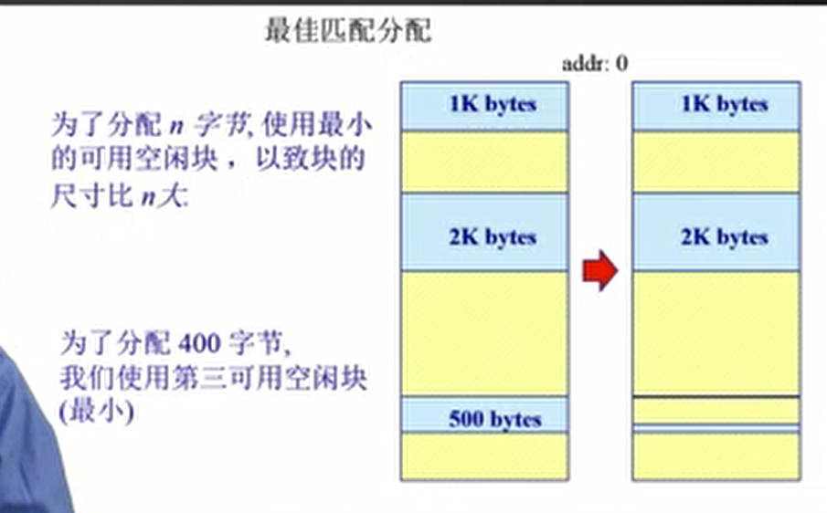
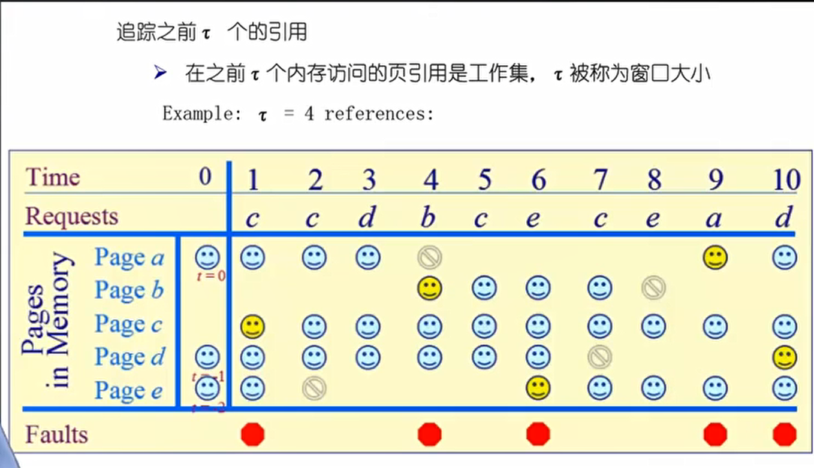
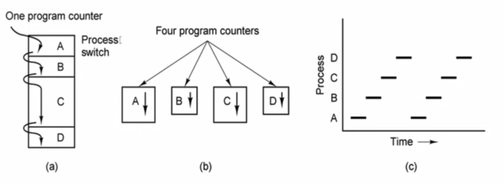
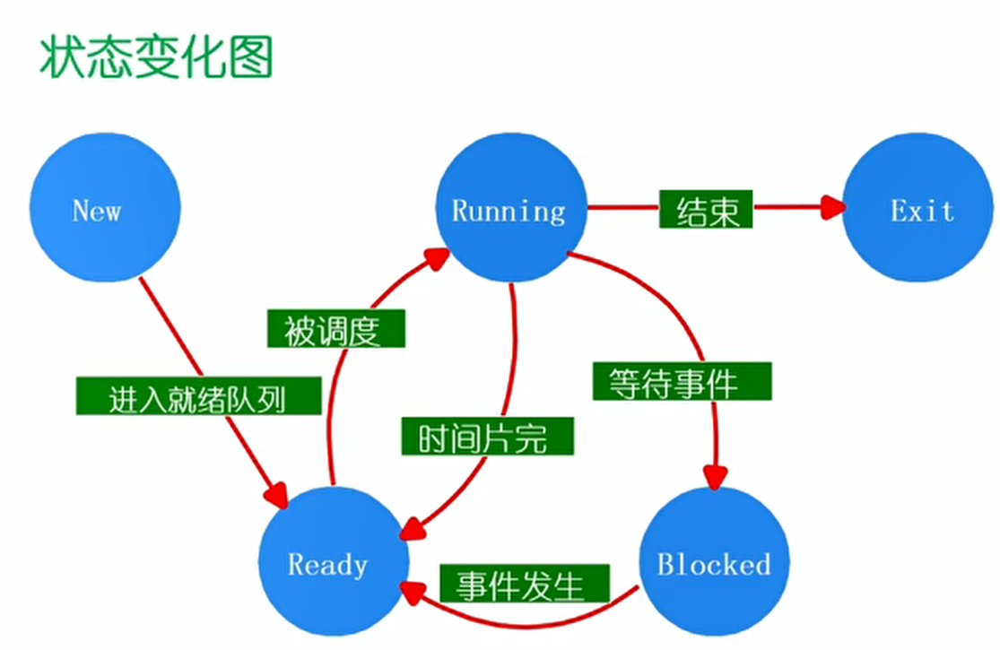
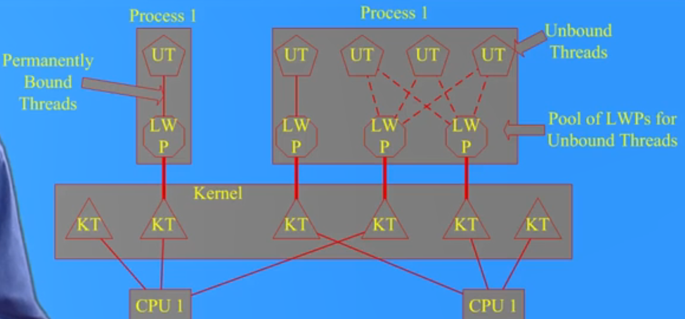
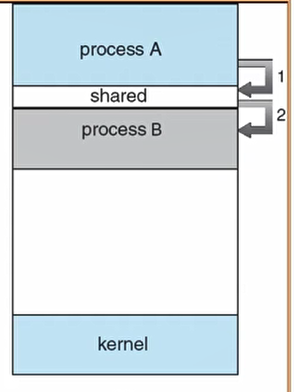
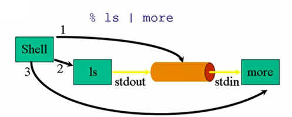
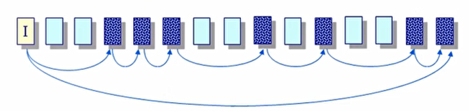

[前往底部](#EOF)


# 序言

1. 现在是2022年6月24日，我开始自学操作系统。虽然今年秋学期，学校要求必修操作系统，但为了:one:学习到真正的知识，:two:防止上课耽误学习，我决定自学。
2. 学习的视频为[清华 操作系统原理](https://www.bilibili.com/video/BV1uW411f72n)（2014年），这个视频合集收录质量不佳（有些视频480p、爆音），故有些内容参考[学堂在线 清华 操作系统 2022春](https://www.xuetangx.com/course/THU08091000267/10322317?channel=i.area.learn_title)的内容（讲了这么多年，内容基本没有变:+1: ）。课件参考[这个](https://github.com/el-nino2020/os-online-recources/tree/master/material/tsinghua-os-2019-spring)（这是学堂在线2019年的教学资料，与视频中的基本一样）
3. 现在是2022年7月7日，网课学习完毕:tada:，但没有做对应的lab


# 版本记录

- ver 1.0，2022年7月7日，笔记完成
- ver 1.1，2022年7月xx日，对ver 1.0进行一些修正


# 目录

[toc]


# 1. 基本概念及原理

## 1.1 什么是操作系统

1. 定义
	- OS是一种系统软件：它管理应用程序，同时也管理计算机的硬件资源
	- OS在计算机体系结构中的位置为：硬件之上，应用程序之下。因而起到承上启下的作用


2. shell & kernel
	- 
	- Linux、Windows的**界面**属于Shell——它是OS暴露给用户的一组接口，用来提供服务给用户——在Windows中，更多地表现为GUI，而Linux中则更多表现为命令行
	- Kernel是OS的核心——它负责资源的调度
	- 


3. OS Kernel的组件
	- CPU调度：管理进程和线程
	- 内存管理：物理内存和虚拟内存
	- 文件系统管理：连接磁盘和应用程序
	- 设备驱动与中断处理
4. OS Kernel的特征
	1. 并发
		- 并发指**一段时间**内有多个程序运行，而并行指**某一时刻**有多个程序运行。因此，并行要求**多个**CPU，而一个CPU就能满足并发
	2. 共享
		- 共享资源
	3. 虚拟
		- 将硬件虚拟化，让程序认为只有自己在使用一台计算机
	4. 异步
		- 并发导致某一程序并不是连续执行，而是走走停停。但需要保证在输入相同的情况下，程序运行的结果是相同的


## 1.2 操作系统实例

1. UNIX家族
	- 
2. Linux家族
	- 
	- Google的安卓使用的是Linux Kernel，因而Linux在智能终端领域占很大比重
3. Windows系统


# 2. OS基础

## 2.1 启动

1. 一些概念
	- OS存放在磁盘中，而非内存中
	- BIOS：基本IO处理系统。其作用是在按下电源后，检测各种外设，检测完毕才加载相应软件
	- Bootloader：作用是加载OS到内存中，也存放在磁盘中


2. 启动顺序
	1. 打开电源
	2. 从特定的内存地址开始执行BIOS的工作，包括POST（加电自检）等
	3. BIOS在硬盘的第一个扇区取出Bootloader，放入内存
	4. Bootloader加载OS进入内存
	5. 跳转到OS的起始地址，OS接管硬件资源


## 2.2 系统调用、异常、中断

1. 定义
	- 这三者是OS与程序和外设交互的**接口**
	- 系统调用（system call）：来源于应用程序，是应用程序主动向操作系统发出服务请求
	- 异常（exception）：来源于不良的应用程序，是非法指令或其他坏的处理状态（如内存出错）
	- 中断（interrupt）：来源于外设，是来自不同硬件设备的计时器和网络的中断


2. 处理时间
	- 中断：异步——程序不知道中断何时产生
	- 异常：同步——某一条指令，如除0操作，一定会产生异常
	- 系统调用：同步或异步。程序发出请求一定是同步的，而系统返回相应资源可能是同步，也可能是异步


3. 响应状态
	- 中断：对应用程序来说是透明的。OS处理中断，从应用程序的角度来看，自己的运行是连续的
	- 异常：可能会杀死当前应用程序，也可能会重新执行指令
	- 系统调用：程序会等待OS返回结果


## 2.3 中断和异常处理机制

- 中断是外设的事件，异常是CPU的事件。两者的发生都迫使CPU执行相应的处理
- 需要有中断（异常）表。当产生中断（异常）时，OS根据中断（异常）的编号在表中查找，查找到处理中断（异常）的服务的地址，执行该服务。


1. 中断处理——硬件层面
	- 设置中断标记（CPU初始化），包括：
		- 将内部、外部事件设置中断标记
		- 产生中断事件的ID


2. 中断处理——软件层面，OS负责
	- 保存当前处理状态（指令地址、寄存器内容）
	- 执行中断服务程序（根据中断ID）
	- 清除中断标记
	- 恢复之前保存的处理状态


3. 异常处理
	- 保存处理状态
	- 根据异常ID执行异常处理程序，有两种处理方式：
		- :one:：杀死异常程序
		- :two:：OS判断自己提供的服务不到位，进行弥补后，**重新执行**异常指令
	- 恢复处理状态


- 由此可见，（没有被杀死的）异常和中断对于应用程序来说都是透明的


## 2.4 系统调用

1. 一些概念
	- 应用程序需要OS提供某些服务，但程序无法执行该服务，只能由OS来执行，因而OS需要提供系统调用接口给程序使用
	- 举例，程序调用`printf()`会触发OS的`write()`。后者将内容输出到特定外设（比如屏幕），并将结果返回给程序
	- 程序访问主要是通过更高层次的API接口，而不是直接进行系统调用。如Win32 API用于Windows，POSIX API用于POSIX-based OS（UNIX、LINUX和Mac OS）
	- 对于程序而言，它只需要使用系统调用这一接口，而不需要知道其如何实现


2. 系统调用过程
	- 程序通过库（library）进行系统调用
	- 当发生系统调用，特权级从应用程序的用户态转变为OS的内核态。前者只能执行某些CPU指令，而后者可以执行所有CPU指令。OS通过系统调用的ID和参数，对系统调用进行识别，从而完成具体的服务。


3. 系统调用和函数调用的区别
	- 函数调用：程序使用自己的堆栈完成函数调用
	- 系统调用：程序使用自己的堆栈，而OS有自己的堆栈。发生系统调用时，除了有特权级的转换，还需要切换堆栈。这两者都需要开销。
	- 因此系统调用的开销大于函数调用的开销。但系统调用的开销是**必要**的，它保证了OS的安全与可靠


4. 跨越OS边界（OS与硬件的边界、OS与程序的边界）的开销
	- 首先需要明确，这些开销是**值得的**，因为能保证OS的安全与可靠
	- 开销如下：
		- 建立中断/异常/系统调用号与对应服务的映射关系——初始化开销
		- 维护内核的堆栈
		- 验证程序发出的系统调用的参数
		- 内核态映射到用户态的地址空间、数据传输
		- 内核态独立地址空间：TLB


# 3. 连续内存分配

## 3.1 计算机体系结构


## 3.2 内存分层体系


- OS无法管理缓存
- 磁盘提供数据的持久化
- 在内存体系中，越往上，速度越快，但空间越小；反之，越往下，速度越慢，但空间越大
- 通过OS，可以有效地达到这个目标：速度快，同时空间大


## 3.3 OS管理内存

1. 目标
	- :one:抽象：提供给应用程序一片连续的逻辑地址空间，使应用程序不用考虑底层和物理空间
	- :two:保护：隔离每个应用程序能够使用的地址空间，使其相互独立，不去访问不属于它的地址空间
	- :three:共享：保证程序间安全、有效、可靠地访问相同的内存
	- :four:虚拟化：提供更多的地址空间。由于主存是有限的，OS将最需要运行的程序放在内存中，而暂时不需要运行的程序存入磁盘中，从而扩大地址空间
2. 例子
	- 
	- 除去OS内核，有4个程序正在运行。可以将暂时不运行的P4放入磁盘中。


3. OS管理内存的不同方法
	 - 程序重定位
	 - 分段
	 - 分页
	 - 虚拟内存
	 - 按需分页虚拟内存


4. OS管理内存的实现**高度依赖硬件**
	- 必须知道内存架构
	- 需要结合MMU（内存管理单元：硬件组件，负责处理CPU的内存访问请求）


## 3.4 地址空间 & 地址生成

1. 地址空间
	- 物理地址空间：硬件支持的地址空间，包括主存和磁盘。起始地址$0$，到$MAX_{sys}$
	- 逻辑地址空间：运行的程序所拥有的内存范围。起始地址$0$，到$MAX_{prog}$
	- 


2. 逻辑地址生成
	- 
	- 逻辑地址生成不需要OS，由编译器、Linker和Loader完成

3. 物理地址生成
	- 
	- :one:CPU需要执行某条指令时，ALU需要这条指令的内容，因而用指令的逻辑地址发出请求
	- :two:CPU中的MMU会去映射表中使用逻辑地址查找对应的物理地址
	- :three:如果MMU中找不到，去主存中的表中查找物理地址。知道了物理地址，也就知道了指令的内容
	- :four:主存把指令的内容通过总线传给CPU，CPU进而执行指令
	- :eight_pointed_black_star:OS负责建立逻辑地址映射到物理地址的表


4. 地址安全检查
	- OS会限定每个程序能够访问的物理地址空间，通过起始地址和最大偏移量能够算出请求的地址是否合法
	- 


## 3.5 连续内存分配

### 内存碎片问题

- 主存中空闲的内存不能被利用
- 外部碎片：分配单元间（为不同程序分配的内存空间）的未使用内存
- 内部碎片：分配单元中的未使用内存：程序本身无法再利用这些碎片

### 分区的动态分配

1. 何时需要内存管理：
	- 当OS**允许**一个程序在主存中运行时，为其分配一个连续的空间
	- 一个**运行**的程序需要访问数据，OS为其分配一个连续的空间


2. 分配策略
	- 首次适配 First Fit
	- 最优适配 Best Fit
	- 最差适配 Worst Fit
3. 首次适配 
	1. 原理：如果需要分配大小为`n`的内存空间，使用**第一个**大小$\ge$ `n`的空闲块
		- 
		- 地址从低到高，分别有大小为1k、2k和500 bytes的空闲块。则为了分配400 bytes，第一个空闲空间为1k bytes的空闲块
	2. 实现：
		- 维护一个按地址排序的空闲块列表
		- 顺序遍历，找到第一个满足要求的空闲块
		- 重分配时需要检查，查看相邻的空闲分区是否能够合并
	3. 优点：
		- 实现简单
		- 易于在地址空间的尾部产生更大空闲块
	4. 缺点：
		- 外部碎片
		- 不确定性


4. 最优匹配
	1. 原理：如果需要分配大小为`n`的内存空间，使用大小$\ge$ `n`的**最小**空闲块
		- 
		- 内存中分别有大小为1k、2k和500 bytes的空闲块。为了分配400 bytes，大小最小的满足分配要求的空闲块为500 bytes的空闲块
	2. 这种策略能够避免分割大的空闲块，且能够最小化外部碎片的大小
	3. 实现：
		- 维护一个按大小排序的空闲块列表
		- 顺序遍历，找到第一个满足要求的空闲块
		- 重分配时需要检查，查看相邻的空闲分区是否能够合并
	4. 优点：
		- 当大部分分配请求为小尺寸时非常有效
		- 实现简单
	5. 缺点：
		- 外部碎片
		- 重分配慢
		- 容易产生很多较小的外部碎片，没法使用


5. 最差匹配：
	1. 原理：
		- 如果需要分配大小为`n`的内存空间，使用大小$\ge$ `n`的**最大**空闲块。
		- 
		- 内存中分别有大小为1k、2k和500 bytes的空闲块。为了分配400 bytes，大小最大的满足分配要求的空闲块为2k bytes的空闲块
	2. 实现：
		- 维护一个按大小排序的空闲块列表
		- 顺序遍历，找到第一个满足要求的空闲块
		- 重分配时需要检查，查看相邻的空闲分区是否能够合并
	3. 优点：
		- 当大部分分配请求为中等尺寸时非常有效
	4. 缺点：
		- 外部碎片
		- 重分配慢
		- 优先破碎大的空闲块导致大尺寸的分配请求无法满足


- 由于程序对于内存分配的请求是随机的，无法评判哪一种策略为最好


### 压缩式碎片整理

1. 原理
	- 将空闲块压缩，使所有使用中的内存空间紧靠在一起
	- 


2. 何时进行压缩？
	- 不能在程序运行时——这会造成程序的地址访问失效
	- 因而只能在程序等待时
3. 开销问题
	- 在内存中频繁地执行压缩，会造成很大的开销


### 交换式碎片整理

1. 原理
	- 利用磁盘的存储空间，扩大程序能够使用的内存
	- 
	- 如果某个运行的程序需要更多的内存，则将等待的程序整体放入磁盘中。如果放入磁盘的程序需要运行，再将其放入内存中


2. 一些问题
	- 何时进行交换？交换哪个程序？
	- 将程序所用的数据整体放入磁盘开销较大，是否能分为小部分放入？


# 4. 非连续内存分配


## 4.1 为什么需要非连续内存分配

1. 连续内存分配的缺点
	- 内存利用率低
	- 会产生外碎片和内碎片


2. 非连续分配的优点
	- 更好的内存利用和管理
	- 允许共享代码与数据
	- 支持动态加载和动态链接


3. 非连续内存分配的缺点
	- 在逻辑地址与物理地址之间的转换会造成开销
	-  如果用软件方案解决，会造成很大的开销。故，使用硬件方案，通过与计算机中的硬件结合，以完成转换
	- 两种硬件方案：
		- 分段
		- 分页


## 4.2 分段

1. 分段地址空间
	- 将拥有**不同属性**的数据段（如栈、堆、全局变量等）在内存中不同位置存储，实现更好的分离和共享（某些数据段允许共享，而另一些数据段则被保护）
	- 


2. 段
	- 
	- 用一个逻辑地址表示一个段，该地址的前半部分表示段号，后半部分表示该地址在段中的偏移量


3. 分段寻址方案
	- 
	- CPU获得一个逻辑地址
	- 该地址的段号对应段表（段表在硬件上）中的索引。在段表的该索引处，可以获得段对应的物理内存的起始地址`base`和段的长度`limit`（最大偏移量）
	- 然后，校验地址的访问是否合法


## 4.3 分页

- 大多数OS使用分页机制，而非分段机制
- 分页使用的逻辑地址包含页号和页内偏移量，这和分段机制一样。两者**唯一**的区别在于，段的大小是可变的，而页的大小是固定的。
- 分页机制讲述：
	- 划分物理内存为固定大小的帧（frame）:eight_pointed_black_star:，大小为2的幂
	- 划分逻辑内存为与帧相同大小的页（page):eight_pointed_black_star:
	- 建立逻辑地址到物理地址的映射
		- 页表
		- MMU/TLB（在CPU中，加速映射） 
	- :eight_pointed_black_star:帧和页都是指相同大小的内存块，只不是物理内存上叫做帧，而逻辑内存上叫做页


1. 帧Frame
	- 
	- 一道例题：
		- 
		- 在这里， $S = 9. f = 3, o = 6$，则$address = 2 ^ 9 \times 3 + 6 = 1542$


2. 页 page
	- 
	- 逻辑地址和物理地址的偏移量是相同的，都是`S`位，即两者所占空间相同
	- **页的数量与帧的数量不等**，因为逻辑内存往往大于物理内存。故$P > F$


3. 页寻址机制
	- 
	- CPU拿到逻辑地址`(p, o)`，去页表中查询物理地址
	- 设页表基址为`base`，则帧号`f = base[p]`，偏移量`o`不变，得到物理地址`(f, o)`
	- 页表，page table，由OS在OS初始化时建立


4. 注意事项
	- 
	- 逻辑内存空间往往大于物理内存空间
	- 页是连续的，而帧不是连续的


## 4.4 页表

1. 页表概述
	- 
	- 页表，底层是一个数组。
	- 页号对应数组的索引，每一个元素除了有帧号，还有一些标志位（flags）


2. 地址转换实例
	- 
	- 该系统的地址为`16`位，说明虚拟内存的空间为$2 ^{16} =64\text{KB} $，而物理内存只有`32 KB`
	- :one:先查找虚拟地址`(4, 0)`，页号对应页表中从下往上第5个元素，即`100|00000`
	- 由于`resident bit`为`0`，该页号不存在对应的帧号，请求非法
	- :two:再查找虚拟内存`(3, 1023)`，页号对应页表中从下往上第4个元素，即`011|00100`
	- `resident bit`为`1`，存在对应的帧号，为`0b00100`，即`4`。故物理地址为`(4, 1023)`


3. 分页机制的性能问题
	1. 空间消耗大
		- 64位机器，如果每页有`1024`字节，那么一张页表要占用$2 ^ {64} \div 1024 = 2 ^{64} \div 2 ^{10} = 2^{54} \text{B}$，明显太大了
		- 每一个程序都需要一张页表，更加消耗存储空间
	2. 时间消耗大，访问一个内存单元需要2次内存访问
		- 第一次获取页表元素
		- 第二次获取数据
	3. 解决方法
		- 缓存（cache）——解决时间问题
		- 间接访问——解决空间问题


## 4.5 TLB

1. 概念
	- 
	- CPU中有MMU，MMU中有TLB
	- TLB也是一张表，元素的键为页号，值为帧号
	- 访问TLB的时间远小于访问内存的时间
	- CPU拿到一条逻辑地址，先去TLB中查找，如果TLB中存在，则直接生成物理地址
	- 如果TLB不存在，CPU去内存的页表中查找。查找到的帧号会被存入TLB中
	- 有些CPU会负责将帧号存入TLB，而另一些则交给OS负责


## 4.6 多级页表

1. 二级页表
	- 
	- 原先存放页号$p$的位被划分为$p_1$和$p_2$，而偏移量不变
	- 通过$p_1$在一级页表中找到对应的二级页表的**基地址**，通过$p_2$在对应的二级页表中查找帧号
	- 如果$p_1$对应的一级页表的`resident bit`为`0`，则没有必要建立相应的二级页表——节省空间


2. 多级页表
	- 
	- 多级页表在寻址时的时间开销增大了，但也节省了很多内存，是一种时间换空间的策略。通过使用TLB，能降低时间开销，从而有效平衡时间和空间开销。
	- 这种结构类似于B+ 树


## 4.7 反向页表 inverted page table

1. 大地址空间问题
	- 对于64位系统，使用5级页表，仍旧会占用很多空间
	- 解决方法：不是让页表与**逻辑**地址空间的大小相对应，而是让页表与**物理**地址空间的大小适应


2. 页寄存器 page registers
	- 
	- 页寄存器以帧号作为索引，存放的元素为对应的页号，从而使页寄存器的大小只与物理内存有关。
	- 一个页寄存器的例子：
		- 
		- 我们只需要一个页寄存器，但如果使用页表（其大小大于页寄存器的大小），需要为每一个程序创建一个页表。故，这种方式能够减小内存消耗
	- 问题在于CPU需要通过逻辑地址找到物理地址，而页寄存器只建立了物理地址到逻辑地址的映射


3. 关联内存 associative memory
	- 
	- 关联内存是一种特殊的硬件，它可以**并行**地比较反向页表中的页号，从而找到对应的帧号
	- 由于关联内存的设计复杂、成本高、容量小，无法满足反向页表的需求


4. 哈希查找
	- 
	- 同样使用反向页表
	- 使用一个哈希函数，输入为页号`p`，输出为帧号`f`，用`f`作为索引，找到反向页表中的元素。
	- 为了提高哈希效率，增加一个参数，当前程序的id，即`PID`
	- 使用硬件能够加速哈希函数
	- 问题：
		- 哈希碰撞：引入`PID`以缓解冲突。同时需要设计一套解决哈希碰撞的机制
		- 反向页表存放在内存中，需要类似TLB来存放频繁使用的地址来加速寻址
	- 只有一部分**高端**CPU使用基于哈希查找的反向页表


# 5. 虚拟内存

## 5.1 起因

1. 需求
	- 程序规模的增长速度**远大于**存储器容量的增长速度
	- 于是，产生了对:one:更大、:two:更快、:three:更便宜和:four:非易失性的存储器的需求——一种理想的存储器
	- 实际的存储器：
		- 
	- 由于内存可能无法满足程序的存储要求，可以利用**磁盘的空间**
	- 要求程序员去管理多层次的存储器结构是**不现实**的，**OS应该承担这个工作**，从而为程序员提供一个:one:更大、:two:更快、:three:更便宜的内存空间（当前的内存无法做到非易失性，因为一没电，数据就没了）

2. 一些技术的介绍
	- 在计算机系统中，尤其是多道程序运行时，出现内存不够的现象，怎么办？
	- :one:早期，OS不够强大，受制于当时的硬件能力，如果程序超过内存容量，要求程序员**手动**地采用**覆盖技术（overlay）**，只把需要的指令和数据保存在内存中，而把其他数据存放在硬盘上
	- :two:随着硬件能力和OS能力的增强，采用**自动**的**交换技术（overlapping）**，把需要的程序放入内存中，把暂时不需要的程序（**整体**）放入磁盘
	- :three:如果要在有限的内存中，以**更小的页粒度**为单位，装入更大的程序，可以使用**自动**的**虚拟存储技术**

## 5.2 覆盖技术

1. 原理
	- 把程序按照其逻辑结构，划分为若干个功能上相对独立的程序模块（可以理解为函数）。不会同时执行的模块**共享同一块内存区域**，按时间先后来运行
	- 必要部分（主控、常用功能）的代码和数据常驻内存
	- 可选部分（不常用功能）在模块中实现，平时存放在外存中，需要时才装入内存
	- 不存在调用关系的模块不必同时装入内存，从而可以相互覆盖，共用一个分区

2. 例子
	- 
	- `A`至`F`为不同的模块
	- 分区的粒度由程序调用的逻辑关系来决定，这意味着可能有多种覆盖方法


3. 缺点
	- 程序员需要**手动**把一个大的程序划分为若干个小的功能模块，并确定各个模块之间的覆盖关系，费事费力，增加编程复杂度
		- 早期的一种较为自动化的覆盖技术系统：
		- 
	- 模块从外存装入内存，实际是用时间换空间


## 5.3 交换技术

- Unix系统最初采用这种技术

1. 原理
	- 将暂时不运行的程序送到外存，从而获得空闲内存空间
	- OS把一个进程的整个地址空间的内容保存到外存中（换出，swap out）；OS把外存中某个进程的地址空间读入内存（换入，swap in）
	- 换入、换出内容的大小为**整个程序**的地址空间，即以程序为单位
	- 


2. 一些问题
	1. 交换时机：何时需要交换？采用**惰性交换**的策略，只有当内存空间不够或可能不够时才换出。否则，频繁的交换会影响系统的效率，因为内存和磁盘的读写速度差距很大
	2. （磁盘）交换区的大小：必须足够大，能够存放**所有进程**的内存映像的拷贝，因为某一个进程可能会使用整个内存空间
	3. 重定位：程序再换入时内存位置大概率发生改变，从而使原有的逻辑地址到物理地址的映射无效。解决方法：使用动态地址映射，多级页表可以实现这一点


## 5.4 虚存技术

- 虚拟内存管理技术，简称虚存技术

1. 现有技术存在的缺点
	- 覆盖技术：程序员需要手动地将程序划分为若干模块，并确定这些模块的覆盖关系，增加程序员负担
	- 交换技术：以进程作为交换单位，把进程的整个地址空间换入换出，增加处理器开销


2. 虚存技术的目标
	- :one:像覆盖技术一样，只把程序的**部分**内容放在内存中，但由OS**自动完成**
	- :two:像交换技术一样，能够**自动**实现进程在内存与外存之间的交换，但每次只交换程序的**部分内容**
	- 故，虚存技术的目标是结合覆盖技术和交换技术的优点


3. 局部性原理
	- 时间局部性：**同一条**指令的多次执行，或同一个数据的多次访问，集中在**较短时期**内
	- 空间局部性：在一段时间内，访问的**几个**数据，或执行的几条数据，集中在**内存中一个较小的局域**
	- 程序的局部性越好，其执行效率越高
	- 一个例子：
		- 
		- 
		- 二维数组的大小为$\text{sizeof(int)} * 1024*1024 = 4 \text{MB}$，超过每个进程的虚拟内存大小`4KB`
		- 数组的每一行的大小等于一页的大小，故第一次操作某一行时，会造成缺页中断。OS将该页从磁盘换入内存


4. 虚存技术基本概念
	- 虚存技术的实现要求：:one:OS、:two:硬件（MMU等）、:three:分页（分段）机制、:four:局部性，这四者的结合保证了高效的虚拟内存。（:four:要求程序员写出的代码具有局部性，从而保证高效）
	- 
	- 由OS判断应该将哪些页保存在内存，哪些页保存在外存。优秀的OS设计能够保证这一过程的高效，从而降低开销


5. 虚存技术特征
	- 大的用户空间：通过把物理内存与外存结合，提供给用户的虚拟内存空间大于物理内存空间
	- 部分交换：与交换技术相比，虚拟内存的调入和调出是对部分地址空间进行的
	- 不连续性：物理内存分配的不连续，虚拟内存空间使用的不连续


6. 虚拟页式内存管理
	- 大部分虚拟存储系统都采用虚拟页式管理技术，即**在页式存储管理的基础上**，增加**请求调页**和**页面置换**功能。
	- 基本思路：
		- 当一个程序要运行时，不是将程序的所有页装入内存，而是只装入部分页，就可启动程序
		- 在运行过程中，如果发现要运行的程序，或要访问的数据不在内存，则向OS发出缺页中断请求。OS处理这个中断，将外存中相应的页调入内存，使程序继续运行


7. 页表元素
	- 
	- 驻留位：表示该页在内存还是外存。如果为`1`，则该页存在于内存中，可以直接使用；如果为`0`，表示该页存在于外存。如果访问位于外存的页，会导致缺页中断
	- 保护位：表示允许对该页做何种类型的访问，如只读、可读写、可执行等
	- 修改位（dirty bit）：表示该页在内存中被修改过。OS回收帧时，根据此位决定是否把该帧的内容**写回**外存
	- 访问位：如果当前页被访问，则设置此位。该位用于页面置换算法


8. 页表寻址
	- 
	- 虚拟内存的一个蓝色格子中存放的是当前页的驻留位，`X`对应不存在，数字对应页表中的索引
	- :one:假设我们有虚拟地址`0`，它位于0K - 4K的区间，驻留位为`2`，故物理地址为$2 \times 4 K + 0 = 8192$
	- :two:假设我们有虚拟地址`32780`，它位于32K - 36K的范围，驻留位为`X`，故会造成缺页中断


9. 缺页中断
	- :one:如果内存中有空闲的物理帧，则执行:four:，否则执行:two:
	- :two:这种情况下，没有空闲的物理帧。OS采用**[某种页面置换算法](# 6. 页面置换算法)**，选择一个将被替换的物理帧`f`（作为victim），其对应的页为`q`。如果该页被修改过，需要将它写回外存
	- :three:修改以`q`为索引的页表元素，将驻留位设置为`0`
	- :four:将需要访问的页`p`从外存调入内存的物理帧`f`中
	- :five:修改以`p`为索引的页表元素，将驻留位设置为`1`，帧号设置为`f`
	- :six:重新执行中断的指令
	- 


10. 后备存储 backing store
	- 使用虚拟内存，在程序运行过程中，大量的数据存放在外存中。存在以下几种数据存储形式：
	- :one:数据文件，例如一个大的数组`int[9_000_000_000]`。当需要访问该数组时，将它从数据文件中读取
	- :two:执行文件，即代码段。指令本质也是数据，它存放在硬盘的可执行程序上。OS将代码段读入内存，让CPU执行指令
	- :three:库文件，动态加载的共享库。程序需要用到某个库时，OS再把它读入内存
	- :four:不对应硬盘上的文件，是程序运行过程中产生的较大的数据段，如堆栈中的数据。当OS要把这些数据调入外存时，会创建交换文件（swap file），在该文件中存放数据


11. 虚拟内存性能
	- 
	- EAT是在运**用虚拟内存技术**后，对于内存的**平均访问**时间
	- 注意，$5,000,000\times p \times (1+q)$中的$q$表示写回操作也会导致对硬盘的访问，从而增加了EAT。$p\times (1+q)$表示对于硬盘总的操作次数，即读和写的总概率
	- 尽管$5,000,000 \gg 10$，由于局部性的存在，可以使$p$降到很低，从而使EAT尽可能的小


# 6. 页面置换算法

1. 功能和目标
	- 功能：当缺页中断发生时，需要调入新的页而内存已满时，选择内存中某一帧，将其置换
	- 目标：尽可能减少页面的换进换出次数（缺页中断的次数）。具体来说，把未来不再使用，或短期较少使用的页面换出。通常是根据局部性原理，使用过去的数据来进行预测
	- 页面锁定（frame locking）：用来描述必须常驻内存的OS关键部分或time-critical的进程。实现的方法为：为页表元素添加锁定标志位lock bit


2. 如何评价页面置换算法的好坏？
	- 在计算机上实际应用某一算法，进行测试？可行，但麻烦
	- 可以模拟一个进程的的页访问序列（页内偏移可以忽略）。通过调用不同的算法执行这个页访问的序列，看哪个算法产生的缺页次数更少，则该算法性能更优
	- 


## 6.1 局部页面置换算法

- 所谓局部，是指算法**只针对一个进程**。因此，判断算法的优劣只要考虑算法本身即可。

### 最优页面置换算法

1. 原理
	- 直观表述：**假设可以预知未来**（:eight_pointed_black_star: ），当发生缺页中断时，替换那个在将来最长时间不需要访问的页
	- 具体来说，当缺页中断发生时，对于内存中的每一页，计算**该页下一次被访问的时间**。**替换时间最久的页**
	- 由于这个假设（:eight_pointed_black_star:）显然是一种理想情况，在真实的系统中无法实现，所以可以用作其他算法性能评价的**依据和参考**（我们使用相同的页访问序列测出每一种算法的缺页次数）
	
	
	
2. 例子
	- 
	- 在这个例子中，物理内存只能存放4个页，而虚拟内存有5个页
	- 在`time`为`5`时要访问页`e`，由于该页不在内存中，选择页`d`进行替换


### 先进先出算法

- first in first out, FIFO

1. 原理：
	- 替换在内存中驻留时间最长的页面
	- 使用队列实现，队首的页驻留时间最久。每次发生缺页中断，将队首元素弹出，在队尾加入新的页
	- 该算法性能较差，调出的页面有可能是经常要访问的现象，并且会产生Belady现象


2. 例子
	- 
	- 按照假定的初始顺序，页表（底层为数组）可以用一个指针实现循环队列


### LRU

- Least Recently Used, LRU


1. 原理

	- 发生缺页中断时，替换最久未使用的页面
	- 该算法是对最优页面置换算法的一个**近似**，其依据是**局部性原理**。如果在过去一小段时间内，某些页被频繁地访问，那么在将来的一小段时间内，这些页可能再次被访问。而对于过去长时间未被访问的页，它们在将来也大概率不会被访问

	

2. 例子
	- 


3. 具体实现
	- LRU算法需要记录各个页使用时间的先后顺序，一种可能的实现方法为：
	- OS维护一个页面链表，刚使用过的页作为首节点，最久未使用的节点作为尾节点。每访问一个页面，将该页面对应的节点移动到首节点的位置
	- 每一次访问页，时间复杂度为`O(n)`，开销较大。故，尽管LRU的缺页中断次数较少，其开销过大，不是一种有效的页面置换算法


### 时钟算法

- clock algorithm，在缺页中断次数上是对LRU的近似，在开销上是对FIFO的近似。clock算法结合了LRU和FIFO的优点


1. 原理
	- 使用页表元素中的访问位。当一个页被装入内存，其访问位被初始化为`0`；当该页被访问，访问位被硬件置`1`
	- 使用环形链表，每个节点指向某一页。将指针指向最早的页
	- 当发生缺页中断，考察指针指向的页。如果访问位是`0`，则将新的页与该页置换；如果该位为`1`，（OS）将该位置为`0`，指针往下移动。不断重复该过程，直至找到访问位为`0`的页
	- 
	- `used bit`即访问位，假如此时发生缺页中断，则依次将页`0`、页`3`的访问位置`0`。然后替换页`1`为目标页


2. 例子
	- 
	- `Time`为`5`和`10`的两次访问，由于页表所有访问位都为`1`，指针遍历了一圈，将所有的访问位都置`0`，并将原先的首节点替换
	- 如果访问成功，硬件会将对应页的访问位置为1，如`Time`为`6`时


- clock算法用1个bit（访问位）来模拟整个历史信息，不如LRU精确。但clock算法的开销远低于LRU。综合考虑，clock算法是**较优**的页面置换算法


### 二次机会法

- second chance algorithm，又称enhanced clock algorithm


1. 原理
	- 如果被替换的页的dirty bit被置为`1`，则在替换时需要将该页**写回硬盘，开销较大**
	- 二次机会法是**对时钟法的改进**，它使得“脏”页在第一次扫描中能够保留下来，从而**优先替换只发生读操作**的页，提高效率
	- 
	- 这里同时使用`used bit`和`dirty bit`作为二次机会法的状态位。每一次指针扫过页表元素，状态位的变化如上图所示。
	- 如果状态位为`11`，需要两次循环才能替换该页；如果状态位为`00`，则直接替换；否则，需要一次循环才能替换
	- :warning:需要明确，一般的二次机会法不**改变`dirty bit`**，因为替换时应有的写入会被忽略，而是另外设置一个second chance bit。这里只是为了易于讲解才这么设置


2. 例子
	- 
	- 访问请求$x^w$表示对页`x`进行写操作


### LFU

- 最不常用算法，Least Frequently Used, LFU

1. 原理
	- 发生缺页中断时，替换访问次数最少的页面

2. 实现
	- 对每个页表元素设置一个计数器。每当一页被访问，其计数器增加`1`。
	- 发生缺页时，替换计数值最小的页
	- 缺点:unamused:：计数器占用硬件资源，且找到计数值最小的页花费`O(n)`时间。开销比LRU还要大，不合适


3. LRU和LFU的区别
	- LRU考察多久未访问，时间越短越好
	- LFU考察访问次数，次数越多越好


### Belady现象

1. Bélády's anomaly
	- 在采用某些页面置换算法时，如FIFO，有时会出现分配的**物理帧增加，缺页率反而提高**的异常现象


2. Belady现象的原因
	- FIFO算法的置换特征与进程访问内存的动态特征是矛盾的，与置换算法的目标（替换较少使用的页）是不一致的。


3. 举例
	- 对于某一访问序列，帧数为3，缺页次数为9
	- 
	- 但当帧数变为4，缺页率反而上升到10
	- 
	- LRU算法可以在帧数增加时，降低缺页次数
	- 


### LRU、FIFO和Clock的比较

1. LRU和FIFO
	- LRU算法和FIFO算法本质上都是先进先出的思路
	- LRU根据页面最近访问时间来排序，每当执行一次页面访问，各个页面之间的顺序会发生变化
	- FIFO根据页面进入内存的时间排序，其顺序是固定不变的，不受页面访问的影响。
	- **LRU实现更优的页面置换的前提是程序有较好的局部性。**如果程序没有局部性，例如只有3帧，但访问页的序列为`1 2 3 4 5 1 2 3 4 5 ......`，则LRU退化为FIFO


2. LRU、FIFO和Clock
	- LRU算法性能好，但系统（时间、空间）开销大
	- FIFO系统开销小，但效果不佳，还会产生Belady现象
	- 由此产生了折中的算法——Clock


## 6.2 全局页面置换算法

### 局部页置换算法的问题

- **局部**页面置换算法的**前提**为：分配给**某一进程的帧数是固定的**
- 但由下图可以看出，使用同一页面置换算法，增加帧数可以减少程序缺页中断的次数

- 
- **全局**页面置换算法的工作，就是根据程序运行的**不同阶段**，**动态地调整**每一进程的帧数，从而达到**全局缺页次数尽可能得少**


### 工作集模型

- 页面置换算法，不论是局部和全局，都要求程序具有局部性，才能体现出算法的效果
- 为了对程序局部性做定量分析，引入了工作集模型


1. 工作集 working set
	- 定义：**一个**进程当前正在使用的**逻辑**页面**集合**，可以用二元函数$W(t, \Delta)$表示，其中：
		- $t$是当前执行**时刻**
		- $\Delta$称为工作集窗口（working set window），是一个**定长**的页面访问时间窗口
		- $W(t, \Delta)$表示在当前时刻$t$之前的$\Delta$时间窗口内（即$(t-\Delta,t]$这一段时间内）所有页面组成的集合。故，随着$t$变化，集合也在不断发生变化
		- $|W(t, \Delta)|$指工作集大小，即页面数目
	- 工作集的例子：
		- 
		- 可以看出，$W(t_2, \Delta)$表示的时间窗口内，程序的局部性更好
	- 


2. 常驻集
	- 定义：在**当前时刻**，**某一**进程**实际驻留在内存中**的页面集合
		- 工作集是进程在运行过程中的**固有性质**。而常驻集取决于OS当前分配给该进程的物理帧数，以及所采用的页面置换算法
		- 如果一个进程的工作集都在内存中，即$工作集\subseteq常驻集$，那么程序将顺利执行，而不会造成太多缺页中断
		- 当进程的常驻集达到一定大小，再给它分配更多物理帧，缺页率也不会明显下降


### 工作集置换算法

1. 原理
	- 对于给定的$\Delta$，维护一个工作集$W(t, \Delta)$。每当$t$增加，主动换出不在工作集中的页面（如果有的话）。
	- 可以看出，该算法**主动地**进行页面置换，而不像局部页面置换算法——发生了缺页中断，才**被动**地进行页面置换
	- 因此，该算法只有应用于多个程序，才能体现出该算法的优越性


2. 例子
	- 
	- 访问请求的数量通常与物理帧数不同，这里只是一种特殊情况
	- $\Delta = \tau = 4$
	- 在$t =0$时，页`a`上一次访问是在$t = 0$，页`d`是在$t = -1$，页`e`是在$t = -2$
	- 当$t =1$时，发生缺页中断，将页`c`调入物理内存
	- 当$t=  2$时，时间窗口为$(-1,2]$，页`e`上一次引用是在$t =-2$，故页`e`不在工作集中，将`e`换出


### 缺页率置换算法

- 在工作集算法中，$\Delta$是不变的。假如$\Delta$是可变的，则常驻集也表现为可变的
- 常驻集可变，则OS会在进程运行过程中，**动态地**调整该进程**能够使用的物理帧数**
- 这也是一种全局页面置换算法


1. 缺页率
	- 定义：:one:$\frac {缺页次数}{内存访问次数}$，或:two:缺页的平均时间间隔的倒数
	- 影响缺页率的原因有：
		- 页面置换算法
		- 分配给进程的物理帧数
		- 页面本身的大小
		- 程序的编写方法，即局部性好坏


3. 缺页率算法
	- PFF，page fault frequency
	- 
	- 如果程序的缺页率过高，则增加工作集大小，从而分配更多物理帧；反之，如果程序缺页率过低，则减小工作集大小。OS力图使每个程序的缺页率维持在一个合理的范围内


4. 原理
	- 记录缺页发生时间，记$t_{last}$为上次缺页的时刻，$t_{current}$为本次缺页的时刻，对于**给定的$T$**
	- 如果$t_{current} - t_{last} > T$，说明缺页率低，从内存中移除$[t_{last},t_{current}]$时间内没有被引用的页
	- 如果$t_{current} - t_{last} \le T$，说明缺页率高，增加缺失的页到工作集中
	- 从实现来看，缺页率算法也是一种**被动调整**的算法，只有发生缺页中断才调整


5. 例子
	- 


- 工作集算法是根据工作集模型，缺页率算法是根据缺页率，将某一页换出，**与物理帧数无关（使用全局页面置换算法，每一个进程能够使用的物理帧数没有固定的上限）**。而**所有**的**局部**页面置换算法都是在某一进程使用了全部的物理帧，再次发生缺页中断时，才换出某一页。


### 抖动问题

1. 抖动问题 thrashing
	- 如果分配给一个进程的物理页面太少，不能包含整个工作集，即常驻集$\subset$ 工作集，则该进程会产生很多缺页中断。**频繁的换入换出会导致进程运行速度变慢**。这种状态称为“**抖动**”

2. 产生抖动的原因 
	- 随着进程数增加，分配给每个内存的帧数减小，缺页率不断上升。
	- 故，OS要选择一个**适当的进程数目**和进程所需要的帧数，以便在并发水平和缺页率之间达到一个平衡


3. 改善抖动现象
	- 定义MTBF（mean time between page faults，平均页缺失时间）为两次连续缺页发生的时间差的平均值
	- 定义PFST(page fault service time，页缺失服务时间)为一次页面置换所花费的时间
	- 通过调整MPL（multiprogramming level，进程数量），使得$\text{MTBF} = \text{PFST}$，从而改善抖动现象
	- 解释如下：
	- 
	- 紫色的线是CPU利用率关于进程数量的函数，可以确定一点$N_{max}$，此时CPU利用率最高
	- 也可以用另外一种评判标准：
	- 当$\text{MTBF} = \text{PFST}$时，即两者比值为$1$时，缺页率是可以接受的。图中蓝线是两者比值关于进程数量的函数
	- 当比值为$1$时，可以确定一点$N_{IO-BALANCE}$，此时**并发水平和缺页率综合表现最好**，CPU利用率也不差
	- OS可以根据CPU利用率，确定应该运行多少个程序，从而改善内存抖动现象


- 抖动现象也可能由于一个进程需要极大的内存而导致。故抖动现象受多种因素共同导致


# 7. 进程管理

## 7.1 进程描述

### 进程定义

- 早期的计算机只能执行一个程序
- 随着硬件水平的进步，计算机能够运行多个程序，也能够运行一个程序的多个实例。这时，再用『程序』一词来表示，会不准确。而『进程』一词可以更好的表示程序的执行过程


1. 定义
	- 进程是**一个**具有一定独立功能的**程序**在一个数据集合上的**一次** **动态执行**过程
	- 
	- 程序作为可执行文件存储在磁盘上，是程序的静态表现
	- 只有程序被OS加载入内存，由CPU开始执行指令，才表现为动态的

### 进程组成

1. 进程的组成
	- 程序代码
	- 程序处理的数据——输入
	- Program Counter, PC, 一个寄存器，指示当前运行到了哪条指令
	- 一组通用寄存器、栈、堆
	- 一组系统资源（CPU、内存、文件资源）
	- 总之，进程包含一个**正在运行**的程序的**所有状态信息**


2. 进程与程序的联系
	- 程序是产生进程的基础
	- 程序每次运行构成不同的进程
	- 进程是程序功能的体现
	- 通过多次执行，一个程序可以对应多个进程；通过调用关系，一个进程可以包括多个程序。两者是多对多的关系


3. 进程和程序的区别
	- 进程是动态的，程序是静态的：程序是有序代码的集合，进程是程序的执行。进程有核心态和用户态。（用户态为CPU执行程序中的指令；核心态为产生中断、异常、系统调用时，CPU转而执行OS负责的功能）
	- 进程是暂时的，它在内存中执行，状态不断发生变化；程序是永久的，被长久保存在磁盘上
	- 两者的组成不同，进程包括程序、数据和进程控制块


4. 进程与程序关系的类比
	- 
	- 做蛋糕的过程涉及到其他所有的要素
	- 进程的切换同样体现了动态性

### 进程特点

- 动态性：可动态地创建、结束进程
- 并发性：多个进程运行时，每个进程可以被独立调度并占用CPU运行
- 独立性：不同进程的工作不相互影响。（这里指程序的**正确性**不受影响，而并发会导致程序运行时间增长）
- 制约性：因访问共享数据（资源），或进程间同步而产生制约

- 
- 图(a)体现并发性，OS切换当前执行的进程；图(b)体现出独立性，4个进程的地址空间是独立的；图(c)体现并发性和制约性，一个进程占用CPU时，其他进程无法执行


### 进程控制结构

- PCB，Process Control Block，进程控制块
- PCB：OS管理**一个**进程运行时所用信息的**数据结构**
- OS用PCB描述进程的基本情况和运行变化的过程
- PCB是进程存在的**唯一标识**，两者**一一对应**


1. PCB包含三大类信息
	- :one:进程标识信息：本进程的标识（一个ID）、本进程的产生者（父进程）标识、用户标识
	- :two:CPU状态信息保存区，保存进程的运行状态：
		- 用户可见寄存器：用户可以使用的数据、地址等寄存器
		- 控制和状态寄存器：PC、PSW（程序状态字）等
		- 栈指针
	- :three:进程控制信息
		- 调度和状态信息：用于OS调度进程并占用CPU
		- 进程间通讯信息
		- 存储管理信息：指向本进程逻辑内存空间的数据结构（页表）
		- 进程所用资源：如文件资源
		- 有关PCB连接信息：连接到当前进程的父进程，或连接到一个进程队列中


2. PCB的组织方式
	- 链表：**同一状态**的进程对应的PCB组成一个链表，多个状态对应多条链表
	- 数组：**同一状态**的进程对应的PCB放入一个数组，多个状态对应多个数组
	- 通常使用链表来组织PCB，但对于进程数较为固定的特殊用途的OS，使用数组效率更高


## 7.2 进程状态

- [进程描述](#7.1 进程描述)讲的是进程的静态特征，而这一部分要讲进程的动态特征

### 进程生命期管理


1. 进程创建
	- 引起进程创建的3个主要事件
		- 系统初始化时——创建最初的进程（Genesis:laughing: ）
		- 用户请求创建一个新进程
		- 正在运行的进程执行了创建进程的系统调用
	- 创建进程时，会创建并初始化PCB
	- 进程创建后，进入就绪（ready）状态
	- 


2. 进程运行
	- OS在多个就绪的进程中选择一个进程，使其占用CPU执行
	- 选择哪个进程取决于调度算法
	- 进程状态从ready变为running
	- 


3. 进程等待/阻塞
	- 进程等待（阻塞）的原因如下：
		- 请求并等待系统服务，无法马上完成
		- 启动某种操作，无法马上完成
		- 需要的数据没有到达
	- 当前进程进入等待状态，会将CPU**让给其他就绪的进程执行**，避免浪费CPU资源
	- **进程只能自己阻塞自己**，因为只有进程自身知道何时需要等待某种事件
	- 


4. 进程唤醒
	- 进程唤醒的原因：
		- 被阻塞进程需要的资源被满足
		- 被阻塞进程等待的事件到达
		- 被阻塞进程的PCB被插入就绪队列
	- 进程唤醒是一个动作，目的是将某一进程从waiting变为ready
	- 进程只能被别的进程或OS唤醒
	- 


5. 进程结束
	- 导致进程结束的情况：
		- 正常退出（自愿）
		- 错误退出（自愿）
		- 致命错误（被OS强制）
		- 被其他进程所杀（强制）


### 进程状态变化模型

1. 进程的三种基本状态
	- 运行状态（running）：该进程在CPU上运行
	- 就绪状态（ready）：该进程获得了除CPU以外的一切所需资源，一旦得到CPU即可运行
	- 等待状态/阻塞状态（block）：该进程正在等待某一事件而暂停运行
	- 


2. 进程其它基本状态
	- 创建状态（New）：该进程正在被创建，还没有就绪
	- 结束状态（Exit）：该进程正在从OS中消失


3. 状态变化图
	- 
	- Running $\rightarrow$ Ready：由于并发，每个进程只能运行一定的时间，之后需要让出CPU给其他进程运行


### 进程挂起模型

- 进程（Suspend）：把一个进程从内存转到外存。
- 进程在挂起状态时，进程没有占用内存空间，而是在磁盘上（虚拟内存）


1. 挂起状态
	- 阻塞挂起状态（Blocked-suspend）：进程在外存并等待某事件发生
	- 就绪挂起状态（Ready-suspend）：进程在外存，但只要进入内存，即可运行


2. 与挂起相关的状态转换
	- :six_pointed_star:**内存中**的状态转换
		- :one:阻塞 $\rightarrow$ 阻塞挂起：没有进程处于就绪状态，或者就绪进程要求更多内存时，会进行转换，以提交新进程，或运行就绪进程
		- :two:就绪$\rightarrow$ 就绪挂起：与:one:的情况类似，挂起一些就绪进程，给其他进程更多内存。特别地，当有高优先级阻塞进程和低优先级就绪进程时，OS会认为高优先级阻塞进程很快就绪，因为挂起低优先级就绪进程
		- :three:运行$\rightarrow$就绪挂起：对于抢先式分时系统，当有高优先级阻塞挂起进程因事件出现而进入就绪挂起时，OS可能会把运行进程转到就绪挂起状态
	- :six_pointed_star:**外存中**的状态转换
		- :four:阻塞挂起$\rightarrow$就绪挂起：阻塞挂起进程在相关事件发生时，OS会把该进程转换为就绪挂起进程
	- :six_pointed_star:解挂/激活（Activate）：把一个进程从外存移动到内存
		- :five:就绪挂起$\rightarrow$就绪：没有就绪进程，或就绪挂起进程优先级高于就绪进程，会进行转换
		- :six:阻塞挂起$\rightarrow$阻塞：当有足够内存时，OS会把一个高优先级阻塞挂起进程转换为阻塞进程


---


:question: OS如何通过PCB和进程状态，完成进程的调度？


- 状态队列
	- OS维护一组队列，表示系统中所有进程当前的状态
	- 不同的状态用不同队列表示
	- 每个进程的PCB都根据它的状态加入到相应的队列中。进程状态发生变化，其PCB也转移到另一个队列中
	- 


## 7.3 线程管理

### 为什么要有线程

1. 需求
	- 编写一个MP3播放软件，其核心功能模块有3个
	- :one:从MP3文件读取数据
	- :two:对数据进行解压缩
	- :three:把解压后的音频数据播放出来


2. 解决方案1——单进程

	- ```c
		while (true) {
		    read(...);				// IO
		    decompress(...); // CPU
		    play(...);
		}
		```

	- 问题：

		- `read`需要与文件系统交互，耗时较长，而`decompress`由CPU来执行，耗时较短。时间的不等会造成声音播放的不连续
		- 各个函数之间不是并发的执行，影响资源使用效率


3. 解决方案2——多进程

	- ```c
		//program 1
		while (true)  read();
		```

	- ```c
		//program 2
		while (true)  decompress();
		```

	- ```c
		//program 3
		while (true)  play();
		```

	- 通过同时运行3个进程，并将其有机组合，能够满足需求

	- 问题：

		- 进程之间如何通信，以实现共享数据？——进程1需要将读取的数据传递给进程2来解压缩
		- 维护多个进程，实现并发，系统开销较大


- 因此，需要提出一种新的实体，满足以下特征：
	- :one:实体之间可以**并发**地执行
	- :two:实体之间**共享**相同的地址空间和资源
- 这个实体，就是**线程**


### 什么是线程

- 线程（thread）：进程当中的一条执行流程
- 


1. 重新理解进程
	- 从资源组合的角度看：进程把一组相关的资源组合起来，构成了一个资源平台（环境），与其他进程的资源平台相独立
	- 从运行的角度看：**进程将程序的执行交给线程负责**
	- 因此，进程包含线程，但**进程本身只负责资源管理**，而线程负责程序的执行


2. 线程控制块
	- TCB，thread control block
	- 一个TCB至少包含以下信息：
		- PC
		- SP，栈指针
		- 状态
		- 寄存器
	- 
	- 注意到，**线程有自己的栈**，但共享代码、堆和全局变量
	- 


3. 线程的优缺点
	- 优点：
		- 一个进程中可以同时存在多个线程
		- 各个线程之间可以并发地执行
		- 各个线程之间可以共享地址空间和文件资源
	- 缺点
		- 一个线程对共享的数据进行错误操作而奔溃，其他所有线程，甚至进程都可能会奔溃
	- 线程之间的数据共享可谓是双刃剑


4. 何时使用线程？何时使用进程？
	- 在高性能计算领域，应该使用线程
	- 在网络服务中，如浏览器打开网页时，某一网页包含恶意代码，或代码水平很低，造成该网页崩溃。如果用线程实现，其他所有网页都会崩溃。而使用进程，其他网页不会受影响。
	- 对于如今的CPU来说，进程切换不会造成用户体验的下降（电脑卡顿）。此时，性能不再是瓶颈，而安全性成为重要标准


5. 不同OS对线程的支持
	- 


6. 进程与线程的比较
	- 进程是（内存、文件、网络等）资源分配单位，线程是CPU调度单位
	- 进程拥有一个完整的资源平台，而线程只独享必要的资源，如寄存器和栈
	- 线程同样具有就绪、阻塞和执行三种基本状态，也具有相应的状态转换——进程的运行功能交给了线程
	- 线程能减少并发执行的时间和空间开销：
		- 线程的创建时间比进程短：进程创建时，除了创建PCB，还要管理内存和文件资源；而进程创建时，可以直接**重用**进程创建好的资源
		- 线程的终止时间比进程短：线程不需要考虑内存和文件资源的释放问题
		- 同一进程内的线程切换时间比进程间**切换时间短**：进程页表切换的开销较大。具体来说，已有的缓存和TLB等硬件信息将无效，需要重新加载
		- 由于同一进程的线程共享了内存和文件资源，可进行不经过内核的通信


### 线程的实现

- 线程由几种不同的实现方式


1. 用户线程
	- 用户线程是在**用户空间**中实现的线程**机制**。
	- 它不依赖于OS的内核，**对于OS是透明**的（OS只能看见用户进程，看不见里面的线程）。
	- 进程通过一组用户级的**线程库函数**完成线程的管理，如线程的创建、终止、同步和调度等。常用的线程库有POSIX Pthreads，Mach C-threads，Solaris threads
	- 每个进程都需要私有的TCB列表，以记录它的各个线程的信息。而**TCB列表由线程库函数维护**
	- 用户线程的切换由线程库函数完成，而非OS管理，因此不需要在用户态与核心态之间切换，速度很短
	- 每个进程能够拥有自定义的线程调度算法
	- 


2. 用户线程的缺点
	- 如果一个线程发起系统调用而阻塞，由于OS只知道进程，整个进程都进入阻塞状态
	- 当一个线程开始运行，除非它主动交出CPU使用权，否则进程中的其他线程无法运行——用户线程库没有权限打断线程执行
	- 每个进程都分配到一定的时间片，多线程执行时，每个线程得到的时间片较少，执行较慢


3. 内核线程
	- 与用户线程相比，内核线程对于OS是**可见**的
	- 使用内核线程**机制**，OS内核负责线程的创建、终止和管理
	- 在支持内核线程的OS中，由内核来维护进程和线程的上下文信息（PCB和其TCB都由OS管理）
	- 线程管理由系统调用，或内核函数进行，**开销较大**
	- 如果某个线程发起系统调用而阻塞，**进程中的其他线程不会阻塞**
	- **时间片以线程为单位分配**，多线程的进程获得更多CPU时间
	- Windows系统支持内核线程
	- 


4. 轻量级进程 LightWeight Process
	- 该机制是内核支持的用户线程。
	- 一个进程可有一个或多个轻量级进程。每个轻量级进程由一个单独的内核线程来支持
	- Solaris和Linux使用这种线程机制
	- 该线程机制是对用户线程和内核线程的有机结合
	- 


## 7.4 进程控制

- 进程切换由OS内核负责
- 进程创建、加载、等待与退出是为用户提供的**系统调用**服务 

### 进程切换

1. 进程切换
	- 又称上下文切换，context switch
	- 暂定当前运行进程，从运行状态变成其他状态
	- 调度另一个进程，使其从就绪状态变成运行状态


2. 进程切换的要求
	- 切换前，保存当前运行的进程的上下文信息
	- 切换后，恢复新运行进程的上下文信息
	- 快速切换——进程切换时非常频繁的，因而使用汇编实现
	- 上下文信息：（保存在PCB中）
		- 寄存器（PC、SP等）
		- CPU状态
		- 内存地址空间


3. 例子
	-  


### 进程创建

1. Windows进程创建API：`CreateProcess(filename)`
2. Unix进程创建系统调用：`fork`和`exec`
	- `fork()`把一个进程复制成两个进程，父进程和子进程除了**PID不一致**，其他信息完全一致
	- `exec()`用新的程序重写当前进程（不会改变PID）


3. 创建进程的代码实例

	- ```c
		int pid = fork(); //创建子进程
		if (pid == 0) { //子进程执行这一部分的代码
		    // Do something
		    exec("program", argc, argv0, argv1, ...);
		}
		```

	- `fork()`创建一个继承的子进程

		- 子进程会复制父进程的所有变量和内存；除了一个寄存器外，子进程会复制父进程的所有寄存器

	- `fork()`的返回值

		- 由于`fork()`复制出一个子进程，子进程的代码与父进程一致
		- 子进程的`fork()`返回`0`
		- 父进程的`fork()`返回子进程标识符


4. `fork()`地址空间复制
	- 在`fork()`函数中，完成对父进程地址空间的复制
	- 


### 进程加载和执行

1. 系统调用`exec()`加载程序取代当前运行的进程

	- 覆盖进程的代码段、数据段、堆和栈

	- ```c
		int pid = fork();
		if (pid == 0) {//子进程继续
		    exec("calc", argc, argv0, argv1, ...);
		    printf("这句话不应该出现，因为exec()执行完毕后，进程原来的代码段已经被覆盖");
		} else if (pid > 0) { 
		    printf("父进程继续");
		} else { // pid < 0
		    产生错误
		}
		```

	- `exec()`调用允许一个进程“加载”一个不同的程序，并且在`main`开始执行

	- `exec()`允许一个进程指定参数的数量和字符串参数数组，即`argc`和`argv`——与在控制台手动运行一个程序一样

	- 如果`exec()`调用成功，进程不变，但运行一个不同的程序


2. `fork()`过程展示——代码执行
	- 
	- 
	- 子进程调用`exec()`，进程的代码段被替换为`calc`中的代码
	- 


3. `fork()`过程展示——内存变化
	- 
	- 子进程的地址空间完全复制父进程的地址空间
	- 
	- 


4. `fork()` + `exec()`的缺点 
	- `fork()`的简单实现：
		- 为子进程分配内存
		- **复制父进程的内存**和寄存器到子进程中。**开销昂贵**:disappointed:
	- 在大多数情况下，调用`fork()`后随即调用`exec()`。故，在`fork()`中复制内存是没有意义的
	- 一种解决方案——`vfork()`，virtually fork
		- 这是一个创建进程的系统调用，也被称为轻量级fork。它不需要复制父进程的内存，但要求立即调用`exec()`
		- 想法很好，但多一个接口会对OS开发者增加很多工作
	- 如今的解决方案——COW，copy on write，技术
		- 父进程fork出子进程后，子进程只拥有对父进程内存的引用（一级页表的基地址）。父进程和子进程指向同一个地址空间
		- 当父进程或子进程对数据进行写操作时，才为子进程复制父进程的内存——这两个进程拥有的地址空间**应该是独立的**，但对于只读操作来说，这个定义是无所谓的
		- **惰性的按需复制**内存空间提高了效率 


### 进程等待与退出

1. `wait()`系统调用
	- `wait()`被父进程用来**等待子进程结束**
	- `wait()`的意义何在？子进程为什么不能自己结束？
		- 子进程执行`exit()`系统调用时，OS会把当前进程占用的资源释放。
		- 但是，OS无法回收子进程的PCB。因为PCB是进程存在的唯一标识，而进程在退出过程中，仍旧是存活的。
		- 因此，子进程的PCB的回收是较困难的一件事
	- 子进程`eixt()`结束后，会将返回值——自己的PID——通过OS通知父进程。如果父进程同时使用`wait()`，则父进程可以帮助子进程回收其PCB


2. `exit()`系统调用
	- 关闭所有打开的文件、连接等
	- 释放内存
	- 释放大部分支持进程的OS结构
	- 检查父进程是否存活：
		- 如果是，子进程进入僵尸（zombie/defunct）状态，直到父进程调用`wait()`，删除子进程的PCB
		- 如果否，它释放所有数据结构，但PCB仍旧存在（:eight_pointed_black_star:）
	- :eight_pointed_black_star:OS会定期扫描所有的PCB，对僵尸进程执行垃圾回收——JVM的gc就是这么做的，虽然JVM不是OS


3. 进程状态
	- 
	- 执行`exec()`时，进程处于running状态；但由于程序在磁盘上，加载程序时可能产生堵塞，程序就进入blocked状态

# 8. 调度

## 8.1 背景

1. 上下文切换
	- 切换CPU当前任务，从一个进程/线程切换到另一个
	- 保存当前进程/线程的上下文
	- 读取下一个进程/线程的上下文


2. CPU调度（schedule）
	- 从就绪队列中挑选一个进程/线程，作为CPU将要运行的下一个进程/线程
	- 调度程序：一个内核函数，通过某些调度策略，挑选进程/线程


3. 何时调度？
	- 与running状态相关的状态变化都会触发调度，此时需要决定下一个占用CPU的进程
	- 


4. 程序调度策略
	- 这里的程序，指的是用户态的进程
	- 有两种策略
	- :one:非抢占式（Nonpreemptive）
		- 某个进程一旦启动，就不会被其它进程打断，直到该进程结束
		- 这种策略效率较低，因为即使运行的进程进入等待状态，它仍占有CPU——这是对CPU资源的浪费
		- 早期的OS使用这种策略
	- :two:抢占式（preemptive）
		- 某个进程运行一段时间后，OS将CPU资源交给别的进程运行，而后又将CPU资源给到该进程。这一过程对于进程来说是**透明的**
		- 现代OS使用这种策略


5. 内核进程调度策略
	- :one:非抢占式：当一个程序发起系统调用时，内核中的一个进程执行系统调用。该内核进程**不会被其他内核进程打断**。因此，能够**保证**系统调用的结果返回给发起系统调用的程序
	- :two:抢占式：内核中的一个进程执行系统调用时，有可能被其他内核进程打断。从而**不保证**系统调用的结果返回给发起系统调用的程序

## 8.2 调度原则

1. 评价调度算法的指标
	- :one:CPU使用率：CPU处于忙状态**所占时间的百分比**
	- :two:吞吐量：在**单位时间**内完成的进程数量
	- :three:周转时间：一个进程从初始化到结束，包括所有等待时间所花费的时间
	- :four:等待时间：进程在**就绪队列**中的**总时间**
	- :five:响应时间：从一个请求被提交到产生第一次响应所花费的时间。如按下键盘到CPU接收到该事件的时间


2. 好的调度算法
	- :one:响应时间小：快速处理用户输入，并提供输出
	- :two:平均响应时间的波动小：交互系统中，可预测性（$\sigma$小）比高差异、低平均（$\mu$小但$\sigma$高）要重要。比如使用键盘时，按键的响应时间要平均
	- :three:吞吐量大
		- 减少开销：OS的开销，进程切换的开销
		- 系统资源的高效利用：CPU，IO设备
	- :four:等待时间短
	- 这四个指标往往相互制约，不可能同时达到。不同的使用需求会使用不同的调度算法：
		- 低延迟调度增加了交互式表现：个人电脑要求鼠标、键盘快速反应
		- 服务器要求高带宽进行传输
		- 在这里，吞吐量是OS的计算带宽，响应时间是OS的计算延迟


3. 公平性
	- 定义：每个进程占用相同的CPU时间，且每个进程等待相同的时间
	- 公平通常会增加平均响应时间

## 8.3 调度算法

- 不同的OS使用不同的调度算法
	- PC和服务器等通用型计算机系统
	- 嵌入式实时系统
	- 多核处理器
- 这一节主要讲解面向通用性计算机系统的调度算法


### FCFS 

- First Come, First Served先来先服务
- 使用队列即可实现，CPU优先执行先进入队列的进程。当前进程结束完，才运行下一个进程
- 举例：
	- 
	- 假设P1、P2、P3在很短的一段时间内到达，三个进程的运行时间如图
	- 如果运行时间小的进程排在前面，则平均周转时间小；反之，平均周转时间大
- 优点：实现简单
- 缺点：
	- 平均等待时间波动大
	- 运行时间短的任务可能排在花费时间长的任务后面，例如键盘敲击事件可能很晚才被处理


### SPN(SJF) SRT

1. SPN（SJF）
	- SPN: shortest process next，短进程优先; SJF: shortest job first，短任务优先
	- 选择下一个最短的进程执行
	- 
		- 在就绪队列中，进程按照运行时间长短排序


2. SRT
	- shortest remaining time，最短剩余时间
	- 在SPN中，运行的进程不可被抢占，无论新加入的进程的运行时间是否小于当前进程。
	- 在SRT中，进程可以被抢占，抢占标准是最短剩余时间。如果新加入的进程的运行时间小于当前进程的剩余时间，则新进程抢占CPU


3. 优点
	- 很适合交互式系统要求快速响应的特点
	- 这种算法的平均等待时间一定是最优的（可以证明）


4. 缺点
	- 连续的短任务流会使长任务饥饿
	- 需要预知未来：这个算法的**前提**是**已知每个进程的执行时间**，现实中是不可能的


5. 对执行时间的估计
	- 
	- $t$是实际执行时间，而$\tau$是估计执行时间，$\alpha$是一个人为设置的参数
	- 对递推式求通项，得到：$\tau_{n+1} =  \alpha t_n +(1-\alpha)\alpha t_{n -1 } + (1-\alpha)^2\alpha t_{n - 2} +...$ 
	- 实际效果
		- 


### HRRN

- highest response ratio next，最高响应比优先 
- HRRN是在SPN的基础上进行改进，同时**关注进程的等待时间和执行时间**，从而**更加公平**
- 令$w$为waiting time，等待时间，$s$为service time，执行时间：$R\overset{\underset{\mathrm{def}}{}}{=} \frac{w+s} s$
- 该算法**不可抢占**，每次选择R值最高的进程执行
- 对于长任务，HRRN避免了无限期推迟
- 由于HRRN的**前提**是知道**进程的执行时间**，也需要像SPN一样进行估计

### Round Robin

- 轮循算法


1. 原理
	- 以量子（时间切片）为单位分配CPU
	- 在时间片结束时，OS切换下一个准备好的进程
	- 
	- 轮循算法体现了公平性


2. 例子
	- 


3. 实现
	- 轮循算法相比之前的调度算法，有额外的进程切换的开销
	- 需要选择一个合适的时间片
		- 如果时间片太大，每个进程等待时间过长，且极端情况下会退化成FCFS
		- 如果时间片太小，吞吐量由于频繁的进程切换开销而受到影响
		- 通常根据经验来决定，如Linux以千分之一秒为单位，使得进程切换的开销在$1\%$以内——很合理
		- 
		- 轮循算法设置不同的时间片，与FCFS的比较


### Multilevel feedback queues

- 多级反馈队列


1. 多级队列
	- 就绪队列被划分为不同优先级的队列。例如，交互进程在高优先级队列，运行时间长的任务在低优先级队列
	- **每个队列有自己的调度策略**。例如，高优先级使用RR，低优先级使用FCFS
	- 缺点：
		- 每个进程的**优先级是固定**的，没有考虑到进程运行过程中的动态变化
		- 先执行高优先级队列，再执行低优先级队列，可能造成饥饿


2. 多级反馈机制
	- 根据进程在运行时的动态特征，动态的调整进程的优先级：一个**进程可以在不同的队列间移动**
	- 如果任务在当前时间片中完成，则进程上升一个优先级；如果没有完成，则下降一个优先级
	- 随优先级的降低，时间片长度增加
	- 


### Fair share scheduling

- 公平共享调度，侧重于公平性

- 在**多用户同时使用**服务器或科学计算平台的情况下，有些用户使用的进程多，有些则少。这时，需要在用户级别，而不是进程级别，实现公平调度
- 具体的实现可以参考Linux的CFS（complete fair scheduling）


---

总结


## 8.4 实时调度

- 这种调度算法面向实时（real time）系统


1. 实时系统
	- 实时系统用于工业控制，如机床。它要求某一任务必须在**规定时间**内完成
	- 定义：正确性依赖于其**时间**和**功能**两方面的OS
	- 特征：**确定性**与**可预测性**
		- 时间约束的及时性（deadlines）
		- 时间约束的可预测性
		- 速度和平均性能相对不重要
	- 强实时系统：在一定的时间内**必须完成**重要的任务
	- 弱实时系统：**尽量完成**重要的进程（优先级高的进程），但不是必须


2. 任务（工作单元）
	- 一次计算、文件读取、信息传递等
	- 
	- 蓝色的区间为进程的执行时间，released为进程的就绪时间。
	- 进程必须在absolute deadline前完成


3. 周期任务
	- 有规律地重复某一任务
	- 令周期为$p$，执行时间为$e$（$0<e<p$），定义使用率$U  = \frac e p$
	- 


4. 硬时限与软时限
	- 硬时限（hard deadline）：如果错过了时限，会产生灾难性后果。工业控制中的确定性尤其要求硬时限
	- 软时限（soft deadline）：尽量在时限前完成任务，如果错过了时限，则效果将不太好。比如播放视频丢帧


5. RM（rate monotonic）速率单调调度
	- 最佳静态优先级调度（任务在执行前，其优先级已经确定）
	- 通过周期安排优先级
	- 周期越短，优先级越高
	- OS执行周期最短的任务


6. EDF（earliest deadline first）最早期限调度
	- 最佳的动态优先级调度（任务在执行过程中，其优先级会被动态地调整）
	- deadline越早的任务优先级越高。
	- OS执行deadline最早的任务

## 8.5 多处理器调度

- 如今的设备多为多处理器
- 通用系统和实时系统的调度考虑的是一个CPU的系统，而这里考虑的是有多个CPU的系统
- 每个CPU运行自己的调度程序，同时需要在调度程序中同步，**探测别的CPU的负载情况**，实现**负载均衡**

## 8.6 优先级反转

- priority inversion
- 低优先级任务影响高优先级任务运行
- 例子：
	- 
	- 优先级为:$T_1>T_2>T_3$
	- $T_3$在$t_2$时访问共享资源，给资源加锁
	- $T_3$运行到$t_3$时，被优先级更高的$T_1$抢占
	- $t_4$时，$T_1$企图访问相同的共享资源，但由于其被$T_3$加锁，$T_1$进入等待，$T_3$重新运行
	- $T_3$运行到$t_5$时，被优先级更高的$T_2$抢占
	- $t_6$时，$T_3$重新运行
	- $t_7$时，$T_3$释放锁，$T_1$访问共享资源
	- 在这一过程中，**低优先级的$T_2$先于高优先级的$T_1$运行**


解决方法1：优先级继承

- 低优先级任务继承高优先级任务的优先级
- 
- $T_1$企图访问共享资源，由于该资源被$T_3$加锁，$T_1$无法访问。$T_1$将$T_3$的优先级**提高到与自己相同**，使$T_3$能够尽快释放锁资源，同时避免$T_2$抢占$T_3$导致$T_1$的运行推后


解决方法2：优先级天花板

- 在程序运行前，程序**预先决定**每个资源的优先级。
- **资源优先级**定义为所有可以锁定资源的任务中**最高的优先级**
- 当一个任务锁定某个资源时，其优先级被提升至资源的优先级。
- 除非新的任务的优先级高于资源优先级，当前的任务不会被抢占


# 9. 互斥

## 9.1 背景知识

- 多道程序设计（multi-programming）是现代OS重要的特性


1. 独立与合作
	- 独立的线程（进程）：不和其他线程共享资源或状态的线程。因而**具有稳定性和可重现性**，其调度顺序不重要
	- 合作线程：在多个线程中共享状态，具有不确定性和不可重现性——bug可能是间歇性发生的，难以debug


2. 合作的优点
	- :one:共享资源。比如一台电脑，多个用户；又比如一个银行账户金额，多个ATM机
	- :two:加速。IO操作可以和CPU计算重叠；多处理器使程序能并行执行
	- :three:模块化。将大程序分解为多个模块，使系统易于拓展


3. 程序并发执行的一个问题——从一个案例来理解
	- 程序可以调用`fork()`来创建一个新的进程
	
	- OS需要分配一个新的、唯一的PID
	
	- 在内核中，`fork()`会运行这行代码：`new_pid = next_pid++`，其中`next_pid`是一个共享的全局变量
	
	- 将这行代码翻译为汇编：
		- ```assembly
			LOAD next_pid Reg1
			STORE Reg1 new_pid 	# new_pid  = next_pid;
			INC Reg1						# Reg1++;
			STORE Reg1 next_pid # next_pid = Reg1;
			```
		
	- 如果两个程序并发地调用`fork()`，则若`next_pid`为`100`，一个进程的PID应该为`100`，另一个进程的`PID`应该为`101`，而`next_pid`应该增加到`102`
	
	- 但实际上：
	
	- 
	
	- 由于进程切换时，会保存当前进程的上下文信息，其中包括寄存器`Reg1`的值。当进程1重新运行时，`Reg1`的值仍旧为`100`。于是产生了两个PID为`100`的进程，`next_pid`的值为`101`
	
	- 而我们的目标是：无论多个线程的指令序列怎样交替执行，**程序都必须正常工作**


## 9.2 基本概念

1. race condition 竞态条件
	- 一种系统**缺陷**：结果依赖于并发执行的顺序和时间
	- 这种缺陷拥有不确定性和不可重现性
2. atomic operation 原子操作
	- 原子操作：一次不存在任何中断或者失败的执行。
	- 该操作要么成功结束，要么根本没有执行，不存在任何部分单独执行的状态
	- 实际操作往往不是原子的，例如`++`操作实际涉及3条汇编指令
	- 一个例子
		- 
		- 这一比赛多半没有结果，因为`i`会一直围绕初始值`0`上下浮动
3. critical section 临界区
	- 进程中一段需要**访问共享资源**的**代码区域**。
	- 当另一个进程处于相应代码区域时，当前进程的临界区不会被执行
4. mutual exclusion 互斥
	- 当一个进程处于临界区访问共享资源时，没有其他进程能够处于临界区并且访问该共享资源
5. dead lock 死锁
	- 两个或以上的进程，相互等待对方完成特定任务（比如释放资源），导致自身任务无法进行下去
6. starvation 饥饿
	- 一个可执行的进程，被调度器**持续**忽略，总是无法执行
7. Lock 锁
	- 在某个共享资源上加上保护装置，使其他进程无法访问该资源
8. unlock 解锁
	- 打开保护性装置，使其他进程能够访问共享资源


9. 临界区的实现

	- **上锁和解锁的操作一定是原子**性的，从而在并发情况下保证只有一个进程进入临界区，实现互斥

	- 代码如下：

	- ```c
		lock.acquire();//上锁
		//临界区代码
		lock.release();//解锁
		```


## 9.3 临界区

临界区需要具备这样一些属性：

- 互斥：同一时间，临界区最多存在一个线程
- Progress（前进）：如果一个线程想要进入临界区，那么它**最终会成功**
- 有限等待：如果线程`i`处于临界区入口处，那么在`i`的请求被接受之前，其他线程进入临界区的时间是有限制的
- 无忙等待（可选）：如果一个进程在等待进入临界区，那么在它可以进入之前会被挂起，避免浪费CPU资源


---

**下面是实现保护临界区的3种方法**


## 9.4 方法1：禁用硬件中断

- 导致竞态条件的原因是当前进程被中断，切换到另一个进程。如果没有中断，没有上下文切换，就能够保证临界区的代码只有一个线程执行
- 方法：进入临界区时，禁用中断；离开临界区时，开启中断——实现简单
- 大多数现代计算机体系结构都提供指令来禁用中断
- 缺点：
	- 大部分中断是来自外设的事件，比如收到网络包、收到磁盘的文件等。中断禁止会大幅影响系统效率
	- 临界区的长度是不可控的，其长度是任意的。故该**方法只适用于临界区很小**的情况
	- **多核CPU**的情况下，当前CPU禁用中断**只会影响自身**，不会影响其他CPU，因而是**无效**的

## 9.5 方法2：基于软件的解决方案

1. 代码模板

	- 存在两个线程，$T_0$和$T_1$

	- 由于两个线程都执行同样的代码，$T_i$的通常结构为：

	- ```c
		do {
			enter section 进入区域
			
			//critical section 临界区
			
			exit section 离开区域
			
			//reminder section 提醒区域
		} while (true)
		```

	- **目标**是写出合理的enter section和exit section的代码

	- 线程间可能共享一些变量


2. Peterson算法

	- **前提**（硬件保证）：`LOAD`和`STORE`是原子操作

	- 满足**两个进程**$P_i$和$P_j$之间互斥的经典解决方法

	- 使用两个共享数据项，`int turn`用于指示谁应该进入临界区，`boolean[] flag`用于指示某一进程是否准备好进入临界区

	- enter section代码（对于进程`i`来说）：

		- ```c
			flag[i] = true;
			turn = j;
			while (flag[j] && turn == j) ;//不停等待
			```

	- exit section代码：

		- ```c
			flag[i] = false;
			```

	- 代码模板为

		- ```c
			do {
				flag[i] = true;
				turn = j;
				while (flag[j] && turn == j) ;//不停等待
				
				//critical section 临界区
				
			  flag[i] = false;	
				
				//reminder section 提醒区域
			} while (true)
			```

	- 缺点：`while (flag[j] && turn == j) ;`是忙等待，浪费CPU时间


3. Eisenberg and McGuire's Algorithm
	- 
	- 对于想要进入临界区（$\forall i,flag[i]=true$）的`n`个进程，使其按顺序排成环状。
	- 只有当一个进程离开临界区，另一个进程才进入


4. Bakery算法
	- 针对`n`个进程进入临界区的问题
	- 进入临界区前，每个进程接受一个数字
	- 得到数字最小的进入临界区
	- 如果$P_i$和$P_j$收到相同数字，如果$i < j$，$P_i$先进入临界区，否则$P_j$进入临界区
	- 编号方案总是按照枚举的增加顺序生成数字


## 9.6 方法3：更高级的抽象

1. 引入
	- 使用软件可以实现互斥，但开销较大
	
	- Peterson算法的前提是硬件保证`LOAD`和`STORE`是原子操作
	
	- 大多数现代体系结构提供了特殊的原子操作。这些操作是对**多个行为**的封装，但同时是**原子**的
	
	- 假设CPU支持以下两个原子操作中的任意一个，我们就可以很轻松地设计锁：
	
		- ```c
			//测试和置位
			bool testAndSet(bool *target) {
			    bool rtn = *target;
			    *target = true;
			    return rtn;
			}
			```
	
		- ```c
			//交换
			void exchange(bool *a, bool *b) {
			    bool temp = *a;
			    *a = *b;
			    *b = temp;
			}
			```


2. 锁 Lock

	- 锁是一个抽象的数据结构，它包含以下成员：

		- 一个二进制状态`value`，表示锁定或解锁
		- `acquire()`方法：在锁被释放前一致等待，然后得到锁
		- `release()`方法：释放锁

	- 有了这个数据结构，可以方便地编写临界区：

		- ```c
			lock->acquire();
			//临界区代码
			lock->release();
			```


3. 基于`testAndSet`设计`Lock`

	- ```c++
		class Lock {
		    int value = 0;
		    void acquire() {
		        while (testAndSpin(value)) ;
		    }
		    void release() {
		        value = 0;
		    }
		};
		```

	- 调用`acquire()`时，如果锁处于释放状态（$value=0$），则不会进行循环；反之，不停循环直到锁被释放——自旋spin

	- `acquire()`函数使用**忙等待**的锁，线程在等待时消耗CPU资源

	- 无忙等待的`Lock`

	- ```java
		class Lock{
		    int value = 0;
		    WaitQueue queue = new WaitQueue();
		    
		    void acquire() {
		        while (testAndSet(value)) {
		            queue.add(currentThread);
		            schedule();//系统调用
		        }
		    }
		    
		    void release() {
		        value = 0;
		        Thread t = queue.pollFirst();
		        wakeUp(t);//系统调用
		    }
		}
		```
		
	- 由于**无忙等待**会导致**线程切换**，开销较大，一般**适用于大临界区**。而忙等待的设计适合小临界区


4. 基于`exchange`设计`Lock`

	- 共享数据：`int lock = 0;`

	- 对于线程$P_i$：

	- ```c
		int key;
		do {
		    key = 1;
		    while (key == 1) exhange(lock, key);
		    //critical section
		    lock = 0;
		    //remainder section
		}
		```


5. 优点
	- 适用于单处理器和共享内存的**多处理器**中**任意数量的进程**
	- 简单且容易证明
	- 可以用于支持多临界区


- 这种基于硬件的锁机制在当今的CPU设计中**被广泛应用**


6. 缺点
	- 忙等待消耗处理器时间
	- 多个进程争夺一把锁时可能导致某些进程饥饿


# 10. 信号量与管程

## 10.1 背景与回顾

- 并发会导致竞态条件
- 使用同步来解决这一问题
	- 同步是多线程共享公共数据的协调执行，包括了**互斥**与**条件同步**
	- 在[第9章](#9. 互斥)中介绍了互斥——在同一时间只有一个线程可以访问临界区。
	- 
	- 但假如多个线程对共享资源进行**只读操作**，只允许一个线程访问临界区显然不合理


## 10.2 信号量 Semaphore

- 信号量是一个抽象数据类型，它包含一个**整型**（`sem`），和两个**原子操作**
	- :one:：`P()`：`sem`减去`1`，如果$sem < 0$，当前进程等待，否则继续
	- :two:：`V()`：`sem`加`1`，如果$sem \le 0$，唤醒一个等待的进程
- 信号量类似信号灯，以铁路为例：
	- 初始化2个资源控制信号灯：
	- 
	- 在这段区域内，允许有两个线程同时执行——这与互斥不同
	- 
	- 进来了两辆列车，同时进入区域
	- 
	- 当第三辆列车来的时候，信号量不够用，这辆列车只能等待，直到区域中的某一辆列车离开
	- 
- 信号量是**被保护**的变量（封装），初始化完成后，唯一改变信号量的方法是调用`P()`和`V()`
- `P()`能够阻塞进程，而`V()`不会
- 信号量是**公平**的
	- 如果`V()`被调用任意多次，没有一个由于调用`P()`而被阻塞的进程会继续被阻塞
	- 在实践中，通常使用FIFO保证公平性
- 两种类型信号量：
	- 二进制信号量：值为`0`或`1`
	- 通用/计数信号量：可以取任何非负值
- 信号量用在2个方面：
	- 互斥
	- 条件同步
- 一些历史
	- 


## 10.3 信号量使用

1. 用二进制信号量实现互斥：

	- ```java
		Semaphore mutex = new Semaphore(1);
		```

	- ```java
		mutex.P();
		//critical section;
		mutex.V();
		```


2. 用二进制信号量实现同步（调度约束）

	- ```java
		Semaphore condition = new Semaphore(0);
		```

	- ```java
		//Thread A
		//some work
		condition.P();
		//other work
		```

	- ```java
		//Thread B
		//some work
		condition.V();
		//other work
		```

	- 只有当线程B执行了`condition.V()`，线程A才能从等待中恢复，继续执行


3. 有界缓冲区的生产者-消费者问题
	- 问题描述：
		- 
		- 一个或多个生产者往缓冲区中写入数据
		- 缓冲区有上限
		- 一个或多个消费者从缓冲区取出数据
		
	- 正确性要求：
	
	  - 在任意时刻，只能由一个线程操作缓冲区——互斥
	  - 当缓冲区为空时，消费者必须等待生产者——调度/同步约束
	  - 当缓冲区已满时，生产者必须等待消费者——调度/同步约束
	
	- 每一个约束使用单独的信号量
	
	  - 二进制信号量`mutex`实现互斥
	  - 一般信号量`currentSize`，检查缓冲区是否为空
	  - 一般信号量`remainingSize`，检查缓冲区是否已满
	
	- 设计Buffer数据结构：
	
	  - ```java
	    class BoundedBuffer{
	    	private Semaphore mutex = new Semaphore(1);    
	    	private Semaphore currentSize = new Semaphore(0);    
	    	private Semaphore remainingSize = new Semaphore(n);    
	      private Buffer buffer = new Buffer();
	      
	      //生产者写入数据
	      public void deposit(C C) {
	          remainingSize.P();//看是否还能写入数据，不能的话，等待消费者取出数据
	          
	          mutex.P();//互斥锁
	          buffer.add(c);
	          mutex.V();//释放互斥锁
	          
	          currentSize.V();//buffer.size加1
	      }
	    	
	      //消费者取出数据
	      public C get() {
	          C ans = null;
	          
	          currentSize.P()//看是否能取出数据，即buffer.size() > 0，如果不能，等待生产者写入数据
	          
	          mutex.P();//互斥锁
	          ans = buffer.get();
	          mutex.V();//释放互斥锁
	          
	          remainingSize.V();//buffer.size减1，生产者可以往里面多写入1单位的数据
	          
	          return ans;
	      } 
	    }
	    ```
	
	- 改变`V()`操作的顺序不会影响线程执行，因为`V()`不会阻塞线程
	
	- 而改变`P()`操作会影响线程执行，假如改变`deposit(C)`中两个`P()`操作的顺序：生产者拿到互斥锁，但由于buffer是满的，无法写入，造成阻塞；消费者由于拿不到互斥锁，无法从buffer中取出数据，也阻塞。故，会产生**死锁**


## 10.4 信号量实现

1. 使用硬件原语实现——以[禁用中断](#9.4 方法1：禁用硬件中断)为例

	- ```java
		class Semaphore {
		    private int sem;
		    private WaitQueue q = new WaitQueue();//通常是一个普通的FIFO队列
		    
		    public Semaphore(int sem) {
		        this.sem = sem;
		    }
		    
		    public void P() {
		        sem--;
		        if (sem < 0) {
		            q.addLast(currentThread);//放入当前线程
		            block(currentThread);//系统调用
		        }
		    }
		    
		    public void V() {
		        sem++;
		        if (sem <= 0) {
		            Thread t = q.pollFirst();
		            wakeUp(t);//系统调用
		        }
		    }
		}
		```


- 信号量的双用途：互斥和条件同步

2. 信号量的缺点：
	- 阅读和开发代码比较困难，程序员必须精通信号量
	- 容易出错，比如造成死锁
	- 不能处理死锁问题


## 10.5 管程

- 管程相比信号量，是对于同步、互斥机制**更高级的抽象**
- 信号量的提出是为了**设计OS**，而管程的提出是为了**编程语言的并发机制**，使程序员能够更好地编写并发代码


1. 什么是管程（monitor）
	- 管程是这样一个模块，它包含以下内容：
		- 一个锁：**管程中只允许一个线程运行**
		- 多个条件变量：当某一条件不满足时，某个线程无法访问共享资源，将该资源挂起至某个条件变量中
		- 一般方法：操作共享资源。管程中的所有方法都是互斥的
	- 


2. 管程的实现

	- 实现管程，就是要实现它的两类成员：锁（Lock）和条件变量（Condition Variable）

	- 锁的实现已经在[9.6 方法3：更高级的抽象](#9.6 方法3：更高级的抽象)这一节讲过了。回顾一下，`Lock`类提供了两个方法：`acquire()`不断等待直到锁可用，然后抢占锁；`release()`释放锁

	- 条件变量包含两个方法：

		- `wait(Lock)`：当前线程释放锁（给管程中的其他线程使用），然后睡眠，直到重新获得锁
		- `signal()`/`broadcast()`：唤醒等待的线程，`signal()`是唤醒一个等待的线程，而`broadcast()`是唤醒所有等待的线程

	- 代码实现：

		- ```java
			class Condition {
			    private int numWaiting = 0;
			    private WaitQueue q = new WaitQueue();//一个普通的FIFO队列
			    
			    public void wait(Lock lock) {
			        numWaiting++;
			        q.addLast(currentThread);
			        
			        lock.release();//当前线程释放管程的锁
			        schedule();//系统调用，让别的线程在管程中运行
			        
			        lock.acquire();//当前线程获得管程锁
			    }
			    
			    public void signal() {
			        if (numWaiting > 0) {
			            Thread t = q.pollFirst();
			            
			            wakeUp(t);//系统调用
			            numWaiting--;
			        }
			    }
			}
			```


3. 使用管程解决生产者-消费者问题

	- 问题的描述在[10.3 信号量使用](#10.3 信号量使用)

	- 代码：

	- ```java
		class BoundedBuffer {
		    private Lock lock = new Lock();
		    private int count = 0;
		    private Condition notFull = new Condition(), notEmpty = new Condition();
		    private Buffer buffer = new Buffer();
		    
		    public void deposit(C c) {
		        //管程中只能有一个线程运行方法，所以在方法的开始获得锁，在方法的结尾释放锁。对于java，也可以在函数声明中使用synchronized关键字
		        lock.acquire();
		        
		        //buffer满了，无法再加入数据了
		        //当前的生产者交出锁，并睡眠
		        //设置循环是为了防止生产者获得锁的时候，buffer仍然是满的
		        while (count == n)
		            notFull.wait(lock);
		        
		        buffer.add(c);
		        count++;
		        
		        notEmpty.signal();
		        
		        lock.release();
		    }
		    
		    public C get() {
		        lock.acquire();
		        
		        while (count == 0) {
		            notEmpty.wait(lock);
		        }
		        
		        C ans = buffer.get();
		        count--;
		        
		        notFull.signal();//buffer此时一定是不满的，让一个生产者线程不在等待（如果有等待的生产者的话）
		        
		        lock.release();
		        
		        return ans;//感觉java这么写有点问题。如果是c/c++，会将结果保存在函数传入的参数中
		    }
		}
		```


4. 一个问题
	- 条件变量在调用`signal()`方法后，由于管程只允许一个线程执行，是立刻执行被唤醒的线程，还是等待当前线程执行完毕？
	- 有两种解决方案：Hansen式：先让当前线程执行完毕；Hoare式：立即执行被唤醒的线程
	- 
	- Hoare式：易于证明，但不易实现
	- Hansen式：易于实现，大多数OS都使用这种方式
	- 两个不同的方式导致了不同的程序设计
		- 
		- Hansen式在当前线程执行完毕后，**会有多个线程来争夺一把锁**，被唤醒的线程不一定得到这把锁，故需要用`while`不断判断
		- Hoare式由于在当前线程执行过程中，将CPU**直接交给了被唤醒的线程**，不存在多个线程争夺锁的问题


---

总结

- 同步、互斥结构
	- 
- 由于不确定性，开发/调试并发程序很困难，所以要指定并遵循严格的程序设计风格/策略


## 10.6 经典同步问题

### 读者-写者问题

1. 问题
	- 有两类数据使用者
		- 读者：对数据进行只读操作
		- 写者：读取和修改数据
	- 约束条件：
		- 允许同一时间有多个读者访问数据，但只能有一个写者访问数据
		- 没有写者时，读者才能访问数据
		- 没有其他写者和读者时，写者才能访问数据
		- 任何时候，只有一个线程可以操作共享变量


2. 使用**信号量**实现**读者优先**策略

	- 读者优先策略：只要有一个读者处于活动状态，后来的读者都会先于已有的写者。如果读者源源不断地出现，那么写者始终处于阻塞状态

	- 共享数据如下：

		- 数据集`data`
		- 信号量`countMutex = 1`
		- 信号量`writeMutex = 1`
		- 整数`readerCount = 0`，记录当前读者的个数

	- 读者代码：

	- ```java
		countMutex.P();//只能有一个读者线程访问共享变量
		
		//第一个读者（readCount为0时）需要判断是否有写者，
		//如果已经有其他读者，那么该读者可以正常进入，而写者一定无法工作
		//这个判断也是考虑到writeMutex是二进制信号量
		if (readerCount == 0)
			writeMutex.P();//有写者时，读者需要等待
		++readerCount;
		
		countMutex.V();
		
		
		data.read();
		
		
		countMutex.P();//只能有一个读者线程访问共享变量
		
		--readerCount;
		//二进制信号量
		if (readerCount == 0)
			writeMutex.V();
		
		countMutex.V();
		```

	- 写者代码：

	- ```java
		writeMutex.P();//有写者时，写者需要等待
		
		data.write();
		
		writeMutex.V();
		```


3. 使用**管程**实现**写者优先策略**

	- 写者优先策略：一旦写者就绪，新来的写者能够在已有的读者之前进入工作。如果写者不断出现，读者始终处于阻塞状态

	- 伪代码：

		- ```pseudocode
			read() {
				wait until no writers;//写者包括正在工作的写者，和等待队列中的写者
				read data;
				wake up waiting writers;//如果有的话
			}
			```

		- ```pseudocode
			write() {
				wait until no readers/writers;
				write data;
				wake up waiting readers/writers;
			}
			```

	- 管程的属性：

		- ```java
			int AR = 0;// # of active readers
			int AW = 0;// # of active writers
			int WR = 0;// # of waiting readers
			int WW = 0;// # of waiting writers
			Condition okToRead = new Condition();
			Condition okToWrite = new Condition();
			Lock lock = new Lock();
			```

	- 读者代码：

		- ```java
			public void read() {
			    startRead();
			    data.read();
			    doneRead();
			}
			
			private void startRead() {
			    lock.aquire();
			    //只要存在写者，就等待，因为是写者优先
			    while (AW + WW > 0) {
			        WR++;
			        okToRead.wait(lock);
			        WR--;
			    }
			    AR++;
			    
			    lock.relese();
			}
			
			private void doneRead() {
			    lock.acquire();
			    AR--;
			    //不存在读者的情况下，才唤醒写者
			    if (AR == 0) {
			        okToWrite.signal();
			    }
			    lock.release();
			}
			```

	- 写者代码：

		- ```java
			public void write() {
			    startWrite();
			    data.write();
			    doneWrite();
			}
			private void startWrite() {
			    lock.acquire();
			    //写者工作时，不能存在写者和读者
			    while (AW + AR > 0) {
			        WW++;
			        okToWrite.wait(lock);
			        WW--;
			    }
			    AW++;
			    lock.release();
			}
			
			private void doneWrite() {
			    lock.acquire();
			    AW--;
			    //优先尝试唤醒写者
			    if (WW > 0) {
			        okToWrite.signal();
			    } else {
			        //读者可以同时读取，故全部唤醒
			        okTORead.broadcast();
			    }
			    lock.release();
			}
			```


### 哲学家就餐问题

1. 问题
	- 


2. 方案1
	- 共享数据：
		- `Semaphore[] forks = new Semaphore[5];`，每个信号量的初始值为`1`
		- 互斥锁`Semaphore mutex = new Semaphore(1);`
		
	- 代码：
	
	- ```java
		/**
		* @param i 哲学家的编号，0 <= i <= 4
		*/
		void philosopher(int i) {
		    while (true) {
		        think();
		        
		        mutex.P();//进入临界区
		        
		        forks[i].P();//拿左边的叉子
		        forks[(i + 1) % 5].P();//拿右边的叉子
		        
		        eat();
		        
		        forks[i].V();//放回左边的叉子
		        forks[(i + 1) % 5].V();//放回右边的叉子
		        
		        mutex.V();
		    }
		}
		```
	
	- 能够实现互斥访问，但每次只允许一人进餐。理论上，5把叉子能够让两个不相同的哲学家同时进餐。
	
	- 该方案的问题在于：它把就餐（而不是叉子）看成是必须互斥访问的临界资源，因此会造成（叉子）资源的浪费


3. 方案2
	- 由方案1的引入，可以将哲学家的状态设置为临界资源。假如一个哲学家的左右两个哲学家都不在吃饭，说明该哲学家一定能够拿起两把叉子吃饭
	
	- 代码基本思想
		- :bulb:指导原则：不能浪费CPU资源；进程间相互通信
		- :one:思考
		- :two:进入饥饿状态
		- :three:如果左邻右舍正在用餐，当前进程阻塞，否则执行:four:
		- :four:拿起两把叉子，吃饭
		- :five:放下左叉子，查看左邻居能否吃饭，若能则唤醒他
		- :six:放下右叉子，查看右邻居能否吃饭，若能则唤醒他
		- :seven:重复:one:
		
	- 共享资源：
	
	  - ```java
	    //哲学家人数
	    static final int N = 5;
	    //哲学家可能的状态
	    enum State {THINKING, HUNGRY, EATING}
	    //每个哲学家的状态
	    State[] states = new int[N];
	    //使用二进制信号量互斥地访问共享资源
	    Semaphore mutex = new Semaphore(1);
	    //唤醒，或使哲学家等待
	    Semaphore[] s = new Semaphore[N];//初值都为new Sempathore(0)
	    ```
	
	- 代码：
	
	  - ```java
	    /**
	    * @param i 哲学家的编号，0 <= i <= 4
	    */
	    void philospher(int i) {
	        while (true) {
	            think();
	            takeForks(i);
	            eat();
	            putForks(i);
	        }
	    }
	    
	    void takeForks(int i) {
	        mutex.P();//对共享资源的修改需要互斥机制
	        
	        states[i] = State.HUNGRY;
	        
	        tryTakeForks(i);
	           
	        mutex.V();
	        
	        s[i].P();//如果没有拿到叉子，则阻塞
	    }
	    
	    void tryTakeForks(int i) {
	        //尝试拿叉子，判断左右邻居是否在吃饭
	        if (states[i] == State.HUNGRY &&
	            states[(i - 1) % N] != State.EATING &&
	           states[(i + 1) % N] != State.EATING) {
	            states[i] = State.EATING;
	            s[i].V();//配合之后的s[i].P()，使得拿到叉子的线程不会被阻塞
	        }
	    }
	    
	    void putForks(int i) {
	        mutex.P();
	        
	        states[i] = State.THINKING;
	        
	        //唤醒饥饿的等待中的左右邻居
	        tryTakeForks((i - 1) % N);
	        tryTakeForks((i + 1) % N);
	        
	        mutex.V();
	    }
	    ```


# 11. 死锁

## 11.1 死锁问题

1. 一个例子——交通问题
	-  
	- 某一段路在同一时刻只能通过一个方向的车
	- 路的每个部分可视作一个资源
	- 当两辆车卡在这一段路上时，双方**都拥有一定的资源，但又想要获得对方拥有的资源**，因而僵持不下，产生死锁
	- 这时候，一辆车，或者几辆车需要倒退，释放自己的资源，来解决死锁问题


2. 死锁产生的原因
	- 多个线程的并发，导致了对共享资源的竞争
	- 如果只有一个线程，不会出现死锁


## 11.2 死锁模型

1. 概念

	- 资源请求行为涉及两方：请求方和资源方

	- 请求方是进程$P_1,P_2,...,P_n$

	- 资源方是各种不同的资源类型$R_1,R_2,...,R_m$

	- 其中，每个资源类型$R_i$有$W_i$个实例

	- 进程与资源的关系

		- | 进程行为 | 资源状态 |
			| -------- | -------- |
			| request  | free     |
			| use/hold | used     |
			| release  | free     |


2. 资源
	- 资源的种类有**物理资源**（CPU、IO通道、主副存储器、设备）和**软件资源**（文件、数据库、信号量）
	- 一个资源在任何时刻**只能被一个进程使用**
	- **运行状态**的进程**使用资源的时间是有限的**，它最终会释放资源
	- 资源的状态一直以free---used---free为周期不断变化
	- 进程申请资源时，如果该资源为used，则进程需要**等待**（**阻塞状态**），直到资源变为free状态；进程使用资源，该资源状态变为used；进程释放资源，资源状态变为free


3. 资源分配**图**
	- **有向**图：$G(V，E)$
	- $V$有两种类型
		- $P=\set{P_1,P_2,...,P_n}$，包括系统中所有的进程
		- $R = \set{R_1,R_2,...,R_m}$，包括系统中所有的资源**类型**
	- $\forall e \in  E$，$e$有两种情况：
		- $e = (P_i,R_j)$：requesting/claiming edge，进程$P_i$**正在申请（等待）**资源$R_j$
		- $e = (R_j,P_i)$：assignment/holding edge，进程$P_i$**正在使用**资源$R_j$
	- 图示：
		- 
		- 由于$R_i$是一种资源类型，进程成功获得该资源时，会被分配该资源的一个实例


4. 例子——探讨是否存在死锁
	- 
		- 目前$P_1$和$P_2$都得不到自己申请的资源，因而处于阻塞状态
		- 由于$P_3$位于运行状态，它最终会释放$R_3$，使$P_2$成功申请该资源
		- $P_2$从阻塞态变为运行态后，最终也会释放$R_1$，使$P_1$恢复运行态
	- 
		- 存在死锁：$P_1$需要$R_1$，但被$P_2$占用；$P_2$需要$R_3$，但被$P_3$占用；$P_3$需要$R_2$，但被$P_1$和$P_2$占用。三个进程都处于阻塞态，因而谁也不可能主动释放资源
		- 注意到，图中的环路（$\set{P_1,R_1,P_2,R_3,P_3,R_2,P_1}$，注意有向图的环路要顺着箭头走）恰好表示死锁关系
	- 
		- 不存在死锁，$R_1$和$R_2$的资源最终会被运行态的$P_2$和$P_4$释放
	- 结论
		- 图中不包含环路 $\Rightarrow$ 没有死锁
		- 如果图中有环路：
			- 如果每个资源类只有一个实例，则有死锁
			- 如果资源类有几个实例，则可能有死锁

## 11.3 死锁特征

死锁的4个必要条件：

- 互斥：任意时刻只能有一个进程使用资源
- 持有并等待：进程当前持有资源，并等待获取其他进程的资源
- 无抢占：一个资源只能被进程自愿释放
- 循环等待：存在等待进程集合$\set{P_1,P_2,...,P_n}$，其中，$\forall i \in[n], P_i$正在等待$P_{(i+1) mod \,n}$占用的资源


## 11.4 死锁处理方法

- 以下四种处理方法，约束条件不断变弱：预防的约束最强，恢复的约束最弱
- 可以使用死锁预防、避免机制，使系统永远不会进入死锁状态，但**这会大大限制OS和应用程序的功能**
- 可以使用死锁检测、恢复机制，在系统进入死锁状态时，然后恢复，但**开销太大**
- 也可以忽略这个问题，假设系统中从来没有发生死锁。发生死锁毕竟是小概率事件，如果频繁发生死锁，只能是OS设计不合理。故，**大多数OS采用这种设计**
- 如果真的发生死锁，就把电脑重启吧:laughing:

### 死锁预防

- 死锁有[4个必要条件](#11.3 死锁特征)，只要能够使**其中一个条件不满足，那么死锁就永远不会出现**
- 下面讨论去除这4个条件的可能性和开销

1. 互斥
	- 取消互斥会造成竞态条件，在并发情况下**不能保证程序的正确性**。故，**不可能取消互斥**
2. 占用并等待
	- 在进程请求资源时，它不持有任何资源
	- 进程只请求它运行过程中需要的**全部资源**，否则等待
	- 由于不是动态地请求资源，**资源利用率低**

3. 无抢占
	- 由于互斥性必须得到满足，抢占会导致被抢占的进程无法工作
	- 具体来说，实现抢占的唯一方式是**杀死当前占用资源的进程**——粗暴、不合理
4. 循环等待
	- 只要能够打破原有依赖关系的环状结构，将资源分配图变为DAG，就不会产生死锁
	- 具体做法是：对所有资源类型进行**排序**，要求每个进程**按照资源的顺序进行申请**。
	- 这么做会产生不小的开销，但相比去除占用并等待这一条件的开销，开销较小，且效率较高。
	- 嵌入式系统相比通用OS，采用这种做法效率高，因为其资源类型较少


- 要想实现死锁预防，就要增加系统开销，降低运行效率

### 死锁避免

1. 基本介绍
	- 死锁避免与死锁预防不同。前者是在**系统可能出现死锁**的情况下，通过一定机制，使得系统**回到不会出现死锁的状态**；而后者是让系统不可能存在死锁
	- 系统要求每个进程先声明自己需要的每类资源的**最大数目**——OS需要预先知道这些信息
	- 在进程运行过程中，资源的分配状态是通过限定提供与分配的资源数量，以及进程的最大需求来实现的。比如，进程的实际需求超过了预先声明的最大需求，那么该需求就会被OS拒绝。
	- 死锁避免算法**动态检查**资源分配状态，确保永远不会有一个环形等待状态


2. 实现
	- 当一个进程请求资源时，OS立刻判断分配该资源是否会使系统处于安全状态。如果是，则允许请求；否则，拒绝请求
	- 安全状态：对于系统中的**所有进程**，**存在安全序列**
	- 安全序列：对于有$n$个进程的系统，**存在**这样一个序列：$P_1,P_2,...,P_n$，$\forall i \in[n]$，$P_i$所需要的资源能够由$P_1,P_2,...,P_{i-1}$所占用的资源与当前空闲的资源之和满足。换句话说，$\forall i \in[n]$，如果进程$P_1,P_2,...,P_{i-1}$都运行完毕，释放了它们占有的资源，$P_i$一定能够有足够的资源执行，而不是处于等待状态


3. 韦恩图：安全、不安全和死锁
	- 
	- 死锁避免要确保系统不会进入不安全状态，从而不可能有死锁
	- 判断死锁开销较大，但判断是否处于安全状态开销较小


4. 银行家算法 Banker's Algorithm

	- 一种死锁避免算法，由Dijkstra在1965年设计

	- :one:前提条件/基本假设：

		- 每类**资源有多个实例**
		- 每个进程必须最大限度利用资源——进程不会申请多于它预先声明的最大需求
		- 当一个进程请求资源时，会进入等待状态
		- 一个进程获得资源后，必须在有限的时间内释放该资源
		- 每个进程使用的最大资源量是**已知**的

	- :two:数据结构

		- 进程数量为`n`，资源类型数量`m`
		- `int[m] available`，当前系统中，$R_j$资源类型有`available[j]`个实例可供分配
		- `int[n][m] max`，进程$P_i$**最多请求**资源类型$R_j$的`max[i][j]`个实例
		- `int[n][m] allocation`，进程$P_i$**当前占有**资源类型$R_j$的`max[i][j]`个实例
		- `int[n][m] need`，进程$P_i$**需要**资源类型$R_j$的`max[i][j]`个实例
		- :eight_pointed_black_star:由此可得，`need == Matrix.subtract(max, allocation)`

	- :three:辅助算法：Safety State Estimating Algorithm，安全状态检测算法

		- ```pseudocode
			function SSEA(int[] available, int[][] allocation, int[][] need):
				/* 初始化变量 */
				boolean[] finished = new boolean[n];/* 初始值都为false */
				
				/* 进程i没有运行，且该进程所需要的资源小于当前系统拥有的资源 */
				while (exists i such that finished[i] == false && Matrix.RowNoGreaterThan(need[i], available)) {
					available = Matrix.add(available, allocation[i]); /* 进程i运行结束，释放当前所占用的资源 */
					finished[i] = true;
				}
				
				if (exists i such that finished[i] == false) 
					return false;
				return true;	/* 系统处于安全状态 */
			```

	- :four:银行家算法：

		- ```java
			/**
			* @param request 进程i当前请求的资源量，具体来说，request[j]为进程i当前需要资源j的实例数量
			* @param i 进程编号
			*/
			void BankerAlgorithm(int[] request, int i) {
			    boolean flag = false;
			    //查看进程是否超过最大要求
			    if (Matrix.rowGreaterThan(request, need[i])) {
			        flag = false;
			    } else if (Matrix.rowGreaterThan(request, available)) {
			        //查看是否还有可用资源
			        flag = false;
			    } else {
			        //尝试给进程i分配资源，看系统之后是否处于安全状态
			        flag = SSEA(Matrix.subtract(available, request),
			                   Matrix.addRowAt(allocation, request, i),//返回一个新的矩阵，它由allocation在第i行加上request后产生
			                   Matrix.subtractRowAt(need, request, i));
			    }
			    
			    //以下方法都是系统调用
			    if (flag) {
			        allocate(i, request);//将资源分配给进程i
			    } else {
			        wait(i);//进程i等待
			    }
			}
			```


5. 银行家算法缺点
	- 时间复杂度为$O(mn^2)$，开销过大
	- 实际运行的OS不太可能知道每个进程所需要的最大资源数


### 死锁检测

- 死锁检测和死锁恢复配套使用
- 这种方案允许死锁产生，通过主动检测，并加以恢复


1. 单一资源实例的死锁检测
	- 每个资源类都**只有一个实例**
	- 可以将资源分配图退化为等待图，将进程与资源的关系转化为进程之间的关系
	- 
	- 调用算法检测图中是否存在环，时间复杂度为$O(n^2)$


2. 多资源实例检测
	- 与安全状态检测算法类似
	- 
	- 
	- 由于这种算法的缺点与银行家算法一样，故多用于开发环境，实际的OS中不会采用这种机制 


### 死锁恢复

- 在检测到死锁后，需要采取一些措施恢复死锁
- 终止进程
	- 终止所有死锁进程——不合理
	- 在一段时间内终止一个进程直到死锁消除
	- 终止进程的顺序应该为：
		- 进程优先级
		- 进程运行时间，越长越优先被终止
		- 进程占用的资源
		- 进程完成需要的资源
	- 本质上是选择一个受害者进程，杀死它成本最小
- 回滚：系统返回到一些安全状态，重启进程到安全状态


# 12. 进程间通信

- IPC，inter-process communication


## 12.1 概述


1. 通信模型
	- 进程之间是独立的。但为了让多个进程合作完成一个大的任务，进程间需要在**保持相对独立的基础上**，建立沟通，或者传输数据
	- IPC有两个基本的操作：`send(message)`和`receive(message)`
	- 如果进程P和Q想要通信，它们之间需要**先建立通信链路**，然后才能调用上面的两个函数，交换信息
	- 通信链路的实现：
		- 物理，如共享内存、硬件总线
		- 逻辑，如逻辑属性


2. 直接通信
	- 直接通信需要知道消息的发送者和接收者：
		- `send(P, message)`：发送信息给进程P
		- `receive(Q, message)`：从进程Q接受消息
	- 通信链路的属性：
		- 由OS自动建立链路
		- 一条链路对应一对通信进程，且每对进程之间只能有一个链路
		- 链路可以是单向的，通常为双向的
	- 


3. 间接通信
	- 消息队列存在于OS内核中，间接通信的进程向特定的消息队列收发信息。**消息队列起到中转站的作用**
		- 每个消息队列都有一个唯一的ID
		- 发送方将消息存入队列，而接收方将消息从队列中取出
		- 只有两个进程**共享**了一个消息队列，它们之间才建立通信链路
	- 通信链路属性：
		- 消息队列可以与许多进程关联
		- 每对进程可以共享多个消息队列
		- 链路是单向的，或双向的

4. 阻塞与非阻塞
	- 消息传递可以是阻塞或非阻塞
	- 阻塞 blocking
		- 阻塞是同步的
		- 发送方被阻塞，直到发送的消息被收到
		- 接收方被阻塞，直到收到消息
	- 非阻塞 non-blocking 
		- 非阻塞是异步的
		- 发送方发送消息后，不会被阻塞
		- 接收方调用`receive()`后，要么收到消息，要么啥都没收到


5. 通信链路缓冲
	- 消息队列的容量是可变的
	- :one:0容量：发送方必须等待接收方——阻塞的消息传递
	- :two:有限容量：如果队列满，发送方必须等待——实际OS采用这种方式
	- :three:无限容量：发送方无需等待——理论时的假设


## 12.2 信号

1. 概念
	- 信号 signal
	- 与来自外设的硬件中断不同，信号是软件**中断**，通知进程执行事件处理
	- 进程接收到信号后的两种选择
		- :one:catch：信号处理函数被调用
		- :two:ignore：依靠OS的默认处理
	- 优点：作为中断，通信时收发迅速
	- 缺点：不能传输数据


2. 实现
	- 
	- 进程启动时，使用系统调用，向OS**注册**自己的信号处理函数（告诉OS，自己有哪些信号处理函数）
	- OS收到发送方的信号时，系统处于内核态。当从内核态返回用户态时，OS**修改进程的栈指针**，使进程**执行某个信号处理函数**
	- 进程执行完信号处理后，OS再次修改栈指针，使进程继续执行发生中断时的代码


## 12.3 管道 

- 管道 pipe
- 与信号不同，管道是用来数据交换的
- 管道由**父进程建立，用于在子进程之间或父子进程**之间进行数据通信
- 例子：
	- 
	- `ls`为list file，在屏幕上打印当前文件夹的所有文件
	- `more`读入数据，以分页的形式打印在屏幕上
	- `|`是重定向操作符，将`ls`的输出作为`more`的输入
	- 具体来说：
		- 系统中首先创建了一个shell进程
		- shell创建管道
		- shell创建一个`ls`进程，设置`stdout`为管道输入
		- shell为`more`创建进程，设置`stdin`为管道输出
- 管道实际上是内存中的一块buffer，其大小是有限的，因而可能造成阻塞


## 12.4 消息队列

- 消息队列 message queue
- 管道有两个缺点：
	- **只能在有父子关系**的进程之间建立管道，而不能在无关的进程之间建立管道
	- 管道传输的数据为**字节流**，不能直接传输特定的**数据结构**（需要对字节流进行解析）
- 消息队列克服了这两个缺点：
	- 多个进程可以通过消息队列实现通信
	- 可以传输结构化的数据
	- 
- 与管道一样，消息队列也是采用buffer实现，buffer的大小有限制


## 12.5 共享内存

- 概念：
	- 每个进程的地址空间都是私有的
	- 在各个进程的地址空间内，在**进程初始化**阶段设置**共享内存段**
- 管道、消息队列都是间接通信，而共享内存是直接通信，进程之间访问的是同一块物理内存。因此，这种方式传输数据的**效率最高**
- 缺点：数据访问需要同步
- 实现：两个进程的虚拟地址映射物理地址的表中，将**两个进程的某一虚拟地址映射向同一物理地址**。这对内存管理系统提出了要求
- 


---

套接字（socket）也是一种通信机制，会在计算机网络中讲解


# 13. 文件系统

- 这一章介绍对于**永久存储数据**的保存与恢复机制
- 13.2 - 13.6讲的是文件系统**实现**

## 13.1 基本概念

### 文件系统和文件

1. 文件系统：一种用于持久性存储的系统抽象
	- 它要提供一系列的功能：组织、控制、导航、访问和检索数据


2. 文件：文件系统中**一个单元**的数据在OS中的**抽象**——这里的抽象是指给用户使用的，而不是面向物理层面的
3. 文件系统功能
	- 分配文件磁盘空间——面向磁盘：管理文件块、管理空闲空间、分配算法
	- 管理文件集合——面向用户：定位文件（路径）、文件命名、文件分层（多级目录）
	- 对数据提供保护，使数据安全、持久

4. 文件属性——面向用户
	- 名称、类型、位置、大小、保护、时间等
	- 文件属性存储在每个文件的开始部分——称为元数据，也叫文件头

### 文件描述符

1. 文件描述符

	- 使用文件前必须先打开文件：

		- ```c
			f = open(name, flag);
			//一些操作
			read(f, ...);
			//一些操作
			close(f);
			```

		- 在这里，`f`的值即为文件描述符

	- OS内核为每个进程维护一个打开进程表，而文件描述符是这个表的索引

	- 


2. OS管理文件需要以下数据：
	- 文件指针：指向文件中最近一次读写位置
	- 文件打开次数：当前有多少个进程打开了此文件，类似**引用计数**。当最后一个进程关闭该文件时，将其从打开文件表中移除
	- 文件磁盘位置：为了读写文件，需要将文件与磁盘中的扇区关联起来
	- 访问权限


### 目录

- 为什么有目录？
	- 如果把所有文件都放在根目录中，对于用户来说，使用困难
	- 于是产生了层次命名目录，以树形结构存在
	- 
- 目录的功能：搜索文件、创建文件、删除文件、重命名文件等
- 目录的实现：在同一目录下，不能出现两个名字相同的文件。因此，要使用**set接口**实现目录，可以用线性表，也可以用哈希表

### 文件别名

1. 文件别名
	- 两个或多个文件名关联同一个文件
	- 有两种实现方式：
		- 硬链接：多个文件项**指向磁盘中的一个文件**
		- 软链接：只存在一个文件项指向磁盘中的文件，其他则以快捷方式的形式记录该文件项的**路径**
	- 


2. 删除文件别名会如何？
	- 如果使用软链接，删除了文件后，其他指向该文件的快捷方式都会变成悬空指针，无法访问该文件
	- 如果使用硬链接，只有当删除了所有文件项，即原文件的引用计数为0时，原文件才会被删除。否则，引用计数减小1


3. 相互引用可能造成死循环
	- 
	- 解决方法：
		- 每添加一个新的链接，使用循环检测算法来确定是否存在死循环
		- 限制最大目录深度


### 文件系统种类

- 面向不同的系统，产生了不同的文件系统

1. 磁盘文件系统
	- 文件存储在数据存储设备上，如磁盘
	- 例如Windows的FAT、NTFS，Linux的ext2/3，支持光盘的ISO9660
2. 日志文件系统
	- 记录文件系统的修改/事件。借用了数据库事件的概念，写入数据时要么全部成功，要么全部失败，防止在掉电时，内存中的数据来不及写回磁盘，造成数据不一致问题
3. 网络/分布式文件系统
	- 网络文件系统用来支持**局域网**范围内的文件管理，例如NFS、SMB和AFS
	- 分布式文件系统用来支持数据中心等计算机**集群**的文件管理，如GFS（Google File System）
	- 分布式系统由于存在网络，需要解决延迟大、不可控、数据不一致等问题
4. 虚拟文件系统
	- 不存放数据，而是以文件的读或写的**接口**，与**OS内核中的信息进行交互**

## 13.2 虚拟文件系统

1. 概念
	- 虚拟文件系统是一个**通用**的文件系统**接口**，它使得应用程序不需要关注特定的文件系统，而只需要与一组文件系统API（系统调用）交互即可
	- 
	- JDBC也是为了这个目的设计的，虽然JDBC是用于数据库的
	- 虚拟文件系统实现了对所有具体文件系统的抽象
	- 当OS创建完成，**OS会在内存中创建**虚拟文件系统这一子系统


2. 文件系统的基本信息
	- 卷控制块
		- 负责控制整个文件系统，每个文件系统有一个
		- 卷控制块包含文件系统的详细信息，如块、块大小、空余块等
		- Unix中的superblock
	- 文件控制块
		- 每个文件有一个
		- 包含文件的详细信息，如大小、时间、磁盘位置等
		- Unix中的vnode或inode
	- 目录节点
		- 每个目录项有一个
		- Linux中的dentry


3. 图示
	- 
	- 卷控制块、文件控制块、目录节点都存放在磁盘中，在需要时被加入内存：
		- 卷控制块：文件系统被挂载时进入内存
		- 文件控制块：每当文件被访问时进入内存
		- 目录节点：遍历一个文件路径时进入内存


## 13.3 数据块缓存

- 由于磁盘读写速度慢，**内存中**需要存在一个缓冲区，放置经常使用（当前使用）的磁盘数据。之后，程序只需要从内存中访问数据，效率得到提高
- 


1. 缓存实现
	- 数据块按需读入内存：可以选择预读取后面的数据块
	- 数据块使用后被缓存：基于数据可能再次被用到的假设
	- 延迟写入


2. 两种数据块缓存方式
	- 普通缓冲区缓存：单纯地把数据块放入buffer
	- 页缓存：统一缓存数据块和内存页 


3. 页缓存
	- 
	- 一个页可以被**映射**到数据块，使得对于文件的读写操作被转换为对内存的读写操作
	- 要求更高级的页面置换算法


## 13.4 打开文件的数据结构

- 为什么打开文件后，就可以对该文件进行读写？


1. 应用程序打开文件的过程
	- 将磁盘中对应的文件控制块加载入内存
	- 将该文件控制块的**信息**存入进程的**打开文件表的某一位置**
	- 将该索引返回给进程，`f = open(file, mode)`，`f`即为该索引
	- 通过`f`，可以从获得文件在磁盘中的存储位置，进而将该数据块加载入内存

2. 图示
	- 
	- 多个进程的打开文件表指向系统打开文件表，因为多个进程可能打开同一个文件
	- 从系统打开文件表，查找文件在磁盘中的位置，将数据块读入内存


## 13.5 文件分配

- 如何为一个文件分配数据块，即如何在磁盘中组织这些数据块？
- 有三种分配方式：
	- :one:连续分配
	- :two:链式分配
	- :three:索引分配
- 分配方式评价指标：
	- :one:存储利用率，外部碎片尽可能地少
	- :two:访问速度尽可能地块


1. 连续分配
	- 文件头指定数据起始块的位置和长度，即基地址和偏移量
	- 
	- 类似于内存管理中的[连续分配](#3.5 连续内存分配)，因此可以改用首次匹配、最佳匹配等策略
	- 优点：文件读取表现好——高效的顺序读写和随机访问
	- 缺点：
		- 磁盘碎片多
		- 文件增长问题：文件大小增长，与之后的数据块造成冲突时，需要将一个文件全部的数据块挪动位置，开销大
	- 对于**只读文件**，如CD ROM，这种分配方式**效率很好**；但对于一般文件，效率较低


2. 链式分配
	- 数据块以链表形式存储
	- 文件头包含了头指针和尾指针
	- 
	- 优点：
		- 文件创建、大小变化实现高效
		- 没有外部碎片
	- 缺点：
		- 无法进行随机访问
		- 可靠性：断电导致某一数据块节点丢失时，整个文件会被破坏


3. 索引分配
	- 每个文件有一个索引数据块，它不存放文件数据，但包含到文件数据块的**指针列表**
	- 文件头包含索引数据块
	- 
	- 优点——结合了顺序分配和链式分配的优点
		- 文件创建、大小变化实现高效
		- 没有外部碎片
		- 支持随机访问
	- 缺点：
		- 当文件较小时，索引数据块大小大于文件本身，资源浪费
		- 当文件较大时，指针列表大小不够

4. 对于大文件的索引分配
	- 两种实现：
	- 
	- 索引数据块采用链式存储，与链式存储一样，可靠性存疑
	- 
	- 与多级页表类似
	- Unix系统采用了多级索引块的机制：
		- 


## 13.6 空闲空间列表

- 使用何种数据结构来实现空闲空间列表，以跟踪在磁盘中所有未分配的数据块？


1. 使用位图
	- `10010111111100011...`
	- 如果$i=0$，则表明数据块i是空闲的，否则是已分配的
	- 对于一个160GB的磁盘，一个数据块大小为4KB，则共有40M个数据块，需要5MB个bit来表示位图——可以接受
	- 如果空闲数据块在磁盘中分布均匀，则找到一个空间数据块的平均扫描次数为$\frac n r$，其中$n$为数据块总数，$r$为空闲块数量
	- 位图存放在磁盘上，文件系统将其加载入内存中
	- 可能出现内存中的拷贝和磁盘拷贝不一致的现象，如果此时断电，会造成数据不一致。解决方法为：
		- 先在磁盘上设置`bit[i] = 1`
		- 分配`block[i]`
		- 在内存中设置`bit[i] = 1`
	- 在任意一步断电，对磁盘上的数据都没有影响，至多是将空闲数据块设置为`1`


2. 其他实现方式
	- 


# EOF

[返回顶部](#目录)