[前往底部](# EOF)

# 序言

- 现在是2022年7月7日，我开始自学计算机网络
- 学习的视频是[计算机网络微课堂](https://www.bilibili.com/video/BV1c4411d7jb)，从评论来看，广受赞誉:thumbsup:
- 终于开始学习网络了。以前，网络对我来说如同神话一般。现在让我来破解这个“神话”:muscle:
- 现在是2022年7月18日，课程学完了:tada::tada::tada:。评价一下该课程：
    - 知识点覆盖全面，但知识点之间的逻辑衔接有些缺乏——对于初学者有点致命
    - 该课程以MOOC的形式制作，难免摆脱不了MOOC的缺点：重形式、过分依赖PPT、读PPT——和MIT的教授上课只用黑板粉笔完全没法比
    - 学完该课程，我依然觉得物理和电路好繁琐、好无聊——这可能是我的问题:sweat_smile:

- 之后（先学点别的，休息休息）要看《计算机网络：自定向下方法》、《图解HTTP》、《图解TCP/IP》这几本书，再深入地学习一下计算机网络:muscle:

# 目录

[TOC]

# 1. 概述

## 1.1 计算机网络在信息时代的作用

- 常识

## 1.2 因特网概述

### 网络、互联网和因特网

1. 网络（network）由若干节点（node）和连接这些节点的链路（link）组成
   - 
   - 链路可以是有线链路，也可以是无线链路
2. 多个网络可以通过路由器（router）互联起来，从而形成一个更大的网络，即互联网（internet）。因此，互联网是“网络的网络”（network of networks）
   - 
3. 因特网（Internet）是世界上最大的互联网
   - 
   - 连接在因特网上的计算机称为主机（host）
   - 由于因特网的实现较复杂，可以抽象为上图所示
4. Internet和internet的区别
   - internet，互联网，是一个通用名词，泛指由多个网络互联而成的网络。这些网络间的通信协议是任意的
   - Internet，因特网，是一个专有名词，它是全球最大的互联网，采用TCP/IP协议族作为通信协议

### 因特网发展的三个阶段

1. 一些历史
   - 
2. ISP
   - Internet Service Provider，因特网服务提供者
   - ISP可以从因特网管理机构申请到成块的IP地址，同时拥有通信线路以及路由器等连网设备
   - 个人只要向ISP交钱，就可以得到IP地址——在因特网上通信，必须有IP地址
   - 中国主要的ISP就是三大运营商
   - 
3. 基于ISP的三层结构
   - 第一层ISP服务服务面积最大，能够服务国际性区域，被称为主干网。
   - 第一层ISP之间直接互联，拥有高速链路和交换设备
   - 第二次ISP和一些大公司是**第一层ISP用户**，与少数第一层ISP相连接，具有区域性或国家性规模
   - 第三层ISP称为本地ISP，是**第二层ISP的用户**，只拥有本地区域的网络，提供给个人用户或校园网使用
   - 从主机到主机的通信可能要经过多个ISP
   - 
     ### 因特网的标准化工作

### 因特网的组成

- 边缘部分：由所有连接在因特网上的主机组成，这部分是用户直接使用的，用来进行通信和资源共享
- 核心部分：有大量网络和连接这些网络的路由器组成。核心部分为边缘部分提供服务
  - 路由器是一种专用计算机，但不是主机。它是实现分组交换的关键构建，任务是转发收到的分组
- 

## 1.3 三种交换方式

### 电路交换 circuit switching

1. 引入
   - 2个电话之间建立连接，需要1条电线
   - $n$个电话之间建立相互连接，需要$\frac {n(n-1)} 2$条电线，明显太多了
   - 这样，就催生了电话交换机，只要每个电话都连接到电话交换机上，就能相互通信
   - 
   - 多个电话交换机之间的连接，可以实现全网交换

2. 电路交换
   - 电话交换机接通电话线的方式称为电路交换
   - 从资源分配角度看，交换（switching）就是按照某种方式动态地分配**传输线路**的资源
   - 电话交换的三个步骤：
     - 建立连接（分配通信资源）
     - 通话（占用资源）
     - 释放连接（归还资源给电信网）
   - 
       - 用户线是用户与电话交换机之间私有的，而中继线是用户共用的
       - 建立连接为一方拨号，直到另一方拿起电话，从而接通电话
       - 某一条连接建立后，其他用户无法占用该连接
   - 使用电路交换传输计算机数据，问题在于线路的传输效率低。一旦一对计算机连接，就占用了通道。不论它们是否传输数据，通道都会被占用。除非它们释放连接，其他计算机无法通信

### 分组交换 packet switching

- 因特网中，路由器承担**分组交换机**的功能
- 表示一条消息的**整块数据**称为报文
- 在分组交换中，发送方会把较长的报文划分为一个个更小的**等长数据段**，并在每个数据段前面加上首部。这样的等长数据段称为包，首部称为包头
- 在**报文交换（message switching）**中，直接在报文前加上首部，不拆分报文本身
- 路由器接收到包后，**先将包存在本地缓存**，**检查首部**，根据首部中的地址，通过一个合适的接口（合适的线路），**转发给下一个路由器**
- 接收方收到包后，去掉包头，将数据段组合（数据段可能是乱序收到的），形成原始报文
- 
    - 包在传输过程中的**路径不一定相同**
    - 各包达到接收方的**顺序不一定**与发送包的顺序**相同**
- 早期的报文交换被如今的分组交换替代

### 总结

1. 三者的对比
   
   - 
   - 电路交换建立和释放连接需要较长时间，连接建立后，数据直达终点
   - 报文交换和分组交换不需要建立连接
   - 报文交换中，由于报文可能较大，一个路由器缓存再转发的时间可能较长，因而产生延迟
   - 分组交换中，由于包的大小固定，每一个路由器可以并行地对多个包进行缓存、解析工作，从而减少延迟

2. 电路交换优缺点：
   
   - 优点：
     - 通信延迟小
     - 数据有序传输
     - 多对通信主机之间没有冲突
     - 使用范围广
     - 实时性强
     - 控制简单
   - 缺点：
     - 对于计算机通信，建立连接时间过长
     - 一对主机独占某一条线路，使用效率低
     - 灵活性差，一旦通信线路中的一个电话交换机坏了，就无法通信了
     - 难以标准化：由于数据直达接收方，不同类型、规格和速率的终端之间很难相互通信

3. 报文交换优缺点
   - 优点
     - 无需建立连接
     - 动态分配线路
     - 线路可靠性高
     - 线路利用率高
     - 提供多目标服务
   - 缺点
     - 转发延迟
     - 需要较大存储空间
     - 需要传输额外数据

4. 分组交换优缺点
   - 优点
     - 无需建立连接
     - 线路利用率高
     - 简化了存储管理——包的大小是固定的
     - 加速传输
     - 减少出错概率和重发数据量
   - 缺点
     - 有转发延迟
     - 需要传输额外的数据

## 1.4 计算机网络的定义和分类

1. 定义
   
   - 计算机网络没有公认的、精确的定义
   - 简单的定义：计算机网络是一些互相连接的、独立的计算机集合
     - 每台计算机可以独立运行，且至少有两台计算机
   - 更好的定义：计算机网络由一些**通用的、可编程**的**硬件**组成，这些硬件可以传输**不同类型的数据**，并且支持**不同的应用程序**
     - 硬件可以是计算机，也可以是智能终端
     - 这里的硬件强调通用性，即广义的计算机 

2. 分类
   
   - 

## 1.5 计算机网络性能指标

1. 速率
   - 连接在计算机网络上的主机在数字信道上**传送比特**的**速率**，也称为比特率或数据率
   - 常用单位：
     - bit/s (b/s, bps)
     - kb/s = $10^3$ bps
     - Mb/s = $10^6$ bps
   - 注意，速率与数据存储单位的换算比例不同。估算时，也可以把两者当成一个东西
     - 8 bit = 1 Byte
     - 1 KB = $2^{10}$ B
     - 1 MB = $2^{20}$ B

2. 带宽
   - 带宽在**模拟信号系统**中的意义：
     - 信号占据的**频率范围**，单位为Hz，常用单位：kHz、MHz
     - 例如，电话的信号频率范围为300Hz - 3.4kHz，则其带宽为3.1kHz
   - 带宽在**计算机网络**中的意义：
     - 单位时间内从网络中一点到另一点所能通过的**最高数据率**，单位b/s，常用单位kb/s、Mb/s
   - 这两种定义之间存在联系，一条通信线路的频带宽度越宽，其所传输数据的最高数据率也越高。——类似于马路的宽度对于车流量的影响

3. 吞吐量
   - 吞吐量表示在**单位时间**内通过某个网络的**数据量**
   - 吞吐量用于对现实网络的测量，以便知道网络的实际情况
   - 吞吐量受网络的带宽或额定速率的限制。**后两者是上限**，吞吐量才是实际情况
   - 

4. 时延 
   - 网络时延由三部分组成：
     - :one:发送时延：主机将全部数据发送到传输介质上的时间
     - :two:传播时延：代表数据的电信号在链路上花费的时间
     - :three:处理时延：路由器对数据进行存储转发的时间
   - 
       - 多个路由和多条线路会产生不同的传播时延和处理时延
   - **发送时延**计算公式为$\frac{分组长度}{发送速率}$，其中分组长度为发送的数据大小，发送速率为$\min\set{网卡发送速率,信道带宽,接口速率}$——木桶原理
     - 
   - **传播时延**计算公式为$\frac{信道长度}{电磁波传播速率}$，其中，电磁波在真空中速率为$3 \times 10^8 m/s$，在铜线中速率为$2.3 \times 10^8 m/s$，在光纤中速率为$2 \times 10^8 m/s$
   - **处理时延**没有计算公式，它受到网络繁忙程度和路由器软硬件质量影响

5. 时延带宽积
   - $时延带宽积 = 传播时延 \times带宽$
   - 时延带宽积可以看做传输管道的体积，它表示：若发送端连续发送数据，则当第一个比特到达终点时，发送端已经发送了时延带宽积个比特
   - 
   - 时延带宽积又称为**以比特为单位的链路长度**

6. 往返时间 RTT（round-trip time）
   - 两台计算机双向交互一次所花费的时间，即数据从A到B，再从B返回A的总时间
   - RTT主要受到**传播时延**影响

7. 利用率
   - 利用率分为信道利用率和网络利用率
     - 信道利用率：某信道被利用（有数据通过）的时间比例
     - 网络利用率：全网络的信道利用率的加权平均
   - 信道利用率并非越高越好，根据排队论，信道利用率增大时，时延也会增加。设$D_0$为网络空闲时的时延，利用率为$U$，则当前网络时延$D = \frac{D_0}{1-U}$
   - 既不能让信道利用率太低，浪费通信资源，也不能使其抬高，造成时延过大——动态平衡

8. 丢包率
   - 丢包率即分组丢失率，是指在一段时间内，传输时**丢失的分组数量与总分组数量的比率**
   - 丢包率具体可分为接口丢包率、节点丢包率、链路丢包率等
   - 丢包的原因：
     - 分组在传输过程中出现误码，被路由器丢弃
     - 在网络拥塞时，路由器的队列较满，新的分组到达该路由器，就可能被丢弃（根据路由器自身的算法，不一定在队列满时才开始丢包）
   - 故，丢包反映了网络的**拥塞情况**。

## 1.6 计算机网络体系结构

### 常见的计算机网络结构

1. OSI体系结构
   - 为了使不同类型的计算机能够互联，国际标准化组织提出了**开放系统互联参考模型**，简称**OSI**
   - OSI分为7层
   - 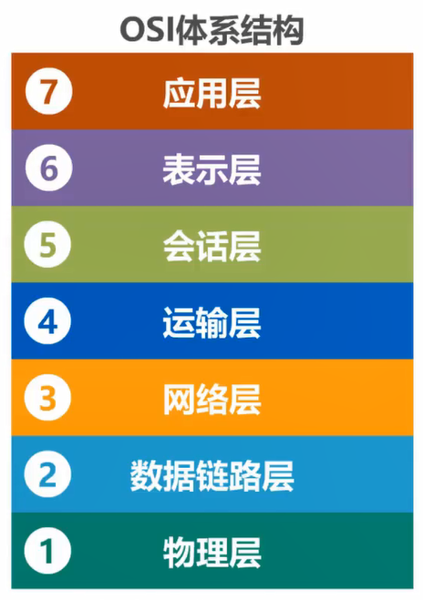

2. TCP/IP体系结构
   
   - OSI制定完成时间较晚，在其制定期间，互联网迅速发展，乃至形成了一个**事实上的国际标准**——TCP/IP体系结构
   - 
       - TCP/IP结构删除了OSI体系中的表示层和会话层，将OSI中的数据链路层和物理层合并为网络接口层——OSI中的有些层功能重复
       - 由于IP协议在中文中叫做网际协议，网络层也叫作网际层
   - 
       - 路由器只有网络接口层和网际层
       - 网络接口层没有指定网络接口的具体类型，因而可以是网线，也可以是WIFI，亦或其他介质。由于该层没有具体规定，TCP/IP协议实际只有3层
       - IP协议是该结构的**核心**，它负责**统一网络接口**，并为TCP和UDP协议**提供服务**
       - TCP向应用层相应协议提供**可靠传输**服务，而UDP则为相应协议提供**不可靠传输服务**

3. 原理体系结构
   
   - TCP/IP结构的网络接口层不适合教学，因而产生了一个用于教学的原理体系结构
   - 

### 计算机网络体系结构分层的必要性

- 计算机网络是一个复杂的系统。实现计算机网络，需要解决很多问题。
- 网络结构分层是将大问题划分为小问题，每一层为一个模块。通过实现多个模块，即可实现计算机网络
1. 物理层的任务
   
   - 在**两台主机**之间传输数据，应该使用何种物理接口？应该使用什么信号表示比特0和1

2. 数据链路层的任务
   
   - 在**同一网络（多台主机）**下，一台主机发出数据，如何知道接收的主机是谁？进而，如何标识同一网络中的各主机（主机编制，如MAC地址）
   - 如何从比特流中区分地址和数据？
   - 如何实现以太网交换机？

3. 网络层的任务
   
   - 
   - 在**不同网络**下，每一个网络中的主机地址可能相同，如何标识不同网络的地址？（如IP地址）
   - 路由器如何转发分组？使用哪条路径？

4. 运输层的任务
   
   - 主机接收到数据后，应该给**哪个进程**使用？
   - 出现传输错误，如误码、丢包时，如何处理？
   - 

5. 应用层的任务
   
   - 编写不同的应用协议，以支持不同的功能。程序只要按照协议设计，就能够实现特定的功能
   - 例如：支持万维网应用的HTTP协议、支持电子邮件的SMTP协议和支持文件传送的FTP协议

6. 总结
   
   - 

### 网络通信举例

- 浏览器想要访问网页，需要想服务器发送请求
- 
- 应用层根据HTTP协议，生成对应的**报文**，并交给运输层
  - 
- 运输层给报文添加TCP报文段。该报文段的作用是标识进程，以及稳定传输。随后交给网络层
  - 
- 网络层在TCP报文的基础上添加IP数据段，成为**IP数据报**。其作用是使报文能够被路由器转发。随后交给数据链路层
  - 
- 数据链路层给IP数据段添加以太网首部和尾部，使之成为**帧**。
  - 以太网首部的作用：让帧在**一段链路，或一个网络**中传输，被目的主机接收
  - 以太网尾部的作用：让目的主机检查帧是否有误码。
  - 随后将帧交给物理层
  - 
- 物理层将栈转换为**比特流**，并在前面添加前导码（作用是让目的主机做好接收帧的准备）。物理层将比特流发送给路由器
  - 
- 路由器对比特流和帧进行解码，根据IP数据段，将生成的新的比特流发送给服务器。
- 服务器通过层层解码，得到请求报文

### 专用术语

1. 实体
   - 实体：**任何**可发送或接收信息的**硬件或软件进程**
   - **对等实体**：收发双方相同层次的实体。
   - 

2. 协议
   - 协议：控制**两个对等实体**进行**逻辑通信**的规则的集合
   - 
   - 协议三要素：语法、语义、同步
   - :one:语法：定义所交换信息的格式
     - 
     - 以IP数据报为例，语法规定了有哪些字段，以及这些字段的位置
   - :two:语义：定义通信双方所要完成的操作
   - :three:同步：定义收发双方的时序关系
     - 
3. 服务
   - 在协议的控制下，两个对等实体间的逻辑通信使得本层能够**向上一层提供服务**。
   - 要实现本层协议，还需要**使用下面一层所提供的服务**
   - 协议是水平的，而服务是垂直的
   - 下层的协议对于上层的实体是透明的，即实体能使用下层提供的服务，但不知道实现该服务的具体协议——接口和实现相分离
   - 
   - **服务访问点**：**同一系统**中**相邻**两层的实体交换信息的**逻辑接口**，用于区分不同的服务类型
     - 数据链路层的服务访问点为帧的类型字段
     - 网络层的服务访问点为IP数据报首部的协议字段
     - 运输层的服务访问点为端口号
   - **服务原语**：上层使用下层服务时与下层交换的**命令**
   - 
   - **协议数据单元PDU**：**对等实体**之间传送的数据报称为**该层的PDU**
     - 不同层的PDU的名称不同
   - **服务数据单元SDU**：同一系统内，**层与层之间交换**的数据包称为SDU
   - 

# 2. 物理层

## 2.1 基本概念

- 物理层考虑的是怎样在连接各种计算机的**传输媒体上传输数据比特流**
- 物理层**为数据链路层屏蔽了传输数据的具体媒介和协议**，数据链路层直接使用物理层提供的数据即可。
- 传输媒体可以分为引导型传输媒体和非引导型传输媒体
- 
- 传输媒体众多，因而物理层协议众多，**物理层协议的主要任务**如下：
- :one:机械特性：指明接口所用接线器的形状和尺寸、引脚数目和排列、固定和锁定装置
- :two:电气特性：指明在接口电缆的各条线上出现的**电压范围**
- :three:功能特性：指明某条线上出现的某一电平的**电压的意义**
- :four:过程特性：指明不同功能的各种可能**事件的出现顺序**

## 2.2 传输媒体

- **传输媒体不属于物理层**。一定要加入计算机网络体系结构的话，应该放在物理层下面
- 导引型传输媒体有：同轴电缆、双绞线、光纤、电力线
- 非导引型传输媒体：无线电波、微波、红外线
1. 同轴电缆
   - 
   - 内导体材质为铜
   - 由于在横切面图中，各层都是同心圆，因而叫做同轴电缆
   - 有两种同轴电缆
     - :one:基带同轴电缆（$50 \Omega$）：数字传输，过去用于局域网。由于价格较贵，且布线不灵活，随着集线器的出现，被双绞线取代
     - :two:宽带同轴电缆（$75\Omega$）：模拟传输，目前用于有线电视

2. 双绞线
   - 把两根互相绝缘的铜导线放在一起，按照一定规则绞合起来，就是双绞线
   - 绞合的作用：
     - 部分抵御来自外接的电磁波干扰
     - 减少相邻导线的电磁干扰
   - 
   - 
   - 家用双绞线装修指南：
   - 

3. 光纤
   - 光纤非常细（多模光纤：50微米、62.5微米；单模光纤：9微米），需要多层包裹成为光缆，以**提高机械强度**
   - 
   - 光纤的优点：
     - 通信容量大（最高30000GHz带宽）
     - 传输损耗小，远距离传输时更加经济
     - 抗雷电和电磁干扰性能好
     - 保密性好
     - 体积小，重量轻
   - 光纤的缺点：
     - 割接需要专用设备
     - 光电接口价格贵
   - 光纤传输原理：
     - 基本结构：
       - 
     - 
     - 当光从高折射率的媒体射向低折射率的媒体时，折射角大于入射角。因此，如果入射角足够大，就会出现**全反射**
     - 
     - 光通过不断反射前进
     - 多模光纤和单模光纤
     - 

4. 电力线
   - 性能一般
   - 
   - 简单来说，就是在插座上插上电力猫，用电线当作网线，就能当路由器使用

5. 无限电波
   - 无限电波的范围是电磁波频谱的一个子集
   - 
   - 无限电波的波长范围：
   - 
   - 无限电波传播方式：
   - 

6. 微波
   - 
   - 微波主要是直线传播，且会穿透电离层，因而不能依靠电离层的反射来传播
   - 两种传播方式：地面微波接力通信和卫星通信
   - 

7. 红外线：
   - 以前的电脑有红外通信的功能，但现在已被淘汰
   - 红外线的特点：
     - 点对点无线传输
     - 只能直线传输，不能有障碍物，且传输距离短
     - 传输速率低

## 2.3 传输方式

1. 串行传输、并行传输
   - 串行传输需要1条通道，而并行传输需要n条通道
   - 远距离传输，如计算机网络，大多使用串行传输
   - 而计算机内部，如CPU和内存之间，使用并行传输

2. 同步传输、异步传输
   - :one:同步传输：发送的**比特流是连续的**，接收端在每个比特信号的**中间时刻**进行检测，判断是0还是1。由于设备的时钟频率不同，会产生**时钟累计误差**，导致接收信号的判别错位
   - 使收发双方时钟同步的方法：
     - 外同步：收发双方之间**额外建立**一条单独的**时钟信号线**
     - 内同步：发送端将时钟同步信号**编码到发送数据**中一起传输（曼彻斯特编码）
   - 
   - :two:异步传输：发送的比特流以字节为单位发送，字节与字节之间不一定连续，时间间隔也不固定
   - 字节中的每个比特是连续的，对于一个字节来说，是同步传输的方式。
   - 

3. 单向通信、双向交替通信、双向同时通信
   - 
   - 单向通信只需要一条信道，而其他两种都需要2条信道

## 2.4 编码与调制

1. 基本概念
   - 
   - 计算机上的文字、图片、音视频可以统称为**消息**
   - 运送消息的实体称为**数据**，用二进制表示
   - 数据传输时，要变为电**信号**进行传输
   - **基带信号**：信源发出的原始电信号。分为数字基带信号和模拟基带信号。总线的数据传输是数字基带信号，而麦克风的记录时模拟基带信号。
   - 对基带信号进行**编码**，使之转化为**数字信号**，在数字信道中传输
   - 对基带信号进行**调制**，使之转化为**模拟信号**，在模拟信道中传输
   - 传输媒体可以包含多条信道

2. 码元
   - 使用波形表示数字信号时，代表不同离散数值的**基本波形**称为码元
   - 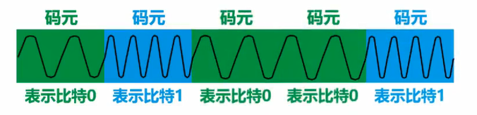

3. 编码
   - 将模拟基带信号编码为数字信号
   - :one:不归零编码（NRZ）：只有高低电平，没有零电平
     - 问题：如何判断连续的高电平或低电平？
     - 解：按照时间长度来判断。但需要一个**额外信道**传输时钟信号，使收发双方**同步**
     - 计算机网络不采用这种编码
     - 
   - :two:归零（RZ）编码
     - 每个码元在传输结束后信号归零。此时，接收方只要在信号**归零后采样**，不需要单独的时钟信号
     - 这种编码相当于把**时钟信号编码在了数据**之内，这成为**自同步信号**
     - 但归零信号会浪费数据带宽
     - 
   - :three:曼彻斯特编码
     - 电平在码元中间时刻跳变，即表示时钟，又表示数据
     - 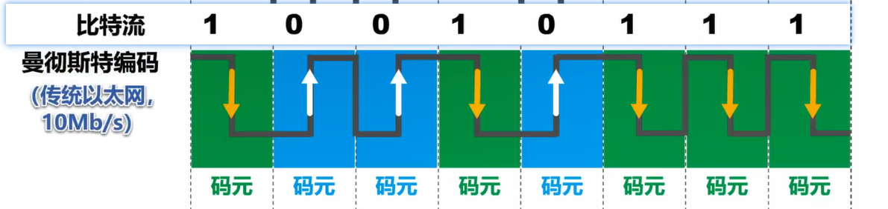
     - 传统以太网采用这种编码
   - :four:差分曼彻斯特编码
     - 电平在码元中间跳变仅表示时钟
     - 用码元开始出电平是否发生变化表示数据
     - 
     - 拆分曼彻斯特编码比曼彻斯特编码变化少，更适合较高的传输速率

4. 调制
   - :one:基本调制方法（二元制）
     - 
   - :two:混合调制（多元制）：使一个码元包含更多比特
     - 由傅里叶变换，任何函数都可以由三角函数的叠加而成。三角函数的标准式为$f(x) = Asin(\omega x + \varphi) + b$，其中**频率、相位和振幅**是三个基本元素
     - 由于频率是相位随时间的变化率，所以一次只能调制两者中的一个
     - 而振幅与两者无关，是一个独立的参数。通常情况下，相位和振幅可以结合起来调制，称为正交振幅调制（QAM）
     - QAM-16：
       - 有12种相位，每种相位有1-2种振幅可选。总共产生16个码元，故**一个码元包含4个比特**
       - 每个码元与4个比特的对应关系采用格雷码，即任意两个相邻码元只有1个比特不同，如图： 
       - 
       - 如果随意定义码元与比特的映射关系，会造成错位，如图：
         - 
         - D有1位错位，而E全错

## 2.5 信道极限容量

1. 引入
   - 信号在经过信道后，会产生失真。如果失真不严重，接收到的信号可以被识别。如果失真严重，会造成无法识别
   - 信号波形**失去了码元之间的清晰界限**，这种现象叫做**码间串扰**
   - 
   - 失真的原因有：
     - 码元传输速率
     - 信号传输距离
     - 噪声干扰
     - 传输媒体质量

2. 奈氏准则
   - 在理想条件下（不存在噪声干扰），**为了避免码间串扰**，码元传输速率是有**上限的**。
   - 理想低通信道的最高码元传输速率为 $2W(Baud) = 2W（码元/秒）$
   - 理想带通信道的最高码元传输速率为 $W(Baud) = W（码元/秒）$
   - 其中，$W$为信道带宽，单位为Hz；单位Baud，波特，即码元/秒
   - 码元传输速率又叫波特率、调制速率、波形速率或符号速率
   - 波特率与比特率的关系：当1个码元携带$n$比特的信息量时，$波特率 = n\times比特率$

3. 香农公式
   - 存在高斯白噪声的信道的极限信息传输速率
   - 
       - 注意信噪比反推$\frac S N$
   - 香农公式的假设仍旧是一种理想状态，没有考虑到脉冲干扰等因素
- 根据奈氏准则和香农公式，在**带宽一定**的情况下，要想提高信息的传输速率，就要采用**多元制**，并**提高信道中的信噪比**

# 3. 数据链路层

## 3.1 概述

1. 研究对象
   - 
   - 研究数据链路层时，可以**忽略网络结构的其它层**，只研究数据在4段链路上的传输

2. 概念
   - 链路（link）：一个节点到其相邻节点的一段物理线路$(u,v)$
   - 数据链路（data link）：把实现通信协议的硬件和软件加到链路上，形成了数据链路
   - 数据链路层以**帧**为单位，传输和处理数据

3. 三个重要问题
   
   - **任何数据链路层协议都要实现这3个机制**
   
   - :one:封装成帧
     
     - 
     - 将网络层数据报封装成帧
   
   - :two:差错检测
     
     - 在传输过程中，可能出现误码。
     - 发送方在发送前，根据算法，求出帧的检错码，存放在帧尾的FCS中
     - 接收方收到帧后， 根据检错码，使用算法，可知道是否出现误码
   
   - :three:可靠传输
     
     - 如果数据链路层为上层提供不可靠传输服务，直接丢弃有误码的帧即可
     - 如果数据链路层提供可靠传输服务，则以某种方式，使得发送方发送该帧的正确副本。

## 3.2 封装成帧

1. **封装成帧**：数据链路层给上层交付的协议数据单元添加帧头和帧尾，使之成为帧
   - 
2. 数据链路层如何从物理层提供的比特流中提取帧？
   - :one:对于PPP帧，其帧头和帧尾各有1个字节的标志字段，作用是**帧定界**
   - 
   - 接收方的数据链路层可以根据帧定界标志，提取出帧
   - 
   - :two:对于不存在帧定界标志的帧，如以太网V2的MAC帧，物理层会给帧添加前导码。前导码的前7字节为时钟同步码，之后的1字节为帧**开始定界符**
   - 
   - 此外，以太网还规定了帧间间隔，因此不需要帧结束定界符
   - 
3. 透明传输：数据链路层对**上层**交付的**传输数据没有任何限制**，就好像数据链路层不存在
   - 举例来说，数据链路层协议应该解决**上层数据中包含与帧定界符一样的比特段的问题**
   - :one:**面向字节**的物理链路使用**字节填充**的方法实现透明传输
     - 在上层数据的帧定界符前加上转移字符
     - 
     - 如果上层数据包含转移字符，则在该转义字符前添加转义字符
     - 
   - :two:**面向比特**的物理链路使用**比特填充**的方式实现透明传输
     - 零比特填充法
     - 
     - 由于帧定界符为`01111110`，帧发送前，数据部分每有5个连续`1`，就插入1个`0`
4. 为了提高帧的传输效率，应使帧数据部分的长度尽可能地大
5. 每一种数据链路层协议都规定了帧的**数据部分的长度上限**，即最大传送单元（MTU, maximum transfer unit）

## 3.3 差错检测

1. 引入
   - 实际的通信链路不是理想的，比特在传输过程中可能产生差错：`1`变成`0`，`0`变成`1`。这称作**bit error**，比特差错，或**误码**
   - 误码率BER（bit error rate）：在一段时间内，传输错误的比特占所传输比特总数的比率
   - 使用差错检测码来检测**帧**在传输过程中是否出现误码，是数据链路层所要解决的重要问题之一 
   - 

2. 奇偶校验
   - 在待发送的数据后面添加**1位奇偶校验位**，记录整个数据中`1`为奇数（奇校验）还是偶数（偶校验）
   - 如果有奇数个误码产生，则接收方可以检查出误码
   - 如果有偶数个误码产生，则接收方不能检查出误码（漏检）
   - 由于BER过高（$E(BER)= 50\%$），一般不采用这种校验方式

3. 循环冗余校验
   - CRC，cyclic redundancy check
   - 收发双方约定好一个**生成多项式**$G(x)$
   - 发送方基于待发送的数据和生成多项式计算出冗余码，将其添加到待发送的数据尾部，然后发送
   - 接收方根据生成多项式计算收到的数据是否产生误码
   - 计算方法如下：
     - 
     - 如果$G(x) = x^4 + x^2 + x + 1$，则生成多项式各项系数构成的比特串为`10111`
     - 
   - 例子：
     - :one:发送数据：
     - 
     - $G(x)$的最高位为$3$，故在发送的信息后面补3个$0$
     - 这里的除法是异或操作
     - 余数的位数要与$G(x)$的最高位相同，不足补$0$
     - :two:接收数据：
     - 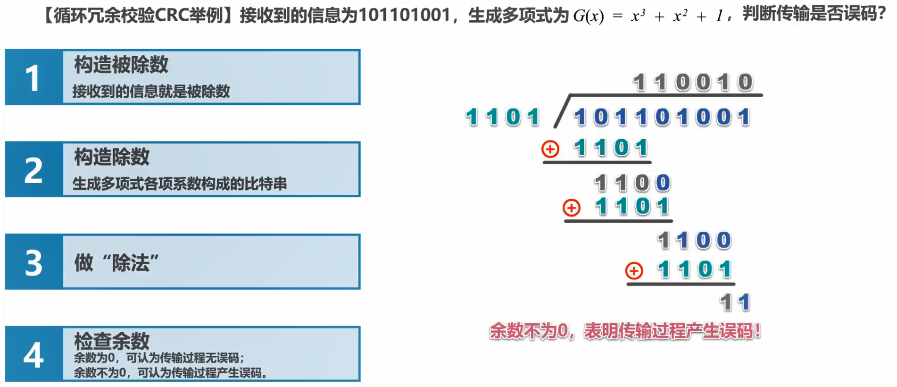

4. 注意事项
   - 检错码只能检测出帧出现误码，但不能定位错误，更**无法纠正错误**
   - 要想纠错，需要使用冗余信息更多的纠错码进行前向校验。但开销较大，**一般不使用**
   - CRC的漏检率非常低。虽然计算较复杂，但硬件实现较容易，因而**广泛应用于数据链路层**

## 3.4 可靠传输

### 基本概念

- 使用差错检测技术，接收方的数据链路层可检测出帧是否有误码
- 根据数据链路层向上层提供的**服务类型**：
  - **不可靠**传输服务：**丢弃**有误码的帧，然后什么也不做
  - **可靠**传输服务：使用某种方法，实现这样的功能——不论发送端发送什么，接收端都会收到
- 一般情况下，**有线链路的误码率较低**。为了较小开销，**不要求**数据链路层向上层提供可靠传输服务。即使有误码，可靠传输也是由上层处理。
- **无线链路**易受干扰，**误码率较高**，要求数据链路层向上层提供可靠传输服务

---

- 传输差错包括比特差错、分组丢失、分组失序和分组重复
- 分组丢失、分组失序和分组重复一般**不出现**在数据链路层，而是其上层
- 因此，可靠传输服务**不仅局限于数据链路层**，其他各层也可以实现可靠传输
- 

### 实现机制

- 可靠传输的实现机制有3种：
  - 停止-等待协议SW
  - 回退N帧协议GBN
  - 选择重传协议SR
- 这三种可靠传输实现机制的基本原理**不局限于数据链路层**，而是可以应用到其他各层协议

#### 停止-等待协议 SW

- SW，Stop-and-Wait
1. 基本原理（理想情况）
   - 理想情况下，发送方发送分组，等待接收方回复。
   - 如果接收方收到的分组没有误码，则给发送方回复**接收分组（ACK）**
   - 如果收到的数据有误码，则回复发送方**否认分组（NAK）**，将当前分组**丢弃**，等待发送方**重传**
   - 

2. 情况一：发送方的分组丢失
   - 发送方在发送分组后，会一直等待，直到收到接收方的回复。但若分组丢失，接收方不会回复任何信息。发送方陷入**阻塞**状态
   - 解决方法：发送方发送分组后，启动一个**超时计时器**。如果在**设置的重传时间**以内，没有收到接收方的回复，则**重传原分组**。——这叫做**超时重传**
   - 一般的重传时间可以略大于平均RTT
   - 

3. 情况二：接收方的回复丢失，发送方发送重复分组
   - 接收方收到分组，回复ACK；**ACK在传输过程中丢失**，发送方超时重传原分组。
   - 为了**避免分组重复**，必须给每个分组带上序号。接收方收到了相同序号的分组后，**丢弃**即可
   - 对于SW，只要保证每次新发送的分组序号与上一次的不同即可，因而可以**用一个bit来表示**
   - 
       - 注意到，丢弃分组返回的也是ACK

4. 情况三：ACK迟到
   - 由于ACK迟到，发送方启动超时重传；在ACK收到后，发送方又发送新的分组
   - 原分组由于序号相同，被接收方丢弃，同时返回ACK；新的分组稍晚到达接收方，接收方同样返回ACK
   - 发送方已经发送新分组，再收到ACK，应该再次发送更新的分组。但该ACK其实是对原分组的确认，应该被发送方忽略
   - 由此，应该**给ACK加上序号**，序号与分组的序号相同
   - 

5. 注意事项：
   - 数据链路层一般不会出现ACK迟到的情况，在**数据链路层实现**SW可以不用给ACK编号
   - 超时计时器的重传时间应仔细选择，一般略大约平均RTT
     - 数据链路层**点对点的往返时间比较确定**，重传时间方便设定
     - 运输层**端对端往返时间非常不确定**，难以设定重传时间

6. SW的信道利用率
   - 
   - $T_D$为分组发送时延，$T_A$为ACK发送时延
   - 前提：**忽略**:one:接收方对分组的**处理时延**和:two:发送方对ACK的**处理时延**；分组和ACK**及时发送**，没有误码
   - 信道利用率$U=\frac{T_D}{T_D+RTT+T_A}$
   - $T_A \ll T_D$，一般可以忽略；故，$U$的大小取决于$\frac {RTT}{ T_D}$，看一个例子：
     - 
   - 当$RTT \gg T_D$时（如卫星链路），信道利用率非常低
   - 如果出现重传等传输错误，信道利用率还会进一步降低
   - 为了克服**SW信道利用率低的缺点**，产生了后两种实现机制

#### 回退N帧协议 GBN

- GBN，Go-Back-N
1. 引入
   - SW的信道利用率低
   - 如果采用流水线方式发送一组数据，则可以提高信道利用率
   - 
       - GBN就是以流水线方式传输分组

1. 原理
   - 采用$n$个比特给分组编号，即序号$0$到$2^n -1 $
   - 发送窗口的尺寸$W_T\in (1, 2^n - 1]$
     - 如果$W_T =1$，则GBN协议退化为SW协议
     - 如果$W_T \ge 2 ^n$，则可能接收重复的分组
   - 接收窗口的尺寸$W_R$始终为$1$
   - 发送方一次发送$W_T$个分组；接收方每次接收一个分组，如果分组序号相同、没有误码，则接收该分组，同时接收窗口向右移动
   - 
   - 接收方发回一组ACK。发送方每收到一个ACK，发送窗口向右移动一格
   - 
   - 此时，发送方可以将已经发送的分组从缓存中删除，而接收方可以将收到的分组交给上层处理

2. 累计确认
   - 接收方**不一定要为每个分组**回复一个ACK，而是每收到几个分组，才对最后一个分组回复ACK。其中，$ACK_n$表示第$n$个分组及以前的分组都已经收到
   - 发送窗口可以根据$ACK_n$，一次滑动多个格子
   - 优点：
     - 减少接收方的开销
     - 网络资源占用更少
   - 缺点：
     - 不能及时反馈接收分组的信息

3. 有差错情况
   - 假设传输过程中，第一个分组出现误码，则第一个分组被丢弃
   - 由于之后的分组序号与接收窗口当前的序号都不匹配，故**剩余的全部分组被丢弃**
   - 在这种情况下，要么接收方通知发送方重传，要么发送方触发超时重传
   - 发送方需要重传这$W_T$个分组——回退N帧名称的由来
   - 当通信线路质量不好时，GBN的信道利用率并不比SW高
- 由于在工作过程中，接收窗口和发送窗口不断滑动，这类协议也被称为**滑动窗口协议**

#### 选择重传协议 SR

1. 引入
   - GBN的问题在于：接收窗口尺寸$W_R=1$，即**只能按照顺序**，正确接收分组。对于一组分组，如果其中一个分组丢失，或者出现误码，就必须丢弃其后正确的分组，这是对通信资源的浪费
   - 如果$W_R>1$，就可以接收一组分组中正确的分组，而**只对丢失或出现误码的分组要求重传**

2. 原理
   - 采用$n$个比特给分组编号
   - 发送窗口的尺寸$W_T \in (1,2^{n  -1}]$
   - 接收窗口的尺寸$W_R\in (1, W_T]$
   - 
   - 发送方先发送0-3的分组，分组2丢失
   - 接收窗口向右移动2格，并标记3为已接收，同时回复编号为0、1和3的ACK
   - 发送窗口在收到ACK后，向右移动2格，标记3为已发送。随后发送分组4和5
   - 发送方的分组2随后满足超时重传条件，重传分组2
   - 只有收到分组2，接收窗口才能继续移动；同理，只有收到编号为2的ACK，发送窗口才能继续移动

3. 注意事项
   - SR中**没有**GBN中**累计重传**的概念，SR中的接收方必须对每一个分组回复一个ACK

## 3.5 点对点协议PPP

1. 基本介绍
   - PPP（Point-to-Point Protocol）是目前使用最广的点对点**数据链路层**协议。
   - 使用场景：
     - :one:ISP拥有一批IP地址，可以访问因特网。用户计算机想要访问因特网，必须向ISP购买服务（ISP向用户提供**以太网接口**）。用户计算机只有获取合法的IP地址后，才能访问因特网。
     - 用户与ISP通信时，使用的数据链路层协议就是PPP
     - :two:PPP也应用于广域网路由器之间的专用线路
     - 
   - PPP为在点对点链路传输各种协议数据报提供了一个标准方法，由三部分组成：
     - 将各种协议数据报**封装成帧**
     - 链路控制协议LCP：建立、配置，以及测试数据链路的连接
     - 一套网络控制协议NCPs：每一个协议支持不同的网络层协议
     - 

2. 帧格式
   - 
   - Flag字段：PPP的帧定界符，值为`0x7E`，即`0b01111110`
   - Address字段：值为`0xFF`，是预留字段
   - Control字段：值为`0x03`，是预留字段
   - Protocol字段：指明数据部分交给哪个协议处理：
     - 
   - FCS（frame check sequence，帧检验序列）字段：由CRC计算出的校验位

3. 透明传输——**面向字节**的异步链路**采用插入转义字符**的字节填充法
   - 
   - 将每一个帧定界符`7E`变为`7D5E`
   - 将每一个转义符`7D`变为`7D5D`
   - 对于每一个数值小于`0x20`的字符（ASCII控制字符），在该字符前插入`7D`，并将该字符编码加上`0x20`
   - 接收方按照**反变换**即可恢复原来的数据部分

4. 透明传输——**面向比特**的同步链路采用**插入比特`0`**的比特填充法
   - 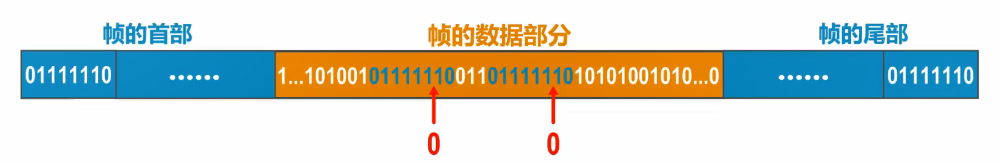
   - 发送方对帧的数据部分进行扫描，只要有5个连续的`1`，就在后面填充`0`
   - 接收方对帧的数据部分进行扫描，只要有5个连续的`1`，就删除后面的`0`
   - 这两个操作一般由硬件实现

5. 差错检验
   
   - FCS由CRC-CCITT计算而得：$\text{CRC-CCITT} = x^{16} + x^{12}+x^5+1$
   - 对于每一个PPP帧，接收方进行CRC校验；如果正确，则接收帧；否则，丢弃帧
   - PPP向上层提供**不可靠**传输服务

6. 工作状态
   
   - 

## 3.6 媒体接入控制 MAC

### 基本概念

- 对于总线型局域网，如果两个主机同时发送信号，会造成信号碰撞，导致2台主机的通信都失败
- 
- 因此，**共享信道**要重点解决的问题之一，就是协调**多个**发送和接收**站点**对**一个共享传输媒体**的占用，即媒体接入控制（MAC，medium access control）

---

- MAC的分类：
- 
- 静态划分信道
  - 预先分配好信道。由于不具备灵活性，对于突发性数据传输，信道利用率低；
  - 该方法通常在**无线网络的物理层**使用，而非数据链路层使用
- **受控接入**分为集中控制和分散控制，由于竞争原因，受控接入**已经被淘汰**
  - 集中控制：主站以循环方式询问每个站点是否有数据发送。只有被询问的站点才能发送数据。问题在于主站故障会导致所有站点无法联网
  - 分散控制：各站点以循环的方式传递令牌。只有拿到令牌的站点才能发送数据，并将令牌交给下一个站点
- 随机接入
  - 所有站点**竞争**，随机地在信道上发送数据。如果同一时刻至少有两个站点发送数据。由于信号碰撞，**所有站点的发送都失败**。
  - 该类协议重点要解决:one:如何避免冲突:two:发生冲突后如何快速恢复通信

- :warning:随着交换技术的成熟，具有更高性能的使用点对点链路和链路层交换机的**交换式局域网**在**有线领域**完全取代了共享式局域网。由于无线信道的广播特性，**无线局域网仍然使用共享媒体技术**

### 静态划分信道

1. 信道复用
   - 复用（multiplexing）：通过一条物理线路同时传输多路用户的信号
   - 当网络中传输媒体的传输容量大于多条单一信道传输的总通信量时，可利用复用技术，在一条物理线路上**建立多条信道**，充分利用传输媒体的带宽
   - 
   - 常用的信道复用技术：
     - 频分复用FDM
     - 时分复用TDM
     - 波分复用WDM
     - 码分复用CDM

2. 频分复用
   - 
   - 将频带划分为多个子频带，中间使用隔离频带防止信号干扰
   - 不同的用户占用**不同的频带资源**，可以实现**并行**通信

3. 时分复用
   - 
   - 同一时刻，一个用户占用全部频带资源。
   - 以类似round robin算法的形式实现**并发**通信。具体来说，在每一个TDM帧内，用户发送的数据有一个固**定的序号**。因此，每一个用户发送数据的周期为传输一个TDM花费的时间

4. 波分复用
   - 波分复用就是光的频分复用
   - 
   - 将波长相近的光经过光调制器（复用器）变为一束光，在光纤上传输。传输速率为所有信道速率之和。使用光解调器将多路光还原
   - 由于光信号传输一段距离后会衰减，因而需要放大器

5. 码分复用CDM
   - 该技术主要用于多址接入，更常用的名称是CDMA（code division multiple access）
   - FDM和TDM同样用于多址接入，相应的名称为FDMA和TDMA
   - 复用和多址的区别
     - 复用是将一个媒体资源划分为**多个**独立的子信道
     - 多址是动态分配信道给用户，用户只是**暂时地**占用该信道
     - 这一小节讨论的是静态划分信道，因而不必讨论多址
   - 与FDM和TDM不同，CDM的用户可以在**同样的时间，使用同样的频带进行通信**
   - 基本原理：
     - 每一个比特时间被划分为$m$个短的间隔。一个短的间隔称为**码片（chip）**
     - 每一个站点都被指派一个唯一的$m$ bit码片序列
       - 如果该站点要发送比特`1`，需要发送其$m$ bit码片序列
       - 如果该站点要发送比特`0`，需要发送其$m$ bit码片序列的反码
     - 任意两个站点的码片序列必须正交
   - 应用：
     - 
     - 
     - 

### 随机接入——CSMA/CD协议

1. 引入
   - 早期的共享式以太网使用总线型结构，易发生信号碰撞。如何检测碰撞，并在碰撞后快速恢复，是重要的问题。
   - 为了解决这一问题，产生了CSMA/CD协议
   - 载波监听多址接入/碰撞检测，CSMA/CD，carrier sense multiple access/ collision detection

2. 基本介绍
   - 多址接入MA：
     - 多个站点连接在一条总线上，**竞争**使用总线
   - 载波监听CS：
     - 每一个站点在**发送帧之前**，要检测总线是否空闲
     - 如果总线空闲96比特时间（帧间间距，参考[3.2 封装成帧 2. :two:](# 3.2 封装成帧)），则发送该帧
     - 否则持续等待，直到空闲96比特时间
   - 碰撞检测CD：
     - 每一个正在发送帧的站点**边发送边检测碰撞**
     - 一旦发现总线上出现碰撞，立即停止发送，等待一段随机时间后再次发送

3. 争用期（碰撞窗口）
   - 
   - $\tau$为以太网任意两个站点之间**最长**的传播时延
   - 主机最多经过$2\tau$的时间，就可以检测到本次发送是否产生碰撞
   - 因此，以太网**端到端最长往返传播时延**$2\tau$被称为争用期，或碰撞窗口
   - 如果在争用期内没有发生碰撞，则此次发送不会产生碰撞
   - 在以太网中，发送帧的主机越多，$\tau$越大，发生碰撞的概率就越大。因此，共**享式以太网不能连接太多主机，使用的总线也不能太长**
   - $10Mb/s$以太网把争用期定为512比特发送时间，即$51.2\mu s$，故总线长度不能超过$5120m$。但考虑到信号衰减等因素，以太网总线长度不能超过$2500m$

4. 最小帧长
   - 站点边发送边检测。如果帧长太小，站点发送完毕时（不再检测），帧头不一定达到目标站点。如果此时发送碰撞，**站点无法得知碰撞信息**
   - 以太网规定**最小帧长为64字节**，即512bit——争用期的长度。如果发送的数据较少，则使用填充字节，以满足最小帧长
     - $最小帧长 = 争用期 \times 信道带宽$，传统以太网的数据传输速率为$10Mb/s$，争用期为$51.2\mu s$，故最小帧长为$512b$
   - 最小帧长确保了主机在**帧发送完成之前就检测到**该帧是否会遭遇碰撞：
     - 如果争用期内没有碰撞，那么后续发送的数据一定不会发生碰撞——其他站点一直等待
     - 如果在争用期内发送碰撞，立即停止发送。此时已发送的数据小于64字节。接收方只需**将小于64字节的帧视作无效帧**，丢弃即可

5. 最大帧长
   - 帧的数据部分的最大长度为1500字节
   - 
   - 设置最大帧长是为了：
     - :one:防止某些需要发送数据的站点陷入长时间等待
     - :two:防止接收方主机缓冲区不够

6. 退避时间
   - 退避时间是**发生碰撞后，主机需要等待**的一段随机时间
   - 计算退避时间，采用**截断二进制指数退避算法**
   - $退避时间 = 基本退避时间 \times 随机数 = 2\tau \times r$，其中$r \in \set{0,1,...,2^k - 1}, k = \min \set{重传次数,10}$
   - 举例：
   - 
   - 当碰撞次数增加时，$k$增加，该算法会使**重传需要推迟的时间的期望增加**，从而减小发生碰撞的概率
   - 当重传达16次仍不能成功时，表面同时发送帧的主机太多。主机丢弃该帧，并向高层报告

7. 信道利用率
   - 假设：发送帧时**不会产生碰撞**
   - 令帧的发送时间为$T_0$，发送一帧占用总线的时间为$T_0+\tau$，则极限信道利用率为$\frac {T_0} {T_0 +  \tau} = \frac 1 {1 + \frac \tau {T_0}}$
   - 端对端距离越短，$\tau$越小，同时帧长度越大，信道利用率越高

8. 帧发送流程
   - 

9. 帧接收流程
   - 

### 随机接入——CSMA/CA协议

- CSMA/CD应用于总线局域网，而CSMA.CA应用于无线局域网
1. 引入
   - 在无线局域网中，仍然可以使用载波监听多址接入（CSMA），只在信道空闲时传输数据
   - 但无线局域网不能使用碰撞检测（CD），原因为：
     - :one:无线信道信号强度的动态范围非常大，无线网卡**收到的信号强度远小于发送信号的强度**。如果要在无线网卡上实现CD，对硬件要求极高
     - 由于无线电波传播的性质，会产生隐蔽站问题，导致无法实现CD
     - 

2. 基本介绍
   - **802.11无线局域网**使用CSMA/CA协议，在CSMA的基础上增加碰撞避免功能（CA，collision avoidance），而不是CD
   - 由于**不可能避免所有的碰撞**，且**无线信道误码率较高**，802.11标准还使用**数据链路层确认机制**（[停止-等待协议 SW](# 停止-等待协议 SW)）保证数据被正确接收
   - 两种不同的媒体接入控制方式：
     - 分布式协调功能（DCF, distributed coordination function）：没有中心控制站点，每个站点使用CSMA/CA协议争用信道获取发送权。这是802.11的**默认方式**
     - 点协调功能（PCF，point coordination function）：使用集中控制的接入算法（一般在接入点AP实现集中控制）。这是802.11的可选方式，**实际很少使用**

3. 帧间间隔
   - IFS，interframe space
   - 所有站点必须在检测到信道空闲后，**再等待一段时间**，才能发送帧。这段时间称为IFS
   - IFS的长短取决于站点发送的帧类型：
     - :one:高优先级帧等待时间较短，可优先获得发送权。
     - 短帧间间隔SIFS，时长$28\mu s$，是最短的IFS。使用SIFS的帧类型有ACK帧、CTS帧、过长的MAC帧分片后的数据帧、所有回答AP探寻的帧
     - :two:低优先级帧等待时间较长，在等待时间内可能被高优先级帧抢占发送权，因而只能推迟发送。
     - DCF帧间间隔DIFS，时长$128\mu s$，在DCF方式中用来发送数据帧和管理帧

4. CSMA/CA工作原理
   - 
   - 源站为什么在检测到信道空闲后还要再等待DIFS时间？——考虑到其他站可能有高优先级的帧要发送
   - 目的站在接收数据后为什么要等待SIFS才发送ACK帧？——SIFS用来分隔属于一次对话的各帧。在SIFS时间内，一个站点（这里指源站）应该能够从发送方式切换到接收方式
   - 注意到，这里除了有IFS，还有一段**退避时间**
   - 当站点检测到信道是**空闲**的，且当前发送的数据帧与上一次发送的数据帧**不连续**，不使用**退避算法**
   - 以下情况使用退避算法：
     - 发送数据帧前，信道处于忙状态
     - 每次重传数据帧时
     - 每次成功发送后，要连续发送下一个帧

5. 退避算法
   - 站点为退避计时器设置一个随机的退避时间：
     - 当退避时间减小到零时，开始发送数据
     - 当时间未减小到零，信道又转入忙状态时，冻结退避计时器。当信道变为空闲，又经过DIFS后，才启动退避计时器
     - 在进行第$i$次退避时，$退避时间 = 基本退避时间 \times r$，其中基本退避时间为一个时隙的长度，$r$在$\set{0,1,...,\min\set{255,2^{2+i}-1}}$中随机选一个
   - 退避算法例子：
     - 

6. 信道预约
   - 源站在发送数据帧之前，先发送一个短的控制帧，称为**请求发送（RTS，request to send）**，包括源地址、目的地址和通信所需的时间
   - 若目的站收到源站发送的RTS帧，且信道空间，就发送一个**允许发送（CTS，clear to send）**，也包括通信的持续时间
   - 源站收到CTS帧后，**等待SIFS**，即可发送**数据帧**
   - 
   - 其它各站点，在收到CTS帧后，推迟接入无限局域网，保证源站和目的站之间的通信不受干扰
   - 如果RTS帧发送碰撞，源站就收不到CTS帧，需执行退避算法重传RTS帧
   - 由于**RTS和CTS帧很短，发生碰撞的概率、碰撞产生的开销很小**，而数据帧由于长度大，碰撞概率高、碰撞开销大。因此，**用较小的代价执行信道预约是值得的**

7. 虚拟载波监听
   - RTS、CTS和数据帧都会携带通信所需要的时间
   - 站点只要监听到这3个帧的任意一个，而**不需要真正监听到信道上的信号**，就能知道信道被占用的持续时间。
   - 该机制可以用来减少隐蔽站带来的问题，举例如下：
     - 
     - A发送RTS帧给B，B给每个站点发送CTS
     - 尽管C无法监听A对B的通信，但由于CTS包含传输数据帧的时间，C在这段时间内不会占用信道

## 3.7 MAC地址、IP地址、ARP协议

- MAC地址是以太网的MAC子层所使用的地址，属于**数据链路层**
- IP是**网际层**所使用的地址
- ARP协议属于**网际层**，作用是已知设备的IP地址，使用该协议可以获取设备的MAC地址；
- 这三者虽然不同层，但有一定关系，因此放在一起讨论

### MAC地址

1. 基本介绍
   - 当多个主机连接在同一个广播信道（如总线型局域网）上，要想实现两个主机之间的通信，每个主机都必须有一个唯一的标识，即一个数据链路层地址
   - 每个主机发送的**帧中必须携带发送主机和接收主机的地址**，由于这类地址用于媒体接入控制（MAC），也被称为**MAC地址**
   - MAC地址一般被**固化（出厂时就确定的）**在网卡（网络适配器）的EEPROM中，因此MAC地址也称为**硬件地址**
     - 
   - MAC地址也称为**物理地址**，但和物理层无关
   - 一般来说，用户主机会包含两个网卡：有线网卡和无限网卡。每一个网卡都有一个全球唯一的MAC地址。而交换机和路由器有更多的网络接口，所以会有更多的MAC地址。故，MAC地址是**对网络接口的唯一标识，而不是对网络设备的唯一标识**

2. IEEE 802的MAC地址格式
   - 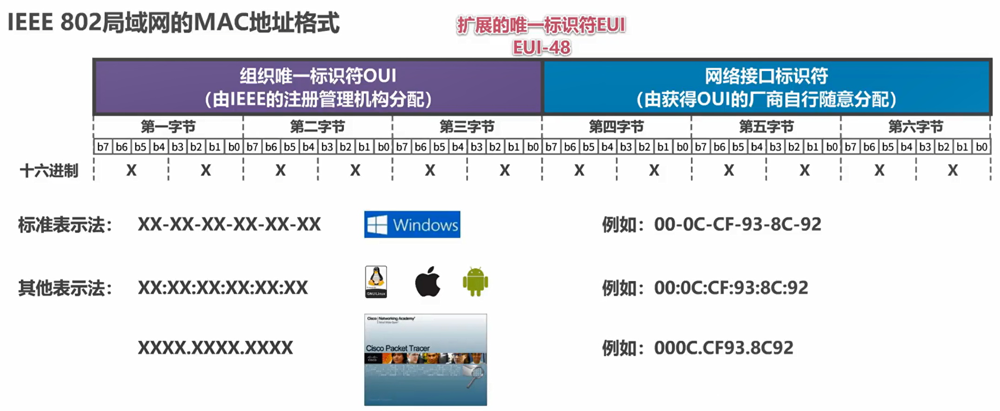
       - 根据组织标识符OUI，可以查到哪家公司生产了该网卡
   - 
       - 覆盖表示本地单播的优先级比全球单薄高

3. MAC地址发送顺序
   - 字节发送顺序：第一字节$\rightarrow$第六字节
   - 字节内比特发送顺序：$b_0 \rightarrow b_7$
   - 总的比特发送顺序**与表示顺序不一致**

4. 单播MAC地址举例
   - 
   - 在局域网内广播时，会给其他所有主机发送帧
   - 目标地址与站点MAC地址不匹配时，帧会被丢弃

5. 广播MAC地址
   - 
   - 广播地址为`FF-FF-FF-FF-FF-FF`

6. 多播MAC地址
   - 

### IP地址

1. 基本介绍
   - IP地址是因特网上主机和路由器所使用的地址，用于标识两部分信息：
     - 网络编号：标识不同的网络
     - 主机编号：标识同一网络不同主机（或路由器各接口）
   - 
   - MAC地址不具备区分不同网络的功能。
     - 如果只是一个独立的网络，不接入因特网，可以只使用MAC地址（虽然一般用户不这么用）
     - 如果主机所在网络要接入因特网，则需要IP地址和MAC地址

2. 网络体系结构中IP地址与MAC地址
   - 
   - 黑色表示本层无需知道上层的数据报的内容的意义

3. 数据包转发的例子
   - 
   - 注意到，转发过程中，**源IP地址和目的IP地址保持不变**，而**源MAC地址和目的MAC地址随逐个链路改变**
   - 实际转发过程中，H1知道R1相应接口的IP地址为IP3，却**不知道对应的MAC地址**。R1、R2页如此。此时，**需要ARP协议**，由已知的IP地址，找到对应的MAC地址

### ARP协议

- 地址解析协议，ARP
1. 工作原理
   - 当B给C发送数据包时，由于不知道目的MAC地址，需要查询主机B中的ARP高速缓存表
   - 
   - 如果找到，则填入MAC帧
   - 如果没有找到，主机B以**广播**的形式发送ARP请求报文，要求知道主机C的MAC地址
   - 
   - 主机C将**B的IP地址与MAC地址记录**到自己的ARP高速缓存表中，并给B发送ARP响应，告知自己的MAC地址
   - 
   - 主机B将C的IP地址和对应的MAC地址记入ARP高度缓存，将该MAC地址填入MAC帧，并发送
   - 

2. 动态与静态
   - ARP表中的每条记录，都有其类型：
   - :one:动态：主机自动获取，其生命周期默认为2分钟。原因是目标主机的MAC地址可能更换，例如网卡坏了
   - :two:静态：手工配置，不同OS下的生命周期不同

3. 注意事项
   1. ARP协议是逐链路进行的，没法跨越多条链路
      - 
   2. 除ARP请求和响应外，ARP还有其他类型的报文
   3. ARP没有安全验证机制，因此存在ARP欺骗（攻击）问题

## 3.8 集线器与交换机

1. 早期的总线型以太网
   - 

2. 使用双绞线和集线器（hub）的星型以太网
   - 在逻辑上**仍旧是一个总线网**，各站点共享总线资源，使用的是CSMA/CD协议
   - 集线器工作在**物理层**，它的每个接口仅转发比特，不进行碰撞检测。CD由站点的网卡进行
   - 集线器有少量的容错能力和网络管理能力。例如，某个站点的网卡出现问题，不停地发送帧。这时，集线器检测到问题后，主动断开与该网卡的连线。
   - 
   - 双绞线和集线器的成本低于同轴电缆，因此总线型以太网被淘汰。
   - 多个集线器在物理层实现以太网拓展
     - 
     - 原本的三个局域网都是独立的碰撞域，在使用主干集线器拓展后，三个局域网都**属于一个碰撞域**。一个站点发送帧，整个碰撞域中的其他站点都能收到该帧
     - 

3. 交换机（switch）
   - 在发送**单播帧**时，交换机只会把该帧转发给目的主机，而非转发给所有主机。这使得交换机相比集线器，具有巨大优势
     - 
   - 以太网交换机有**多个接口**。每个接口可以与一台主机或另一个以太网交换机相连。以**全双工方式**工作
   - 交换机具有**并行性**，能同时连通多对接口，使多对主机**能同时通信，无碰撞**
   - 交换机具有多种速率的接口
   - 交换机工作在**数据链路层**。它受到帧后，在**帧交换表**中查找帧的目的MAC地址对应的接口号，然后通过该接口转发帧
   - 交换机即插即用，其帧交换表是通过**自学习算法**逐渐建立起来的
   - 帧的两种转发方式：
     - 存储转发
     - 直通交换：采用**基于硬件**的交叉矩阵，交换时延非常小，但不检查帧是否有问题
   - 
   - 交换机的成本与集线器相近，但性能远好于集线器，故集线器也被淘汰

4. 交换机和集线器对比
   - 多个站点同时发送单播。集线器方式会产生信号碰撞，将错误的帧发给每一台主机。而交换机方式能够正确地将每个帧送达目标站点
     - 
   - 多个集线器和多个交换机
     - 
     - 

## 3.9 交换机自学习和转发帧的流程

- 交换机刚启动时，其帧交换表是空的。随着网络中各主机的通信，交换机通过**自学习算法**逐渐建立帧交换表
- 
- 主机A向主机B发送帧。交换机1收到帧，记录A的MAC地址和对应的接口。然后，交换机1在帧交换表中查找B对应的接口。该接口不存在，于是交换机1向**其他所有端口盲目转发该帧**，主机B成功收到该帧，其他主机拒绝该帧。注意到，交换机2收到该帧后，以同样的方式处理。
- 
- 主机B向A发送帧。交换机1记录B的MAC地址，以及对应的接口。由于帧交换表中存在A对应的接口，**交换机明确地将该帧转发给对应接口**
- 
- 主机E向A发送帧。交换机2记录E对应的接口，并从之前记录的A的接口转发给交换机1。交换机1登记该接口为E对应的接口，并将帧转发给A
- 
- 假设A、G和交换机1用集线器连接，形成总线型网络。G要给A发送帧，A和交换机1都会收到。交换机1接收后，记录G对应的接口号。由于A和G（**发送方和接收方）的接口一样，交换机1不会转发该帧**。
- :warning:帧交换表中的每条记录都**存在有效时间**，**到期后自动删除**——MAC地址与交换机接口的对应关系不是永久的

## 3.10 交换机的生成树协议STP

1. 引入
   - 对于以下的交换机网络，只要有一条链路出现故障，就会存在一个网络无法与其他网络通信
   - 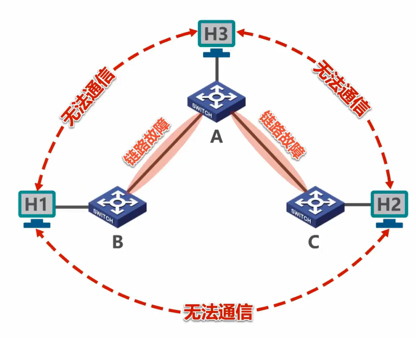
   - 解决方法：添加**冗余链路**以提高以太网的可靠性（在B和C之间添加一条链路）
   - 但冗余链路会形成**网络环路**，会带来以下问题：
     - 
     - 假设从H1发送广播帧，每个交换机收到后，会向其他接口发送。广播帧会按照图中箭头的方向，不停地在各交换机之间转发
     - :one:广播风暴：大量消耗网络资源，是网络无法正常转发其他数据帧
     - :two:主机收到重复数据帧，大量消耗主机资源
     - :three:交换机的帧交换表震荡：如图，主机H1对应的接口不断地发送变化

2. 生成树协议STP
   - STP，spanning tree protocol
   - 交换机使用STP，可以避免网络环路带来的问题
   - 不管交换机之间采用何种物理连接，交换机能够**自动计算并构建一个逻辑上没有环路的网络**，其拓扑结构为树形
   - 当有新加入的交换机，或网络物理拓扑发送变化，交换机都会重新计算生成树
   - 

## 3.11 虚拟局域网VLAN

1. 引入
   - 交换机工作在数据链路层，多个交换机互联而成的以太网中的**所有站点属于一个广播域**
   - 巨大的广播域会带来很多问题：
     - **广播风暴**：占用CPU资源和网络资源
     - 难以管理和维护
     - 潜在的安全问题
   - 

2. 已有的解决广播风暴的方法
   1. 尽可能不使用广播
      - :x:不可能，TCP/IP协议栈中很多协议都会使用广播，比如ARP、RIP和DHCP
   2. 使用路由器分割广播域
      - 路由器工作在**网络层**
      - 默认情况下，路由器不转发广播数据包，因此可以隔离广播域
      - 
      - 
      - 但，路由器**成本较高**，局域网内部使用路由器隔离广播域不现实

3. VLAN
   - 虚拟局域网（VLAN，virtual local area network）是一种将局域网内的设备划分成**与物理位置无关的逻辑组**的技术。
   - 
   - 使用VLAN后，同一VLAN内部可以广播通信，不同VLAN之间不能广播通信
   - 

4. VLAN实现机制
   - VLAN机制**要求交换机具备以下两个条件**：
     - :one:支持IEEE 802.1Q帧
     - :two:各端口可以支持不同的端口类型

5. IEEE 802.1Q帧
   - 也称为Dot One Q帧，是对**MAC帧格式进行了拓展**，插入了4字节的VLAN标记
   - 
   - VLAN标记的最后12比特称为**VLAN标识符VID**，它唯一地标识了该帧属于哪一个VLAN
     - VID的取值范围是0到4095，**有效取值范围是1到4094**
   - 802.1Q帧**由交换机来处理。不是由用户主机处理**
     - 当交换机**收到普通以太网帧**时，将其插入VLAN标记变为802.1Q帧——“**打标签**”
     - 当交换机**转发802.1Q帧**时，**可能**删除VLAN标记变为普通以太网帧——“**去标签**”

6. 端口类型
   - 交换机有3种端口类型：:one:Access、:two:Trunk、:three:Hybrid
   - 交换机各端口的默认VID
     - 在思科交换机上被称为Native VLAN，即本征VLAN
     - 在华为交换机上被称为Port VLAN ID，即端口VID，简称PVID

7. Access端口
   - Access端口一般用于**连接用户计算机**
   - Access端口**只能属于一个VLAN**，其PVID与VID相同
   - Access端口**接收**处理方法：一般**只接受未打标签**的MAC帧，根据**接收端口的PVID给帧打标签**
   - Access端口**发送**处理方法：若帧的VID与端口PVID相等，则**去标签**后**转发**；否则不转发
   - 
   - 

8. Trunk端口
   - Trunk端口一般用于**交换机之间或交换机与路由器之间**的互联
   - Trunk端口**可以属于多个VLAN**
   - Trunk端口**发送**处理方法：
     - 对于VID等于PVID的帧，**去标签再转发**；
     - 对于VID不等于PVID的帧，**直接转发**
   - Trunk端口**接收**处理方法：
     - 接收未打标签的帧时，**根据PVID给帧打标签**
     - **直接接收**打标签的帧
   - 
   - 
   - :warning:互连的Trunk端口的**PVID可能不同，这会造成转发错误**

9. Hybrid端口
   - Hybrid端口是华为路由器独有的功能。既可以用于交换机之间，也可用于交换机与用户计算机之间
   - Hybrid端口可以属于多个VLAN
   - Hybrid端口**发送**处理方法：查看帧的VID这是否在端口的**去标签列表**中。如果是，去标签后转发；如果否，直接转发
   - Hybrid端口**接收**处理方法：直接接收打标签的帧；给未打标签的帧打标签
   - 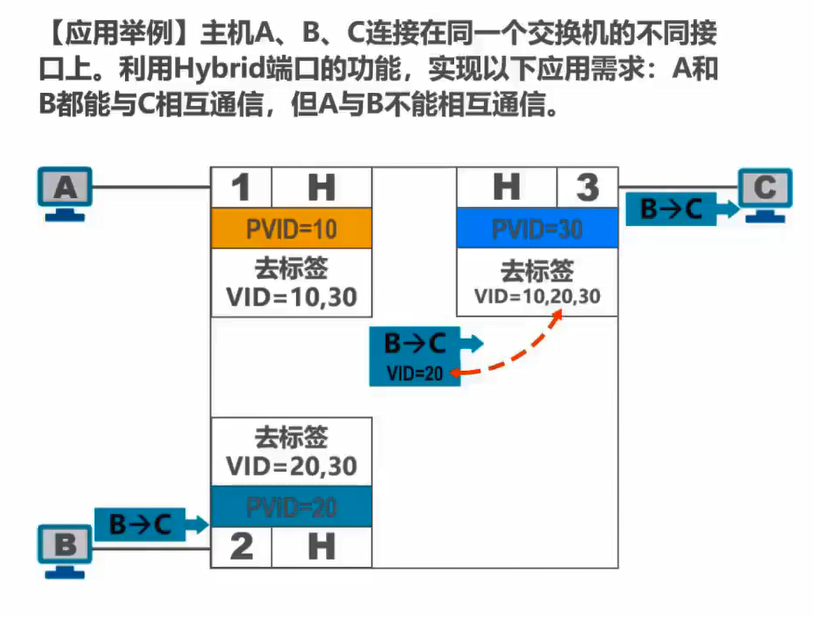
   - 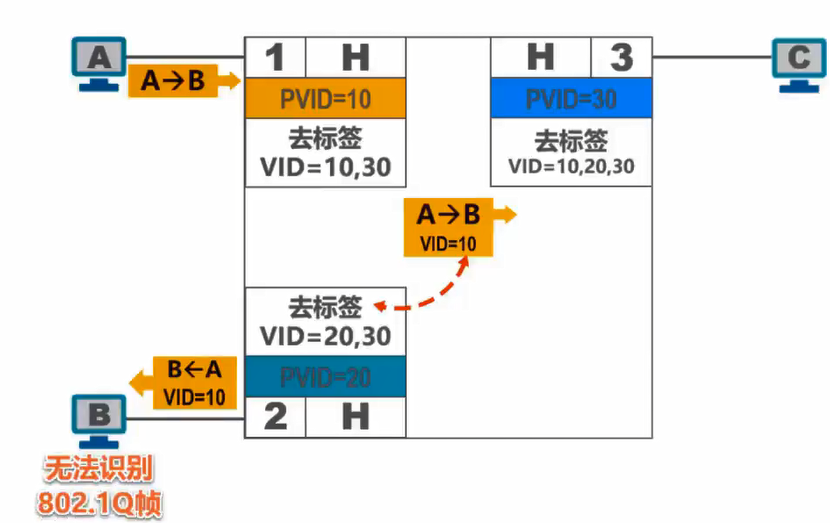
   - B无法识别未去标签的802.1Q帧，只能丢弃该帧

# 4. 网络层

## 4.1 概述

- 网络层的主要任务是实现网络互连，进而实现数据包在**各网络**之间的传输
- **网络层需要解决以下问题**：
  - :one:网络层向运输层提供怎样的服务，可靠传输还是不可靠传输？
  - :two:网络层寻址问题
  - :three:路由选择问题
- 因特网是全球用户数量最多的互联网，它使用TCP/IP协议栈。故本章通过学习TCP/IP的网际层来学习网络层

## 4.2 网络层提供的两种服务

1. 面向连接的虚电路服务
   - 可靠通信由网络来保证
   - 双方主机通信前，必须建立网络层连接——虚电路（VC，virtual circuit）。VC并不像电路交换那样建立了一条物理的连接，而只是**逻辑上的连接**
   - 通信双方**沿着已建立的虚电路发送分组**
   - 目的主机的地址仅在连接建立阶段使用，之后每个分组的首部**只需携带虚电路的编号**
   - 如果使用这种服务，在使用可靠传输的网络协议，就能够保证可靠传输
   - 通信结束后，需要释放之前建立的虚电路
   - 

2. 无连接的数据报服务
   - 可靠通信应当由**用户主机保证**
   - 不需要建立网络层连接
   - 每个分组可走不同路径
   - 每个分组首部必须携带目的主机的完整地址
   - 由于**网络本身不提供端到端的可靠传输**服务，网络中的路由器可以做得比较简单，价格相对低廉
   - **因特网**采用了这种思想，即将**复杂的网络处理功能置于因特网边缘（用户主机和运输层），而将相对简单的分组交付功能置于因特网核心**
   - 

## 4.3 IP地址

### 概述

- IPv4地址是**因特网上**的每一台主机（或路由器）的**每一个接口**被分配的全世界**唯一**的**32比特**的标识符
- IP地址由ICANN（Internet Corporation for Assigned Names and Numbers）进行分配
  - 2011年2月3日，互联网号码分配管理局IANA（由ICANN行使职能）宣布IPv4已经分配完毕
  - 中国在14年逐步停止向新用户分配IPv4地址，开始部署IPv6
- IPv4地址的编制方法经历了下面3个历史阶段：
  - :one:1981年：分类编址
  - :two:1985年：划分子网
  - :three:1993年：无分类编址
- IPv4采用**点分十进制**表示

### 分类编址

- 
- 5类地址都有固定的格式，包括网络号和主机号的字段长度，以及固定的前几个比特（红色标出）

---

| 网络类别 | 第一个可指派的网络号 | 最后一个可指派的网络号 | 最大可指派网络数量              | 每个网络最大主机数量              |
| ---- | ---------- | ----------- | ---------------------- | ----------------------- |
| A    | 1          | 126         | $2^{8 - 1} - 2=126$    | $2^{24} - 2 = 16777214$ |
| B    | 128.0      | 191.255     | $2^{16 - 2} = 16384$   | $2^{16} -2 =65534$      |
| C    | 192.0.0    | 223.255.255 | $2^{24 - 3} = 2097152$ | $2^8-2=254$             |

| 网络类别 | 第一个地址     | 最后一个地址          | 地址数量     |
| ---- | --------- | --------------- | -------- |
| D    | 224.0.0.0 | 239.255.255.255 | $2^{28}$ |
| E    | 240.0.0.0 | 255.255.255.255 | $2^{28}$ |

---

**注意事项**：

- 只有A、B和C类地址可分配网络中的主机或路由器的接口
- 主机号全0的地址是网络地址，**不能分配**给主机或路由器的接口
- 主机号全1的地址是广播地址，**不能分配**给主机或路由器的接口

---

**一般不使用的特殊IP地址：**

| 网络号    | 主机号     | 作为源地址              | 作为目的地址             | 含义               |
| ------ | ------- | ------------------ | ------------------ | ---------------- |
| 0      | 0       | :heavy_check_mark: | :x:                | 本网络上的本主机（DHCP）   |
| 0      | host id | :heavy_check_mark: | :x:                | 本网络上的某台主机        |
| 全1     | 全1      | :x:                | :heavy_check_mark: | 本网络内的广播地址        |
| net id | 全1      | :x:                | :heavy_check_mark: | 对net id网络的所有主机广播 |
| 127    | 非全0或非全1 | :heavy_check_mark: | :heavy_check_mark: | 用于本地软件环回测试       |

### 划分子网

1. 引入
   - 某公司有一个大型局域网，希望接入因特网，于是申请了一个B类地址
   - 
   - 现在，该公司需要将内部的局域网划分为3个独立的网络，且都要接入互联网
   - 
   - 如果要为子网2和子网3申请新的网络号，有以下**缺点**：
     - 需要等待时间，花更多钱
     - 浪费原有网络剩余的大量IP地址
     - 增加其他路由器路由表记录的数量
   - 如果从原**主机号中借用一部分作为子网号**，依靠网络号和子网号，就能实现3个独立的能接入因特网的子网（**对于每一个子网来说，其网络号等于原网络号+子网号）**
   - 

2. 子网掩码
   - 32比特的子网掩码可以表示**子网的网络号占哪几位，即原主机号有几位被用于子网号**
   - 子网掩码使用连续的`1`来对应网络号和子网号
   - 子网掩码使用连续的`0`来对应主机号
   - 将划分子网的IPv4地址与对应的子网掩码做**逻辑与运算**，就可以得到**子网的网络号**
   - 

3. 例子
   - 
   - 注意到，每个子网都有**自己的网络地址和广播地址**

4. 默认子网掩码
   - 定义：未划分子网的情况下使用的子网掩码
   - 默认子网掩码中`1`的长度**等于网络号的长度**
   - 

### 无分类编址

1. 引入
   - 划分子网的IPv4地址造成**数量巨大的C类网**因为其地址空间太小而**没有充分利用**，但因特网的IP地址仍在加速消耗，整个IPv4地址空间面临全部耗尽的威胁
   - 因特网工程任务组IETF提出了采用**无分类编址**的方法解决IP地址紧张的问题，同时成立IPv6工作组
   - 1993年，IETF发布了**无分类间路由选择（CIDR，Classless Inter-Domain Routing）**的RFC文档

2. CIDR
   - CIDR消除了传统的A、B、C类地址，以及划分子网的概念
   - CIDR可以更加有效地分配IPv4的地址空间
   - CIDR使用**斜线记法**，在IPv4地址后面加上`/`，后面在写上**网络号所占的比特数**
     - 如`128.14.25.7/20`，`20`表示前20个比特用于网络号，后12个比特用于主机号
   - CIDR将**网络前缀都相同的连续的IP地址**组成一个**CIDR地址块**
   - 只要知道CIDR地址块中的**任何一个地址**，就可以直到该地址块的**全部细节**，包括：
     - 地址块的最小/最大地址
     - 地址块的地址数量
     - 地址块聚合某类网络（A、B、C）的数量
     - 地址掩码（子网掩码）

3. 举例
   - 

4. 路由聚合（构造超网）
   - 
   - 假设路由器R1和R2相连，R1需要定期地将5条路由记录通告R2
   - 如果能将这5个IP地址聚合，则R2路由表中只要定期维护来自R1的一个地址
   - 具体做法是：找到这5个地址的**共同前缀的长度**作为网络号的长度，**主机号为全0**，即是聚合地址块的地址
   - 网络前缀越长，地址块越小，路由越具体 
   - 若路由器查表转发分组时，有多条路由可选，则选择网络前缀最长的那个，这称为**最长前缀匹配**

### IPv4应用规划

- 应用规划指：给定一个IPv4地址块，如何将其划分为几个更小的地址块，分配给不同网络使用
- 以下面的例子来说明两种不同的划分方式：
  - 原问题：
  - 
  - 对于问题进行分析：
  - 
1. 定长的子网掩码
   - FLSM，fixed length subnet mask
   - 使用同一个子网掩码划分子网
   - 每个子网分配的IP地址数量相同，会造成IP地址的浪费
   - :pencil: 在该问题中，从主机号借用3个比特作为子网号。这样，子网数量为$2^3 = 8>5$，每个子网的数量为$2^{8 - 3} = 32 >25$，满足题目要求
   - 子网掩码为`255.255.255.11100000`，即`255.255.255.224`
   - 具体的分配方式：
   - 
   - 可以看出，FLSM的分配方式造成了IP地址的浪费，对于网络N5尤其如此

2. 变长的子网掩码
   - VLSM，variable length subnet mask
   - 使用**不同的子网掩码**来划分子网
   - 每个子网所分配的IP地址**数量可以不同**，**尽可能减少**对IP地址的浪费
   - 类似于[CIDR](# 无分类编址)
   - :pencil:解题过程：
   - 先分析每个网络需要的主机数，进而可以得出每个网络的网络号的位数
   - 
   - 划分方式如下：
   - 
   - 从地址**需求量最多的网络开始分配**，每个网络都要分配$2^n$个地址，$n$是使$2^n \ge 地址需求数$成立的最小整数。因此，**只能尽可能减少浪费**，无法杜绝浪费

## 4.4 IP数据报的发送和转发过程

- 该小节包括：主机发送IP数据报、路由器转发IP数据报
- 在之后的例子中，我们忽略**:one:使用ARP协议获取MAC地址的过程:two:交换机自学习和转发帧的过程**
- 下面以例子来讲解IP数据报的发送和转发过程：
- 有这样两个网络被路由器连接：
- 
- 在同一网络中发送IP数据报，称为**直接交付**，例如$A\rightarrow C$；在不同网络中发送IP数据报，称为**间接交付**，例如$A\rightarrow D$
- 源主机如何知道目的主机是否与自己在同一个网络中？——将**源主机的网络号与目的主机的网络号比较**，网络号可由**IP地址与子网掩码**作**逻辑与运算**得到
- 
- 主机C怎么知道应该将IP数据报交给哪个路由器转发？——**用户指定**本网络中的一个路由器负责转发，被指定的路由器称为**默认网关**
- 
- 路由器如何转发IP数据报？
  - :one:检查IP数据报首部是否出错
    - 如果出错，丢弃该数据报，并通知源主机
    - 如果没错，则执行:two:
  - :two:根据IP数据报的目的地址在路由表中查找匹配的元素：
    - 如果找到，则转发给元素中指示的下一跳
    - 如果找不到，丢弃该数据报，并通知源主机
- 
- 广播数据报：
- 
- 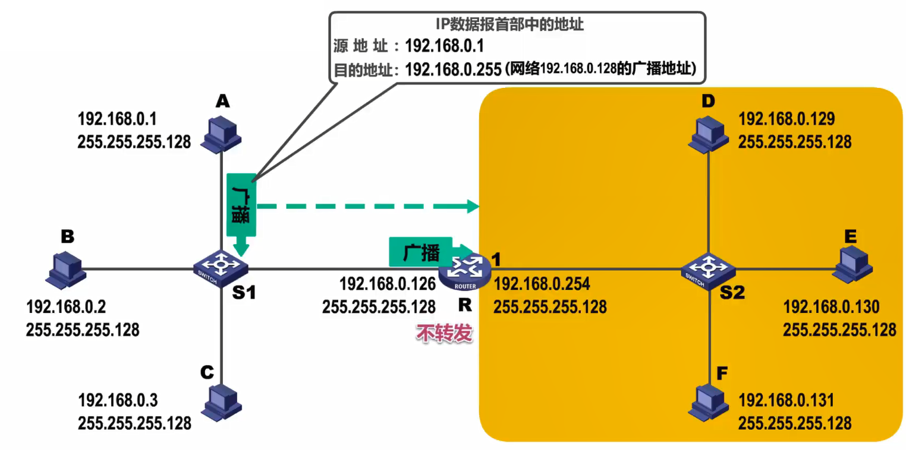
- 注意到，不管是本网络还是其他网络的广播数据报，路由器都不会转发

---

一道题目：

## 4.5 静态路由配置

1. 静态路由配置
   - 用户或网络管理员**人工配置路由表**
   - 这种人工配置方式简单、开销小，但**不能及时适应网络状态的变化**
   - 一般只在小规模网络中使用
   - 
   - 对于**直连**路由器的网络，路由器自动配置
   - 如果R2想要转发IP数据报给`192.168.1.0/24`的网络，则需要在R2的路由表中**手动配置**下一跳的IP地址

2. 默认路由
   - 
   - R2接入因特网，如果要给因特网中的**多个IP地址**在R2的路由表中创建记录，则R2的查表速度会大幅下降
   - 默认路由：如果**目的地址不在路由表**中，则从默认路由`0.0.0.0/0`对应的下一跳的IP地址发出
   - 默认路由也是手动配置的

3. 特定主机路由
   - 为特定的主机设置路由表记录，一般由网络管理人员使用，或者因为安全原因使用
   - 

4. 使用静态路由配置可能出现以下错误，这些错误会**导致路由环路**
   
   - :one:配置错误
   - :two:聚合了不存在的网络
   - :three:网络故障

5. 配置错误
   
   - 
   - R2错误地将`192.168.1.0/24`的下一跳设置为R3，而R3的下一跳又是R2，造成了路由环路
   - 解决方法:bulb:
   - 为了**防止IP数据报在路由环路中永久兜圈**，IP数据报首部有**生存时间TTL字段**。IP数据报进入路由器后，其TTL减小1。如果$TTL = 0$，则数据报被丢弃，否则被转发

6. 聚合了不存在的网络
   - 
   - R2向R1转发目的地址为聚合路由中不存在的IP地址的数据报。理论上，R1找不到该IP，应该丢弃该数据报。但由于R1的默认路由（静态配置）设置为R2，造成环路
   - 解决方法:bulb:
   - 将不存在的IP地址设置为**黑洞路由**，其下一跳为`null0`，相当于丢弃该数据报
   - 

7. 网络故障
   - 
   - 链路故障造成R1使用默认路由，将数据报转发给R2
   - 解决方法:bulb:
   - 将路由表中失效的IP地址设置为黑洞路由，待故障修复后再改为直连对应的接口
   - 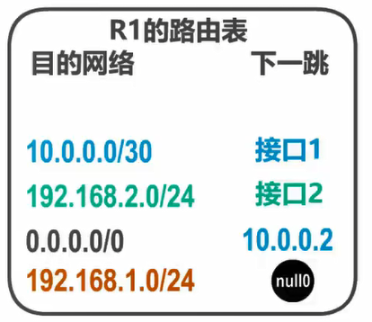

## 4.6 路由选择协议

### 概述

1. 两种路由选择
   
   - |      | 静态路由选择                   | 动态路由选择                    |
     | ---- | ------------------------ | ------------------------- |
     | 介绍   | **人工配置**的路由信息            | 路由器通过路由选择协议**自动获取路由信息**   |
     | 优缺点  | 简单、开销小；但**不能及时适应网络状态变化** | 较复杂、开销大；**能较好地适应网络状态的变化** |
     | 应用场景 | 小规模网络                    | 大规模网路                     |

2. 因特网采用的路由选择协议的特点：
   - :one:自适应：动态路由选择，能较好适应网络变化
   - :two:分布式：路由器之间交换路由信息
   - :three:分层次：将整个因特网划分为许多较小的**自治系统（AS，autonomous system）**。不同的AS可以**使用不同的协议**

3. 分层次的路由选择协议
   - **AS内**的路由选择称为**域内路由选择**，使用**内部网关协议IGP**
   - **AS之间**的路由选择称为**域间路由选择**，使用**外部网关协议EGP**
   - 

4. 常用的路由选择协议
   - 

5. 路由器基本结构
   - 
   - 路由器由两部分组成：:one:路由选择部分、:two:分组转发部分
   - :one:路由选择部分的核心构件是**路由选择处理机**。其任务是**根据路由选择协议**，周期性地**与其他路由器进行路由信息的交互**，**更新路由表**
   - :two:分组转发部分中，对于一段比特流，将其层层解析为**网络层数据报（分组）**
     - 如果该分组为**数据分组**，则根据分组的目的地址查找**转发表**中的元素，找到则转发，否则丢弃
     - 如果该分组为**路由报文**，则将该分组交给路由选择处理机，以更新路由表
   - 路由表一般**仅包含**从目的网络到下一跳的映射
   - 路由表需要对网络拓扑变化的计算最优化
   - 转发表有路由表得出
   - 转发表的数据结构应当**具有使查找过程最优化**的特性

### 路由信息协议 RIP

1. 基本介绍
   - **路由信息协议（RIP，routing information protocol）**是内部网关协议IGP中最先得到广发使用的协议之一
   - RIP要求自治系统AS的**每一个路由器维护**从它自己到AS内其他网络的**距离向量D-V（distance vector）**
   - RIP使用**跳数（hop count）**作为度量(metric)，以衡量到达目的网络的距离
     - 路由器到**直连**网络的距离为1
     - 路由器到**非直连网络**的距离定义为$所经过的路由器数 + 1$
     - RIP中，一条路径最多只能包含15个路由器，**距离为16意味着不可达**。故，RIP用于小型局域网
   - 

2. 工作原理
   - RIP**优先选择距离短的路由**
     - 
     - $R_1 \rightarrow R_4 \rightarrow R_5$是距离最短的路由，即使其带宽非常小
   - 当到达**同一目的网络**存在**多条距离相等**的路由时，可以进行等**价负载均衡**，即将通信量均匀地分布到多条线路上
     - 
   - RIP的三个要点：
     - 仅和**相邻**路由器交换信息
     - 交换的信息为**自己的路由表**
     - **周期性**交换信息

3. 基本工作过程
   - 路由器刚开始工作时，**只知道自己到直连网络的距离为1**
   - 
   - 每个路由器仅和相邻路由器周期性地交换路由信息，并更新
   - 若干次交换和更新后，每个路由器都知道到达其他网络的最短距离和下一跳地址——**收敛**

4. RIP路由条目更新规则
   - 
   - 对于路由器D来说，C的路由表中的下一跳不重要。D只需要根据C路由表中的目的网络和距离更新自己的路由表
   - 
   - 如果C可以到达某个网络，那么D只需要多经过路由器C，也能到达该网络
   - 更新的规则：
   - 

5. RIP存在“坏消息传播慢”的问题
   - 
   - R1与N1的链路出现故障，R1的路由表更新N1为不可达，而R2的路由表认为N1仍旧可达
   - **假如R2的路由信息先到达R1，R1的路由信息后到达R2**，会产生如下现象：
   - 
   - “坏消息传播慢”，又称为**路由环路**，或**距离无穷计数**问题，这是距离向量算法的一个**固有问题（由算法的本质决定的）**
   - 可以采取以下措施**减少（无法杜绝）**出现该问题的概率：
     - 当路由表发生变化时，立即发送更新报文，而不是周期性发送
     - 让路由器记录收到某特定路由信息的接口，**不让**同一路由信息通过该接口**反方向传送**

### 开放最短路径优先OSPF

1. 基本介绍
   - 开放最短路径优先（OSPF，open shortest path first），是为克服RIP的缺点而开发的
     - 开放：该协议不受某一家厂商控制，是**开源**的
     - 最短路径优先：采用了**Dijkstra算法**求最短路径
   - OSPF基于**链路状态**计算路由，从而保证了**不会产生路由环路**
   - OSPF**不限制网络规模**，更新效率高，**收敛速度快**

2. 链路状态
   - 链路状态：:one:当前路由和那些路由器相连，以及:two:链路的**代价**（cost）
   - 代价可以用费用、距离、时延、带宽等来表示，由网络管理人员决定
   - 代价即为Dijkstra中的**边权重**
   - 例子：
     - 思科路由器计算代价的方法为$cost =\max\set{{\lfloor \frac {100Mbps}{链路带宽}  \rfloor},1}$
     - 链路带宽越大，$cost$越小，最小值为$1$，忽略小数部分
     - 

3. 问候（hello）分组
   - 相邻路由器之间通过交互**问候分组**，建立和维护**邻居关系**
   - hello分组封装在IP数据报中，发往组播地址`224.0.0.5`，协议号为`89`
   - 
   - 发送周期为10秒
   - 如果40秒未收到邻居路由器的hello分组，则认为该邻居不可达
   - 

4. 链路状态通告
   - LSA，link state advertisement
   - LSA包含以下内容
     - 直连网络的链路状态信息
     - 邻居路由器的链路状态信息
   - LSA被封装在**链路状态更新分组LSU**中，采用**洪泛法**发送（网络中每个路由都会收到该分组）
   - 

5. 链路状态数据库LSDB
   - 每个路由器都有一个LSDB，存储LSA
   - 通过各路由器洪泛发送封装有LSA的LSU分组，各路由器的LSDB**最终达到一致——每个路由器都获得了网络图$G(V,E)$的全部信息**
   - 路由器对LSDB使用Dijkstra算法，构建出到达其他路由器的最短路径，即**构建自己的路由表**

6. OSPF的5种分组类型
   - :one:问候（hello）分组：发现和维护邻居路由器的可达性
   - :two:数据库描述（database description）分组：向邻居路由器发送自己的LSDB中**所有LSA的摘要信息**
   - :three:链路状态请求（link state request）分组：请求邻居路由器给自己发送**某些LSA的详细信息**
   - :four:链路状态更新（link state update）分组：洪泛发送该分组，发送自己的LSA
   - :five:链路状态确认（link state acknowledgment）分组：对收到LSU的确认分组

7. OSPF基本工作过程
   - 
   - R1和R2相互发送数据库描述分组
   - R1发现自己缺少某些路由信息，于是发送链路状态请求分组
   - R2收到后，发送LSU分组；R1收到后，发送链路状态确认分组

8. DR & BDR
   - 对于有$n$个路由器的网络，如果不加以限制，则会产生$\frac{n(n -1 )} 2$对邻居关系，发送的多播分组会占用网络资源
   - 采用以下机制加以限制：
     - 根据算法，选举出**指定路由器（DR，designated router）和备用指定路由器（BDR，backup designated router）**
     - 所有**非**DR/BDR路由器**只和DR/BDR建立邻居关系**
   - 这么做，邻居关系的数量减少至$2(n -2 ) + 1$
   - BDR用于在DR故障时担任DR的职责——冗余机制
   - 

9. OSPF应用于大规模网络
   - OSPF把一个AS划分为若干个更小的范围，每一个小范围称作**区域（area）**
   - 每一个区域有一个32比特的区域标识符，可以用点分十进制表示。**主干区域的标识符为全0**，其他区域的标识符互不相同
   - 每个区域中的路由器数量不应超过200个，从而**减小LSA的洪泛发送的范围，减小整个网络上的通信量**
   - 存在以下4种路由器分类：
     - :one:区域内路由器（IR，internal router）：其**接口都在一个区域内**的路由器
     - :two:区域边界路由器（ABR，area border router）：一个接口用于连接自身所在区域，另一个接口连接主干区域的路由器
     - :three:主干路由器（BBR，backbone router）：主干区域内的路由器，包括ABR
     - :four:自治系统边界路由器（ASBR，AS border router）：主干区域内的一个路由器，它连接到其他AS
   - 交换LSA的方式：
     - 
     - 非主干区域向主干区域发送本区域的LSA，主干区域向非主干区域发送其他区域的LSA

### 边界网关协议 BGP

1. 引入
   - 内部网关协议IGP（例如RIP、OSPF）：
     - 使分组在一个AS内尽可能有效地从源网络传输到目的网络
     - AS内部相对独立，**IGP不需要考虑AS外部的情况**
   - 外部网关协议EGP（例如BGP）：
     - 在不同AS内，**代价的定义可能不同**。因此，对于AS之间的路由选择，使用代价作为度量，**寻找最佳路由是不可能的**
     - AS之间的路由选择必须考虑多方面的因素，比如政治、经济、安全等
     - 

2. BGP工作原理
   - 在配置BGP时，每个AS的管理员要选择至少一个路由器作为该AS的**BGP发言人**
   - 不同AS的BGP发言人要交换信息，需要**先建立TCP连接，端口号为179**
     - 在TCP连接上交换BGP报文以**建立BGP会话**
     - 利用BGP会话**交换路由信息**
     - 交换路由信息的两个BGP发言人，称为**邻站（neighbor）或对等站（peer）**
   - BGP发言人除了负责运行BGP外，还**负责运行本AS使用的IGP**
   - BGP发言人交换**网络可达性信息**（到达某网络所经过的一系列AS）
   - BGP发言人根据网络可达性信息，构造出一个不存在回路的AS连通图
   - 

3. BGP适用于多级结构的因特网
   - 

4. BGP-4的四种报文：
   - 打开（open）报文：与相邻的BGP发言人建立关系，使通信初始化
   - 更新（update）报文：通告某一路由的信息、列出要撤销的多条路由
   - 保活（keepalive）报文：周期性验证邻站的连通性
   - 通知（notification）报文：发送检测到的差错

## 4.7 IP数据报首部格式

- 每一行有32个bit，即4字节，固定部分共5行，故为20字节
1. 版本：占4 bit，表示IP协议的版本。通信双方的版本必须一致。目前广泛使用的版本号为4，即IPv4
2. 首部长度：占4 bit，表示IP数据报的长度。这字段的值**以4 Byte为单位**
   - 最小取值为5，表示IP数据报只有20字节固定部分
   - 最大取值为15，表示IP数据报有20字节固定部分和40字节可变部分
3. 可选字段：占1 - 40 Byte不等。用来支持排错、测量及安全等措施。实际很少被使用。由于该字段导致IP数据段首部长度可变，这**增加了路由器处理IP数据报的开销**
4. 填充字段：**确保首部长度为4字节的整数倍**，使用全0进行填充
5. 区分服务：占8 bit，不同数值代表不同等级的服务，一般不使用。
6. 总长度：占16比特，以字节为单位，故最大值为$2^{16} - 1 = 65535 B$，表示IP数据报的总长度
   - IP数据报 = 首部 + 数据载荷
7. 当总长度超过了数据链路层协议规定的MTU时，需要将IP数据报分片，以下3个字段用于分片：
   - :one:标识：占16 bit，属于同一个数据报的各个分片数据报具有相同的标识
   - :two:标志：占3 bit，每个bit含义如下：
     - DF位：`1`表示不允许分片，`0`表示允许分片
     - MF位：`1`表示其后还有分片，`0`表示这是最后一个分片
     - 保留位：必须为`0`
   - :three:片偏移：占13 bit，表示分片数据报的数据载荷部分在原数据报中的起始位置。**片偏移以8个字节为单位**
   - 举例：
   - 
   - 对分片2继续分片
   - 
8. 生存时间TTL：
   - 占8 bit。以跳数为单位，IP数据报每被一个路由器转发，路由器将该字段减去1。该字段为0时，被路由器丢弃
   - TTL的作用是防止路由环路问题，在[4.5 静态路由配置 第5小点](# 4.5 静态路由配置)已经阐释过
9. 协议：
   - 占8bit，指明数据部分是哪种协议数据单元
   - 常用的协议值如下：
   - 
10. 首部检验和：
    - 占16 bit，用来检验首部在传输过程中是否出现差错
    - IP数据段**每经过一个路由器**，其某些字段（TTL、标志、片偏移）的取值可能发生变化，故**需要重新计算首部检验和**
    - 由于网络层**不提供可靠传输服务**，且计算首部校验和是一项**耗时**的操作。在**IPv6中，路由器不在计算首部校验和**，更快转发IP数据报 

## 4.8 网际控制报文协议ICMP

1. 基本介绍
   - 为了**更有效地转发IP数据报和提高交付成功的概率**，网际层使用网际控制报文协议（ICMP， internet control message protocol）
   - 主机或路由器使用ICMP发送**差错报告报文**和**询问报文**
   - **ICMP报文被封装在IP数据报中发送**

2. 5种ICMP差错报告报文
   - :one:终点不可达：路由器或主机**不能交付**数据报时，向源点发送终点不可达报文
   - :two:源点抑制：当路由器或主机由于**拥塞**而丢弃数据报时，向源点发送该报文，通知源点减慢数据报的发送速率
   - :three:时间超过：**TTL值为0**时，路由器除了丢弃该数据报，还要向源点发送该报文
   - :four:参数问题：路由器使用首部校验和发现**首部出现误码**，丢弃该数据报，并向源点发送该报文
   - :five:改变路由（重定向）：路由器发送该报文，通知主机下次将数据报发送给其他的路由器，实现更优的路由路线

3. 路由器对于以下数据报**不发送**ICMP差错报告报文
   - ICMP报文
   - 第一个分片数据报的所有后序数据报
   - 具有多播地址的数据报
   - 具有特殊地址（如`0.0.0.0`或`127.0.0.0`）的数据报

4. 常用的ICMP询问报文：
   - :one:回送请求和回送回答
     - ICMP回送请求报文是由主机或路由器向特定的主机发出的询问
     - 收到该报文的主机**必须给源点发送ICMP回送回答报文**
     - 该报文用于**测试目的站是否可达，并了解其有关状态**
   - :two:时间戳请求和时间戳回答
     - ICMP时间戳请求报文是请求某个主机或路由器回答其当前的日期和时间。
     - 该报文用来进行**时钟同步和测量时间**

5. 应用：PING
   - 分组网间探测（PING，packet inter-net groper）
   - 用来测试主机或路由器间的连通性
   - 应用层**直接使用网际层的ICMP**，发送回送请求和回答报文
   - windows命令行的命令为`ping IP地址|域名`
   - 

6. 应用：跟踪路由
   - 用来测试IP数据报从源主机到达目的主机要经过哪些路由器
   - Windows命令行命令为`tracert IP地址|域名`
     - 应用层直接使用网际层ICMP
     - 使用ICMP回送请求和回答报文、ICMP差错报告报文
   - Unix命令为`traceroute`
     - 运输层使用UDP
     - 使用ICMP差错报告报文
   - 
   - 原理：
     - 不断向目的主机发送ICMP回送请求报文，每次发送时TTL增大1（最初为1）。
     - 当TTL为0时，途经的路由器就会回复时间超过报文。
     - 由于TTL每次增大1，途径的路由器的报文会按顺序发回。
     - 直到报文到达目的主机

## 4.9 虚拟专用网 VPN

- VPN, virtual private network
1. 引入
   - 一个公司有两个部门，这两个部门在**不同城市，且有各自的局域网**
   - 现在需要在这两个部门之间建立通信
   - 现有的做法是：租用电信公司的通信线路。这么做虽然简单方法，但**租金过高**
   - 
2. 虚拟专用网
   - **利用公用的因特网**作为本机构之间的**通信载体**，这样的专用网称为**虚拟专用网**。
   - 由于IPv4地址的紧缺，VPN中各主机所分配的地址应该是**本机构可自由分配的专用地址**，而不是公有地址
   - 以下三个地址是IANA规定的专有地址/私用地址：
     - 
     - 即`10.0.0.0/8`、`172.16.0.0/12`和`192.168.0.0/16`
     - 
     - 私有地址只能用于局域网内部通信（本地地址），而不能和因特网上的主机通信
     - **因特网的**路由器**不转发目的地址是私有地址的IP数据报**
   - 
       - 在本例中，两个部门需要有**连接到因特网的路由器**
       - 内部数据报被加密后，作为IP数据报的数据部分发往因特网
       - 从效果上看，数据报就像在本机构的专用网上传输一样
       - 从逻辑上看，因特网可以被抽象为一个直通的点对点链路，故VPN技术又被称为**IP隧道技术**
   - 同一机构不同部门的内部网络构成的VPN成为**内联网VPN**
   - 当一个机构的VPN需要外部机构参加进来，这样的VPN称为**外联网VPN**
   - 在外员工需要访问公司内网时，运行VPN软件，在员工的PC和公司的主机之间建立VPN通道，即可访问内网的资源。这成为**远程接入VPN**

## 4.10 网络地址转换 NAT

- NAT, network address translation

1. 引入
    - 尽管无分类编址方式减缓了IPv4耗尽的速度，实际上，IPv4仍存在耗尽的危险
    - 1994，NAT方法的提出再次缓解了IPv4耗尽的问题。
    - NAT能使**大量使用内部专用地址**的网路用户**共享少量外部全球地址**来访问因特网上的主机

2. 工作原理
    - 
    - 装有NAT软件的路由器称为NAT路由器
    - 路由器必须有一些全球IP地址，用来接入因特网
    - 数据发回时，路由器需要**查表**得知对应的内网地址：
    - 

3. 细节
    1. 有$n$台内网主机需要与因特网通信，路由器就需要有$n$个全球IP地址——这显然不现实
    	- 
    	- 解决方法:pencil:
    	- 由于绝大多数网络应用都使用TCP或UDP传送数据，可以利用**运输层的端口号和IP地址**一起转换
    	- 这种技术称为**网络地址与端口号转换（NAPT，network address and port translation）**，它可以实现**一个全球IP地址使多个本地主机同时**和因特网上的主机通信
    	- 
    2. 外网主机不能首先发起通信，因为路由器的NAPT转换表中不存在相应记录
      - 故，内网主机不能直接充当因特网服务器
      - 对于一些P2P网络应用，需要外网主机主动与内网主机进行通信，这时，这些应用使用一些特殊的**NAT穿越技术**解决问题
    3. 由于NAT对外网屏蔽了内网主机的网络地址，从而为内网主机提供了一定的安全保护

# 5. 运输层

## 5.1 概述

- 物理层、数据链路层和网络层共同**实现了主机到主机的通信**
- 但计算机网络中进行**通信的真正实体是位于通信两端主机中的进程**
- 运输层的**任务**是：为运行在**不同主机**上的应用**进程**提供**直接的通信服务**
- 运输层协议又称端对端协议
- 
- 
    - 端口是应用进程的标识符，而不是物理的接口
    - 逻辑通信：实际不存在这样一条通信线路，只是运输层向高层用户屏蔽了下层的实现细节，使应用进程**认为**两个运输层实体之间存在一条端对端的信道
- 根据应用需求的不同，**因特网运输层**为应用层提供两种不同的运输协议：
    - 面向连接的TCP
    - 无连接的UDP

## 5.2 概念：端口号、复用与分用

1. 端口
    - 运行在计算机上的进程使用**进程标识符PID**来标志
    - 因特网上的计算机使用不同的OS，不同OS的PID格式不同
    - 为了使不同OS的进程之间能够进行网络通信，需要使用**统一的应用进程标识符**
    - TCP/IP体系的运输层使用**端口号区分应用层不同的进程**
    - 端口号用**16 bit表示，范围为0 - 65535**
        - 熟知端口号：0 - 1023，这些端口号用于TCP/IP体系中最重要的一些应用协议，如FTP使用21/20，HTTP使用80，DNS使用53
        - 登记端口号：1024 - 49151，被一些常用应用程序使用，使用这类端口需要向IANA登记，防止重复。如MySQL使用3306
        - 短暂端口号：49152 - 65535，留给客户进程暂时使用。当客户进程与服务进程通信时，选择其中一个端口号。通信结束后，该端口号给其他客户进程使用
    - 端口号只用来标识**本计算机**应用层中的各进程，不同计算机的端口号没有联系

2. 复用和分用
    - 复用：
        - 将应用层多个应用报文封装在一个TCP/UDP数据报中
        - 将多个TCP/UDP数据报封装在一个IP数据报中
    - 分用：
        - 从一个IP数据报取出多个TCP/UDP数据报
        - 从TCP/UDP数据报中，将各个应用报文根据端口号交给对应的进程
    - 

3. 应用层协议常用端口号
    - 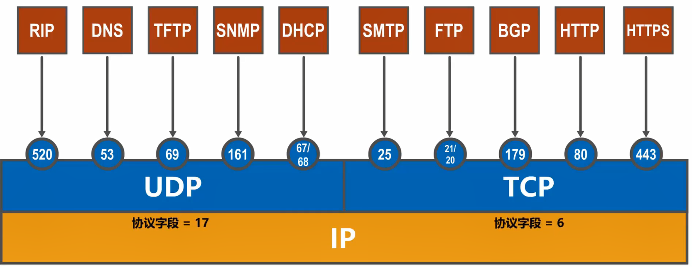

4. 一个例子
    -  
    - 运输层数据报包含首部和应用层报文。首部指定了源端口和目的端口

## 5.3 UDP vs TCP

- UDP，user datagram protocol，用户数据报协议
- TCP，transmission control protocl，传输控制协议

1. - UDP是无连接的，通信双方可随时传输数据
    - TCP是面向连接的，在通信前需要建立连接，通信后需要释放连接
    - 这里的连接是**逻辑连接**，而非物理连接
    - 

2. - UDP支持单播、多播以及广播
    - TCP只支持单播——传输数据前需要建立连接
    - 

3. - UDP是面向应用报文的，UDP数据报是**直接给应用报文加上UDP首部**而形成的
    - TCP是面向字节流的，TCP将应用报文**视作字节流**，将一定数量的字节封装在TCP数据报中发送。TCP交给应用层的也是字节流，这要求应用程序能够解析字节流
    - 

4. - UDP向上层提供**不可靠传输服务**。如果数据报出现误码，会被直接丢弃；如果数据报丢失，接收方不会做任何事。因此，UDP适用于实时应用，如IP电话、视频会议等
    - TCP向上层提供**可靠传输服务**，基于TCP连接的通信信道上的数据传输**不会出现传输差错**。因此，TCP适用于要求可靠传输的应用，如文件传输
    - 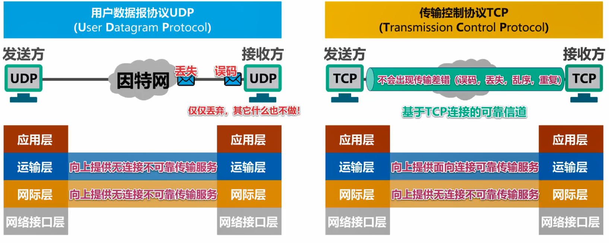

5. - UDP首部仅有8字节
    - TCP首部最小20字节，最大60字节——实现可靠传输
    - 

## 5.4 TCP流量控制

- 通常来说，用户希望数据传输得快一点。但如果发送方数据传输过快，接收方可能**不及接收，造成数据丢失**
- 流量控制（flow control）：让发送方的发送速率不要太快，使得接收方能够及时接收
- 利用**滑动窗口**机制，使发送窗口小于接收窗口，可以在TCP连接上实现对发送方的流量控制

- 以下用例子来阐述：
- 
- 起初发送窗口容量为400字节。接收方收到了前200字节，发送回复报文，其中`ACK = 1`表明这是个ACK报文，`ack = 201`是对前200字节的**累计确认**，而`rwnd = 300`是将接收窗口容量调整为300字节，**要求发送方进行流量控制**
- 
- 发送方用完了发送窗口的容量，在收到ACK报文前，无法再发送数据
- 当ACK中`rwnd = 0`，即这是一个**零窗口通知**，发送方会启动一个**持续计时器**。计时器到时间后，向接收方发送**零窗口探测报文**，接收方回复自己的接收窗口大小。如果接收窗口大小不为零，则调整发送窗口大小；否则，不断执行此过程。
- 这么做是为了**避免死锁**，即通信双方都无法发送、接收对方的数据
- 

## 5.5 TCP拥塞控制

1. 基本介绍
    - 在某短时间内，如果对网络中**某一资源的需求超过了该资源的可用部分**，网络性能就会变坏。这种现象就叫做拥塞（congestion）
    - 网络资源包括：带宽、交换节点的缓存和处理机等
    - 若**出现拥塞而不进行控制**，整个网络的**吞吐量会随输入负载的增大而下降**
    - 好的拥塞控制算法可以试实际的拥塞控制曲线接近理想拥塞控制曲线，见下图：
    - 

2. 拥塞控制算法：
    - :one:慢开始slow-start
    - :two:拥塞避免congestion avoidance
    - :three:快重传fast retransmit
    - :four:快恢复fast recovery
    - 慢开始和拥塞避免于1988年被提出（TCP Tahoe版本）
    - 1990年，为了改进TCP的性能，又提出了快重传和快恢复（TCP Reno版本）

3. 前提条件
    - 下面对于拥塞控制算法的讲解**基于这3个前提**：
    - :one:数据是单向传输的，另一方只回复确认
    - :two:接收方总是有足够大的缓存空间，故TCP流量控制不起作用，**发送窗口的大小由网络拥塞程度决定**
    - :three:以最大报文段MSS的个数为讨论问题的单位，不以字节为单位

4. 慢开始和拥塞避免
    - :one:算法的状态变量：
    - 发送方维护一个状态变量，称为**拥塞窗口`cwnd`**，其**值取决于网络的拥塞程度，且动态变化**
        - 拥塞窗口的**维护原则**：不断增大拥塞窗口，**直到网络出现拥塞**，此时减小拥塞窗口
        - **网络拥塞的标准**：没有按时收到确认报文，即**发生超时重传**时，网络拥塞
    - 将拥塞窗口作为**发送窗口`swnd`**，即$swnd = cwnd$恒成立
    - 维护一个慢开始门限`ssthresh`状态变量：
        - 当`cwnd < ssthresh`时，使用慢开始算法
        - 当`cwnd >= ssthresh`时，使用拥塞避免算法
    - :two:算法机制：
    - 
    - 设置初始值：`cwnd = 1`，`ssthresh = 12`
    - 慢开始阶段：`cwnd`以**指数增长**，即每次乘以$2$；当`cwnd >= ssthresh`时，使用拥塞避免算法，`cwnd`以**线性增长**，即每次增加$1$
    - 当重传计时器超时，网络**很可能出现拥塞**，采取以下行为：
        - 令`ssthresh = cwnd / 2`
        - 令`cwnd = 1`
        - 重新开始执行慢开始算法

5. 快重传和快恢复
    - 有时，个别报文段在网络中丢失，而网络**实际上并未发生拥塞**
    - 这时，会发生超时重传，并**误认为**网络发生拥塞，令`cwnd = 1`后，错误地启动慢开始算法，**降低了传输效率**
    - :one:快重传算法
        - :notebook_with_decorative_cover: 简单来说，该算法就是使发送方**尽快重传**，而**不是等待超时重传机制**
        - 接收方每次收到数据，**立即发送确认**
        - 接收方即使收到失序的报文段，也要立即发送对已收到的报文段的**重复确认**
        - 发送方一旦收到**3个连续**的重复确认，就将相应的报文段**立即重传，不等待超时重传机制**
        - 
        - :eight_pointed_black_star:对于个别丢失的报文段，发送方不会触发超时重传，因而`cwnd`也不会变为1。快重传可以使整个网络的吞吐量提高20%
    - :two:快恢复算法
        - 发送方一旦**收到3个重复确认**，执行快恢复算法，而不是慢开始算法，具体来说：
        - 发送方令`ssthresh = cwnd = cwnd /2`，即都**减小至当前窗口的一半**，然后**执行拥塞避免算法**
        - 

## 5.6 TCP超时重传时间的选择

1. 引入
    - 超时重传时间的选择是TCP**最复杂的问题之一**
    - **超时重传时间（RTO）**过大或过小都会造成网络资源的浪费
    - 通常令RTO略大于往返时间（RTT）
2. 加权平均往返时间$RTT_Ｓ$
    - 由于网络环境经常变化，RTT的变化会较大，因此**不能使用某个RTT值决定RTO**
    - 利用每次测量到的RTT样本，计算**加权平均往返时间RTT~Ｓ~**，又称为平滑的往返时间，**公式**如下：
    - $RTT_{Ｓ,n} = \begin{cases}{RTT_1,n = 1} \\ (1-\alpha)\times RTT_{Ｓ,n -1 } + \alpha \times RTT_{n} , n > 1, 0 \le \alpha  < 1\end{cases}$
    - 根据RFC6298标准，$\alpha = 0.125$
    - **RTO应该略大于RTT~Ｓ~**
3. RFC6298建议的**RTO计算公式**
    - ==$RTO = RTT_S +4\times RTT_D$==
    - 其中，$RTT_D$为**RTT偏差的加权平均**，**公式**如下：
    - $RTT_{D,n} = \begin{cases} \frac {RTT_1 } 2, n =1  \\ (1-\beta) \times RTT_{D,n -1 } + \beta \times |RTT_{S, n - 1} - RTT_n| , n > 1, 0 \le \beta < 1\end{cases}$
    - 根据RFC6298，$\beta = 0.25$
4. RTT的测量
    - 由于**RTO是关于所有RTT的函数**，这对于**RTT测量的准确性**提出了要求
    - 对于**超时重传**情况下的RTT**测量较难**：
        - 
        - 发送方总是会把时间最近的发送数据报和接收确认报文的时间当作本次RTT，与实际不符
    - 针对此问题，Karn提出了一个算法：在计算RTT~s~时，**只要报文重传了，就不采用其RTT样本**。
    - 该算法的**问题**:beetle:在于：假如网络在**一段时间之后一直保持较大的时延**，所有重传的RTT都会被忽略，RTO不会被更新，发送方**一直以网络顺畅的RTO进行重传**，报文段被反复重传，造成资源浪费
    - 对Karn算法进行修正：**报文段每重传一次，就把RTO增大一些**。典型的做法是：==$RTO_n = 2 \times RTO_{n -1}$==

## 5.7 TCP可靠传输的实现

- TCP使用**以字节为单位的滑动窗口**实现可靠传输，其原理与[选择重传协议](# 选择重传协议 SR)类似，这里不再赘述。区别在于：TCP中发送窗口和接收窗口会动态地发生变化
- 虽然发送窗口是由接收窗口设置的，但在**同一时刻，两者并不总是一样大**，原因如下：
    - 包含`rwnd`的确认报文的传输需要一定时间
    - 发送窗口还会因为网络拥塞情况（即`cwnd`）来减小自己的大小
- 对于**不按序到达的数据**应如何处理，TCP并**无明确规定**
    - TCP通常是将不按序达到的数据缓存起来，等到缺失的字节到达后，按序交给应用层。而丢弃不按序到达的数据会造成网络资源的浪费
- TCP要求接收方有**累计确认和捎带确认机制**，以减小传输开销。接收方可以在合适的时候发送确认，也可以在自己有数据发送时把确认信息顺便捎上
    - 接收方不应过分推迟发送确认，因为会造成发送方的超时重传。
    - TCP规定，确认推迟时间不超过0.5秒
    - RFC 1122规定，若连续收到最大长度的报文段，必须每隔一个报文段就发送一个确认
    - **捎带确认实际不经常发生**，因为大多数程序很少同时向网络读写数据
- TCP通信是**全双工通信**。每一方都有自己的发送窗口和接收窗口，不应混淆

## 5.8 TCP运输连接管理

1. 基本介绍
    - TCP是面向连接的协议，基于运输连接传送TCP报文段
    - TCP运输连接有三个阶段：
        - :one:建立TCP连接
        - :two:数据传送
        - :three:释放TCP连接
    - 
    - TCP运输连接管理就是使连接的建立和释放都能正常进行

### 建立TCP连接

1. TCP连接的建立要解决以下三个问题：
    1. 使TCP双方能够确知对方的存在
    2. 使TCP双方能够协商一些参数，如最大窗口值、时间戳选项、服务质量等
    3. 使TCP双方能够对运输实体资源（如缓存大小、连接表中的项目等）进行分配

2. 三报文挥手
    - 当（服务器、客户）进程从closed状态进入打开状态，需要首先建立**传输控制块**，存储TCP连接的重要信息
        - 
        - 这类似于OS中，创建进程需要在内核中先建立PCB一样
    - 三报文挥手的过程：
    - 
    - 客户端主动发送请求，服务器负责监听
    - :one:客户端发送TCP连接请求报文，`SYN = 1`表示该报文是一个同步请求报文；`seq = x`，将第一个报文的序号设置为`x`，之后的报文传输中报文的序号依据该序号增加；
    - 发送连接请求报文的同时，客户端进入**同步已发送**状态
    - :two:服务器收到TCP连接请求，假设同意连接，则回复确认，同时进入**同步已接收**
    - `SYN = 1`表示该报文与请求相关；`ACK = 1`表示同意请求；`seq = y`，`y`是服务器作为发送端的第一个报文需要，`ack = x + 1`是对收到`seq = x`的报文的回复
    - :three:客户端收到确认报文，进入**连接已建立**状态，同时再次发送另一条确认报文，该报文与同步无关
    - :four:服务器收到确认报文，也进入**连接已建立**状态
    - :five:双方都处于连接已建立状态，此时可以进行数据传输

3. 为什么是三报文挥手？
    - 假如只有两次挥手就进入连接以建立状态：
    - 
    - 客户端第一次发送TCP连接请求，由于网络原因，会在很晚才到达服务器
    - 客户端启动超时重传，再次发送连接请求。服务端收到后，进入连接已建立状态，同时回复确认
    - 客户端收到确认，也进入连接已建立状态，开始数据传输
    - 假设最早的TCP连接请求在双方释放连接后到达服务器，服务器进入连接已建立状态，而客户端对服务器的确认不予理睬。
    - 服务器一直等待数据传输，浪费资源
    - 因此，关键在于**客户端必须先于服务器进入连接已建立状态**，且服务器此时有能力拒绝连接，即**连接的主导权一直在服务器**

4. 注意事项
    - TCP有如下规定：
        - `SYN == 1`的报文段不能携带数据，但要消耗序号
        - 普通的**确认**报文段如果不携带数据，则不消耗序号

### TCP连接释放

1. 四报文挥手
    - 
    - 由客户端主动释放连接
    - :one:客户端发送TCP连接释放，状态由连接已建立进入**终止等待1**
    - `FIN = 1`表示这是释放报文；`ACK = 1`，`seq = u`和`ack = v`是关于数据传输阶段的信息
    - :two:客户端收到TCP释放后，状态由连接已建立进入**关闭等待**
    - 服务器运输层通知应用进程，**客户端释放了与服务器的单向连接，即客户端只能接收来自服务器的报文**
    - 服务器发送确认报文
    - :three:客户端收到确认报文，进入**终止等待2**状态，并接收来自服务器的数据传输
    - :four:服务器数据传输完毕，发送TCP连接释放，进入**最后确认**状态
    - `seq = w`表示这期间有数据传输
    - :five:客户端收到释放报文，进入**时间等待**状态，同时发送确认报文
    - :six:服务器收到确认报文后，**关闭**
    - :seven:客户端在时间等待状态中，等待2 MSL后，**关闭**。其中，MSL为**最长报文段寿命（maximum segment lifetime）**，RFC793建议为2分钟，应用程序可视情况而定

2. 时间等待状态的意义
    - :one:**服务器关闭连接的主导权在客户端**，如果最后的TCP确认丢失，则服务器会一直在最后确认状态，浪费资源。等待2 MSL是为了确保服务器收到确认报文
    - 
    - :two:2 MSL可以使本次连接所产生的所有报文段从网络中消失，使下一次的连接中，不会出现旧连接的报文段

3. TCP保活计时器
    - 如果客户端出现故障，服务器应该有某种机制发现该故障，并主动关闭连接
    - 服务器每收到客户端的数据报，就重新设置**保活计时器**（2小时定时）
    - 如果保活计时器到时，服务器每隔75秒向客户端发送**探测报文段**。如果发送10个探测报文段后，客户端仍无响应，则服务器认为客户端出现故障，主动关闭连接

## 5.9 TCP报文段的首部

- TCP发送数据时，从发送缓存中取出一部分获全部字节，并给其添加一个首部使之成为**TCP报文段**
    - TCP报文段由**首部**和**数据载荷**两部分构成
    - TCP的全部功能都体现在其首部个字段的作用
- 

1. **源端口**：占16 bit，标识**发送**TCP报文段的应用**进程**
2. **目的端口**：占16bit，标识**接受**TCP报文段的应用**进程**
3. **序号**：占32 bit，取值范围为$[0,2^{32}-1]$，序号$2^{32}-1$的下一个序号为$0$。序号指出本TCP报文段数据载荷的**第一个字节**的序号（每一个字节都有序号）
    - 
4. **确认号**：占32 bit，取值范围为$[0,2^{32}-1]$，序号$2^{32}-1$的下一个序号为$0$。
    - 指出**期望收到下一个**TCP报文段中数据载荷的第**一个字节的序号**，同时是对**之前收到的所有数据的确认**
    - 若确认号为$n$，则表明前$n - 1$号字节已经正确接收，期望收到$n$号字节
    - 
5. **确认标志位ACK**：取值为`1`时确认号字段才有效，为`0`时无效
    - TCP规定，**连接建立后所有**的TCP报文的ACK都**必须**为`1`
6. **数据偏移**：占4 bit，**以4字节为单位**，表示**首部长度**
7. **保留**：占6 bit，保留为今后使用，目前置0
8. **窗口**：占16 bit，**以字节为单位**，指出**接收窗口的大小**，用于流量控制
9. **校验和**：占16 bit，检查范围为整个TCP报文段
10. **同步标志位SYN**：在TCP连接建立时用来同步
11. **终止标志位FIN**：用来释放TCP连接
12. **复位标志位RST**：用来复位TCP连接
    - 当`RST = 1`时，表明TCP连接出现异常，需要释放连接，然后再重新连接
    - `RST = 1`还用来拒绝一个非法的报文段或拒绝打开TCP连接
13. **推送标志位PSH**：接收方收到`PSH = 1`的报文段会**尽快上交应用进程**，不必等待接收缓存满了后再上交
14. **紧急标志位URG**：为`1`时紧急指针字段有效，为`0`时无效
15. **紧急指针**：占16 bit，以**字节为单位**，指出紧急数据的长度
    - 当发送方有紧急数据时，可将紧急数据**插队到发送缓存最前面**，**立即**封装到一个TCP报文段中进行发送
    - 紧急指针指出报文段数据载荷部分包含多长的紧急数据，**紧急数据之后是普通数据**
    - 接收方收到紧急数据后，**立刻上交应用进程，不在接受缓存中等待**
16. **选项字段**包括以下选项：
    - :one:最大报文段长度MSS选项：数据载荷的最大长度
    - :two:窗口扩大选项：扩大窗口，提供吞吐率
    - :three:时间戳选项：用来计算RTT；用于处理序号超范围的情况，又称为防止序号绕回（PAWS）
    - :four:选择确认功能
17. **填充**：保证首部长度能被4整除

# 6. 应用层

## 6.1 概述

- 应用层是计算机网络体系结构的**最顶层，是设计和建立计算机网络的最终目的**

## 6.2 C/S和P2P

1. 引入
    - 网络应用程序运行在处于网络边缘的不同端系统上，通过彼此的通信来共同完成某项任务
    - 开发网络应用，首先要考虑**网络应用程序在各种端系统上的组织方式和它们之间的关系**，目前主要有两种方式：
        - :one:客户/服务器（Client/Server, C/S）方式
        - :two:对等（Peer-to-Peer, P2P）方式

2. 客户/服务器方式
    - 客户和服务器是指通信中的**两个进程**
    - 客户是服务请求方，服务器是服务提供方
    - 服务器总是处于运行状态，并等待客户的服务请求。服务器有固定的端口号（例如HTTP服务器的端口号为80），运行服务器的主机也有固定的IP地址
    - C/S方式是因特网传统的、最成熟的方式，其应用有万维网WWW、电子邮件、文件传输等
    - 基于C/S方式的应用服务通常是**服务集中型**的，即应用服务集中在**比客户端少得多**的服务器主机上。因此，服务器主机会跟不上众多客户端的请求。
    - 实际应用中，常使用计算机**集群**以构建一个强大的虚拟服务器
    - 

3. 对等方式
    - 在P2P中，没有固定的服务请求者和服务提供者。在不同主机上运行的进程称为**对等方**。对等方之间**直接通信**，每个对等方即是服务请求者，又是服务提供者
    - 常见的P2P应用有：P2P文件共享、即时通信、P2P流媒体、分布式存储
    - P2P是**服务分散性**的，服务分散在大量对等计算机中，这些计算机通常为个人计算机
    - P2P最突出的特性之一是**可拓展性**。每增加一个对等方，就增加了一个服务提供者，因此**系统性能不会因规模的增大而降低**
    - P2P具有**成本优势**，因为P2P应用不需要庞大的服务器设施和服务器带宽

## 6.3 动态主机配置协议 DHCP

1. 引入
    - 考虑如下情况：
    - 
    - 如何配置用户主机，使得主机能够访问Web服务器？——手动配置如上信息
    - 但当网络中主机很多时，**手工配置的工作量大，且容易出错**
    - 是否存在这样一种服务，能够**自动配置网络中的各主机**，使主机能够访问Web服务器？——这引出了DHCP
    - 

2. 动态主机配置协议（DHCP, dynamic host configuration protocol）提供了一种机制，称为即插即用联网。该机制允许**一台计算机加入新网络**时可以**自动获取**IP地址等**网络配置信息而不用手工参与**

3. DHCP报文在运输层使用UDP封装
    - DHCP**客户端**使用的UDP端口为68
    - DHCP**服务端**使用的UDP端口为67

4. DHCP工作过程
    - 
    - 假设局域网内有多个DHCP服务器
    - :one:当客户端启用DHCP后，客户端不知道局域网内的DHCP服务器，于是以广播形式发送DHCP发现报文。
    - **发现报文中包括事务ID和客户端的MAC地址**
    - 由于客户端没有IP地址，其源地址为`0.0.0.0`
    - :two:监听端口67的DHCP服务器收到DHCP发送报文，局域网内的**其他主机由于没有监听该端口，丢弃该报文**
    - DHCP服务器根据MAC地址查找自己的数据库，如果找到相应的网络配置，则返回，否则使用默认网络配置。
    - DHCP服务器以广播形式发送DHCP提供报文。报文中包括事务ID和配置信息。配置信息中的IP地址可能有多个，但都已**使用ARP确保其他主机没有占用这些IP地址**
    - :three:监听端口68的DHCP客户收到DHCP提供报文，从多个IP地址中选择一个，发送DHCP请求报文。报文包括：事务ID、DHCP客户端的MAC地址、接受的租约的IP、提供此租约的DHCP服务器的IP地址
    - 根据报文内容可知，以广播形式发送DHCP请求报文时合理的
    - :four:DHCP服务器同意客户端使用该IP，发送DHCP ACK报文
    - :five:客户端**在使用该IP前，使用ARP检查**该IP是否被其他主机占用
        - 如果被占用：向DHCP服务器发送DHCP decline报文，撤销IP地址租约，并重新发送DHCP发现报文
        - 如果没被占用：使用该IP
    - :six:DHCP客户端每到一定时间，向服务器发送DHCP请求报文，续约IP地址。
        - 如果服务器回复DHCP ACK，则更新租用期
        - 如果服务器回复DHCP NACK，则立即停止租用，重新发送DHCP请求报文
        - 如果服务器未响应，则租用期到期后，立即停止租用，重新发送DHCP请求报文
    - :seven:客户端可随时发送DHCP释放报文，以解除IP地址续约

5. DHCP中继代理
    - 
    - 对于黄色区域的网络，其发送的广播DHCP发现报文会被路由器丢弃，而无法访问DHCP服务器
    - 解决方法是：给该路由器配置DHCP服务器的IP地址，并使其成为中继代理。路由器在收到广播DHCP发现报文后，将其变为单播DHCP发现报文发送给DHCP服务器
    - 这么做，可以避免设置过多的DHCP服务器

## 6.4 域名系统 DNS

- DNS, domain name system

1. 基本介绍
    - DNS的作用：把便于人们记忆的域名（如`www.google.com`）转换为便于机器处理的IP地址
    - DNS报文使用UDP封装，端口号为53

2. 层次树状结构域名系统
    - 因特网使用**层次结构的命名树作为域名**，并使用**分布式的DNS**
    - 域名结构由若干个元素组成，每个元素之间用`.`隔开，代表不同级别的域名
        - `xxx.三级域名.二级域名.顶级域名`
        - 每一级域名都由英文字母和数字组成，不区分大小写
        - 级别最低的域名在最左边，级别最高的域名在最右边
        - 完整域名不超过255个字符
    - **各级域名由上一级的域名管理机构管理**，顶级域名由ICANN管理
    - 顶级域名（TLD, top level domain）分为三类：
        - :one:国家顶级域名（nTLD）：采用ISO 3166标准，如`cn`表示中国，`jp`表示日本
        - :two:通用顶级域名（gTLD）：最常见的通用顶级域名有7个：`com`（公司企业）、`net`（网络服务机构）、`org`（非营利组织）、`int`（国际组织）、`edu`（美国教育机构）、`gov`（美国政府部门）、`mil`（美国军事部门）
        - :three:反向域（arpa）：用于反向域名解析：IP地址反向解析为域名
    - 在国家顶级域名下注册的**二级域名由国家自行确定**。如日本的教育和企业机构的二级域名为`ac`和`co`，而不是`edu`和`com`
    - 中国的**二级域名**有两类：
        - :one:类别域名：`ac`（科研机构）、`com`、`edu`（教育机构）、`gov`（政府部门）、`net`、`org`、`mil`（军事机构）——:warning:这些二级域名和nTLD不同
        - :two:行政局域名，如`bj`为北京，`sh`为上海
    - 按等级管理的命名方法便于维护名字的唯一性（参考Java包命名规范），且容易设计出高效的域名查询机制。
    - 域名只是**逻辑概念**，与计算机的物理地点无关

3. 域名服务器
    - 域名和IP地址的映射关系必须保持在域名服务器中，供其他应用查询。DNS使用**分布在各地的域名服务器**
    - 域名服务器有4种类型：
    - :one:根域名服务器：
        - 最高层次的域名服务器
        - 知道所有顶级域名服务器的域名及其IP地址
        - 因特网总共有13个不同IP地址的根域名服务器，每台服务器都是**一个计算机集群**。
        - 本地域名服务器向根域名服务器查询时，路由器会把请求报文转发给最近的根域名服务器
        - 根域名服务器通常不直接对域名进行解析，而是**返回对应的顶级域名服务器的IP地址**
    - :two:顶级域名服务器：
        - 负责管理该服务器下注册的**所有二级域名**
        - 收到DNS查询请求时，可能返回最终结果，也可能是**下一级权限域名服务器的IP地址**
    - :three:权限域名服务器：
        - 负责管理某个区的域名
        - **每一个主机的域名**都必须在某个权限域名服务器处注册登记
        - 权限域名服务器知道其**下级域名服务器的IP地址**
    - :four:本地域名服务器：
        - 本地域名服务器**不属于**上述的域名服务器结构
        - 当主机发送DNS请求报文时，该报文会被送往主机的本地域名服务器。
        - 每一个ISP、一个大学，都可以拥有一个本地域名服务器，故该域名服务器离用户较近
        - 本地域名服务器也称为**默认域名服务器**，其 IP地址需要直接配置在这主机中
        - 本地域名服务器起着**代理**的作用，将DNS请求报文转发到上述域名服务器结构中

4. 域名解析过程
    - 有两种方式：递归查询和迭代查询
    - 
    - 
    - 由于递归查询对于域名服务器开销太大，通常采用这种方式：**从主机到本地域名服务器是递归查询，其他的查询是迭代查询**

5. DNS缓存
    - 为了:one:提高DNS查询效率:two:减轻根域名服务器负担:three:减少因特网上的DNS查询报文数量，在域名服务器中广泛使用**高速缓存**，记录域名和IP的关系
    - 由于域名到IP的关系不是固定的，域名服务器应为缓存中的每项内容设置**合理时间**，如每个项目只存放2天
    - **用户主机**中也**维护**了域名高速缓存，只有当主机在缓存中找不到域名时，才向域名服务器查询

6. 例题
    - 
    - 注意查询每一级域名服务器的过程，以及域名服务器与域名的关系

## 6.5 文件传送协议 FTP

1. 基本介绍
    - 在两台计算机之间传输文件，是一项基本的网络应用
    - **文件传送协议（FTP，fiel transfer protocol）**是因特网使用最广泛的文件传送协议
    - FTP提供**交互式**的访问，允许客户指明文件的类型与格式，允许文件具有**存取权限**（输入有效口令）
    - FTP**屏蔽了各计算机系统的细节**，适合于在**异构网络中任意计算机**之间传送文件
    - FTP**采用C/S方式**

2. 工作原理
    - FTP客户端和服务器要建立**两个并行的TCP连接**：
        - :one:控制连接：在整个会话期间**一直保持打开**，用于传送FTP控制命令
        - :two:数据连接：用于文件传送，每次文件传输时才建立，传输结束就关闭
    - 
    - 控制连接时，FTP服务器使用端口号21
    - 数据连接时，如果服务器主动连接，则使用端口号20；如果服务器被动连接，则使用临时端口号，由服务器和客户端协商决定

## 6.6 电子邮件

1. 基本介绍
    - 电子邮件系统采用C/S方式
    - 电子邮件系统由三个部分组成：
        - :one:用户代理：用户与电子邮件系统的接口，又称**电子邮件客户端软件**
        - :two:邮件服务器：电子邮件系统的基础设施。因特网上所有ISP都有邮件服务器，功能是收发邮件，并维护用户邮箱
        - :three:协议：包括邮件发送协议（如SMTP）和邮件读取协议（POP3、IMAP）
    - 

2. 简单邮件传送协议 SMTP
    - SMTP，simple mail transfer protocol
    - 使用TCP，端口号为25
    - 基本工作原理如下：
    - 
    - 应答代码后面一般跟有简单描述信息，不同SMTP服务器的描述信息不同

3. 电子邮件格式
    - 电子邮件的信息格式在RFC 822中被定义，最新的定义是RFC 5322
    - 电子邮件分为**信封**和**内容**两部分
    - 内容分为**首部和主体**两部分，用户需要填写内容
    - 邮件系统会自动提取首部的信息到信封上，不需要用户填写
    - 

4. 多用途因特网邮件拓展 MIME
    - MIME，multipurpose internet mail extensions
    - SMTP**只能传送ASCII码文本数据**，故非英语国家文字无法传送，且无法传送其他类型的文件，如音视频等
    - 为了解决该问题，MIME被提出
    - MIME增加了**5个新的邮件首部字段**，提供了邮件主体的相关信息
    - MIME**定义了邮件内容的格式**，对**多媒体电子邮件**的表示方法进行了**标准化**
    - MIME定义了**传送编码**，可以对**任何内容格式**进行转换，而不会被邮件系统改变
    - MIME不仅应用于SMTP，还应用于同样面向ASCII字符的HTTP
    - 

5. 邮件读取协议
    - 常用的邮件读取协议有两个：
    - :one:邮局协议（POP, post office protocol）
        - POP3是POP第三个版本，是因特网正式标准
        - 非常简单、功能有限的邮件读取协议。
        - 用户**只能以下载并删除或下载并保留**方式从邮件服务器下载邮件到计算机。
        - **不允许**用户在邮件服务器上**管理自己的邮件**，如创建文件夹，分类管理邮件
    - :two:因特网邮件访问协议(IMAP, internet message access protocol)
        - IMAP4是IMAP第四个版本，目前是因特网建议标准
        - 功能比POP3强大，用户**在自己计算机上就可以操控邮件服务器的邮箱**，就像在本地操控一样。故IMAP是联机协议
    - POP3和IMAP4都采用**TCP的C/S方式**。
    - POP3使用端口110
    - IMAP4使用端口143

6. 基于万维网的电子邮件
    - 通过**浏览器**登录（用户名和密码）**邮件服务器万维网网站**，就可以收发和管理电子邮件。
    - 该工作模式与IMAP类似，但用户不**需要安装用户代理程序**，只需要使用通用的浏览器
    - 

## 6.7 万维网 WWW

- WWW，world wide web

1. 基本介绍
    - 万维网并非某种特殊的计算机网络。它是一个大规模的、联机式的信息储藏所，是允许在因特网上的一个**分布式应用**
    - 万维网利用网页之间的**超链接**将不同网站的网页链接成一张逻辑上的信息网

2. 浏览器
    - 浏览器**最重要**的部分是**渲染引擎**，也就是**浏览器内核**，负责对网页内容进行解析和显示
    - 不同的浏览器内核对网页内容的解析不同，网页编写者需要在不同内核的浏览器中测试网页显示效果
    - 用户主机向服务器发送HTTP请求报文，服务器接收后发送响应报文。浏览器解析该报文的内容，并将网页显示出来

3. URL
    - 为了方便地访问世界范围内的文档，万维网使用**统一资源定位符URL**指明因特网上任何种类**资源**的位置
    - URL的一般格式：
        - `<协议>://<域名|IP地址>:<端口>/<文件路径>`
        - 如：`http://www.hnust.cn:80/ggtz/119945.htm`

4. 万维网文档
    - 保存一个网站的网页，会得到这样一些文件：`.htm`、`.js`、`.css`和一些图片文件。其中：
    - 超文本标记语言（HTML，hypertext markup language）：使用多种标签来描述网页的**结构和内容**
    - 层叠样式表（CSS, cascading style sheets）：从**审美**的角度描述**网页的样式**
    - 脚本语言JavaScript：控制**网页行为**。
    - 这些文件都存放在**服务器端**，根据用户的请求发送给用户浏览器，由浏览器负责解析

5. 超文本传输协议HTTP
    - HTTP，hyperText transfer protocol
    - HTTP定义了:one:浏览器（万维网客户）怎样想万维网服务器请求万维网文档，以及:two:万维网服务器怎样把万维网文档传送给浏览器
    - 
    - **HTTP/1.0**采用**非持续连接**方式。浏览器**每请求一个文件**，都要和服务器建立TCP连接，**收到响应后立即关闭连接**。
        - 每请求一个文档需要花费2 RTT的时间。如果网页上有很多引用对象，那么消耗时间过长
            - 
            - 如图，在[TCP连接](# 建立TCP连接)的第三个报文中，包含HTTP请求
        - 为了减小时延，浏览器通常会建立**多个并行的TCP连接**同时请求多个对象，但这对万维网服务器负担过大
    - **HTTP/1.1**采用**持续连接**方式。浏览器和服务器建立连接后，可以发送多条HTTP请求和响应报文。
        - 为了进一步提高效率，HTTP/1.1还使用**流水线**方式，连续发送多个请求报文，提高效率

6. HTTP报文
    - HTTP是**面向文本**的，其报文中的每一个字段都是一些**ASCII字符串**，且各字段的**长度不固定**
    - :one:请求报文
    - 
    - 
    - :two:响应报文：
    - 
    - 
    - 

7. Cookie
    - Cookie用于在服务器上记录用户信息
    - 早期的万维网应用非常简单，其功能仅仅是让用户查看服务器上的各种静态文档。因此，HTTP被设计为一种**无状态**协议
    - 现在，用户通过万维网实现网上购物、电子商务等功能，这要求万维网**服务器能够识别用户**
    - Cookie提供了一种机制，使得**服务器能够记住用户，无需用户主动提供用户标识信息**，因此，Cookie是一种**对无状态的HTTP进行状态化的技术**
    - 

8. Web缓存与代理服务器
    - 万维网使用缓存机制提高万维网的效率
    - 万维网缓存又称**Web缓存（Web Cache）**，位于客户端或者位于中间系统上。位于中间系统的Web缓存成为**代理服务器（proxy server）**
    - Web缓存把最近一些请求和响应暂存在本地磁盘中。
        - 当有新的请求时，检索本地数据库，如果存在相同请求，则直接返回暂存的响应，不需要再次去因特网访问资源。
        - 
        - 如果不存在相同请求，代理服务器向原始服务器发出请求。代理服务器收到响应后，再转交主机
        - 
    - 如果缓存命中率高，可以减少链路上的通信量，因而减少访问时延
    - 另外，还存在**数据不一致**问题。如果代理服务器中的响应过期，则向原始服务器发送if-modified-since请求。如果原始服务器中的数据没有被修改，则返回一个空的304响应，否则返回该请求的实体
        - 
        - 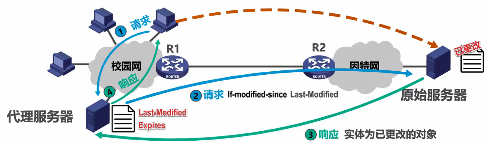

# EOF

[返回顶部](# 目录)
